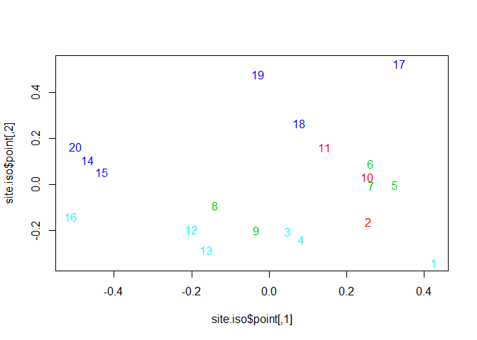

``` r
library (MASS)
```

    ## Warning: package 'MASS' was built under R version 3.6.2

``` r
library(rgl)
```

\#Dataset

``` r
DACA = read.csv("C:/Users/fb8502oa/Desktop/DSCI 415/DSCI 415 fall/DACA.csv", header=TRUE)
head(DACA)
```

    ##        State Lawsuit AcceptInit AcceptRenew AcceptTotal ApprovedInit
    ## 1    Alabama       O       4803        3844        8647         4270
    ## 2     Alaska       N        195         508         703          138
    ## 3    Arizona       N      30652       25314       55966        27865
    ## 4   Arkansas       O       5606        4475       10081         5099
    ## 5 California       T     242339      217023      459362       222795
    ## 6   Colorado       N      19103       15321       34424        17258
    ##   ApprovedRenew ApproveTotal    Pop16 AcceptPerPop ApprovedPerPop MinPer14
    ## 1          3584         7854  4863300  0.001778011    0.001614953    0.338
    ## 2           419          557   741894  0.000947575    0.000750781    0.381
    ## 3         23638        51503  6931071  0.008074654    0.007430742    0.438
    ## 4          4255         9354  2988248  0.003373549    0.003130262    0.266
    ## 5        202200       424995 39250017  0.011703485    0.010827893    0.615
    ## 6         14302        31560  5540545  0.006213107    0.005696191    0.310
    ##   PerWhite PerHisp PerBlack PerAsian Approved.PerWhite Approved.PerBlack
    ## 1    0.662   0.041    0.264    0.013        11864.0483          29750.00
    ## 2    0.619   0.068    0.036    0.059          899.8384          15472.22
    ## 3    0.562   0.305    0.041    0.030        91642.3488        1256170.73
    ## 4    0.734   0.070    0.154    0.014        12743.8692          60740.26
    ## 5    0.385   0.386    0.057    0.138      1103883.1170        7456052.63
    ## 6    0.690   0.212    0.039    0.030        45739.1304         809230.77
    ##   Approved.PerHisp Approved.PerAsian
    ## 1       191560.976        604153.846
    ## 2         8191.176          9440.678
    ## 3       168862.295       1716766.667
    ## 4       133628.571        668142.857
    ## 5      1101023.316       3079673.913
    ## 6       148867.924       1052000.000

1.Use the raw data, which is mostly counts, to create metrics

\#select variables v1, v2, v3 and subsetting \#I am interested to see
how the lawsuits were approved depending per race. Eg: \#1.Approved per
white vs Approved per black. \#2.Approved per Hispanic and Approved per
Asian.

``` r
my_data=DACA[,c(17:20)]
```

1.  Using the data and the metrics I created to conduct a metric MDS (or
    non-metric MDS) with k=2 dimensions, K=3 dimensions.  
    Finding the stress and Constructing a plot of the dimensions created
    and label the points by state, coloring the points by lawsuit
    status.

``` r
##scaling the data is very important
Daca.scale =scale(my_data) 
##now finding the distance 
Dacadis = dist(Daca.scale)
##k=2
Daca.samm = sammon(Dacadis,k=2)
```

    ## Initial stress        : 0.03017
    ## stress after  10 iters: 0.01433, magic = 0.092
    ## stress after  20 iters: 0.00882, magic = 0.043
    ## stress after  30 iters: 0.00638, magic = 0.500
    ## stress after  40 iters: 0.00617, magic = 0.500
    ## stress after  50 iters: 0.00612, magic = 0.500

``` r
#plotting
plot(Daca.samm$points,type="n")
text(Daca.samm$points,as.character(DACA$State),col=as.numeric(DACA$Lawsuit)+2) ##the 2 is for the coloring. 
```


``` r
##The very blue ones are lawsuits against obama, the light blue are against trump while the green is no lawsuits.
```

comments for \#2. The outliers from sammon make sense since California
was among the leading state in lawsuits against trump while Texas had
lawsuits against Obama. The dark blue are the states that have lawsuits
against Obama while the light blue states have lawsuits against trump
while the green states had none. The initial stress is key = 0.03017

3.Repeat part (2) using 𝑘 = 3 dimensions

``` r
##k=3
Daca.samm3d = sammon(Dacadis,k=3) 
```

    ## Initial stress        : 0.00184
    ## stress after  10 iters: 0.00018, magic = 0.500
    ## stress after  20 iters: 0.00017, magic = 0.500

``` r
##install plot 3-d (rgl)
plot3d(Daca.samm3d$points,type="n")
text3d(Daca.samm3d$points, texts= as.character(DACA$State),col=as.numeric(DACA$Lawsuit)+3)
```

Problem 2 - Gene Expression Levels for Colon Tissue Samples These data
come from a microarray experiment where gene expression levels were
measured for colon tissues samples from 40 individuals with colon cancer
and 22 individuals without colon cancer. Below is a blurb about
microarray experiments taken from Modern Multivariate Statistical
Techniques by Alan Izenman.

\#The dataset

``` r
Alontop = read.csv("C:/Users/fb8502oa/Desktop/DSCI 415/DSCI 415 fall/Alontop.csv")
View(Alontop)
```

Form a distance matrix for the 62 tissue samples using Euclidean
distance. Is scaling important? Why or why not? Give summary statistics
for the pairwise distances in the distance matrix.

``` r
names(Alontop)
```

    ##  [1] "T95018"      "T61609"      "T71025"      "X55715"      "T52185"     
    ##  [6] "T57633"      "R78934"      "T51529"      "M26697"      "T51023"     
    ## [11] "D63874"      "T57630"      "M36981"      "M76378"      "M63391"     
    ## [16] "M76378.2"    "T79152"      "H64489"      "X15183"      "X14958"     
    ## [21] "Z50753"      "D31885"      "U30825"      "T60155"      "H40560"     
    ## [26] "R87126"      "M22382"      "R42501"      "T51571"      "X12671"     
    ## [31] "X70944"      "M76378.3"    "H40095"      "X70326"      "Z49269"     
    ## [36] "T92451"      "Z49269.2"    "R75843"      "U29092"      "H43887"     
    ## [41] "H11719"      "T86473"      "X12466"      "R08183"      "R36977"     
    ## [46] "M80815"      "U09564"      "L08069"      "R84411"      "T96873"     
    ## [51] "X74295"      "T40454"      "X12496"      "T47377"      "T62947"     
    ## [56] "L05144"      "U26312"      "H77597"      "R64115"      "J02854"     
    ## [61] "L41559"      "L25941"      "X86693"      "X74262"      "X63629"     
    ## [66] "X13482"      "T83368"      "M36634"      "R52081"      "T86749"     
    ## [71] "H87135"      "M26383"      "D42047"      "T67077"      "D00596"     
    ## [76] "X53586"      "X54942"      "H20819"      "U17899"      "J05032"     
    ## [81] "H08393"      "H06524"      "U32519"      "H55916"      "U25138"     
    ## [86] "U19969"      "X56597"      "M91463"      "X62048"      "D29808"     
    ## [91] "T60778"      "M64110"      "Tissue.Type"

``` r
alon.mat = Alontop[,-93]

dist2 = as.matrix(dist(alon.mat))
dist2
```

    ##            1         2         3         4         5         6         7
    ## 1   0.000000 12.722053 12.116271  8.904844 12.313244 12.586809  9.927910
    ## 2  12.722053  0.000000 16.086286 14.470272 17.352244 18.987285 13.886314
    ## 3  12.116271 16.086286  0.000000 11.579483 11.831250 13.577004  8.063128
    ## 4   8.904844 14.470272 11.579483  0.000000 10.635820 10.153944 10.342858
    ## 5  12.313244 17.352244 11.831250 10.635820  0.000000 12.252118 12.433522
    ## 6  12.586809 18.987285 13.577004 10.153944 12.252118  0.000000 13.447463
    ## 7   9.927910 13.886314  8.063128 10.342858 12.433522 13.447463  0.000000
    ## 8   9.874934 12.711438  8.840547  9.744028 11.119107 13.423927  7.445703
    ## 9   9.751676 15.039332 10.285686  9.099900  9.633396 10.621793  9.845035
    ## 10 11.725043 17.437512 10.563905  8.960787  6.853212 10.616060 10.965617
    ## 11  8.523356 14.623757 12.958967  7.495084 10.204045 10.988671 11.415372
    ## 12 14.683873 18.404642 10.227031 11.772720 11.433073 13.143050 10.984883
    ## 13 10.593054 15.432360 10.136789  8.098732  9.096132 10.868853  9.733179
    ## 14 10.268505 16.651730 12.506156  8.134175 10.443047 10.566385 11.410197
    ## 15  8.236704 13.781861 11.760054  8.160317 13.106976 11.688746  9.054722
    ## 16  9.780472 16.332559 10.407005  7.644310  8.829391 10.930465 10.251841
    ## 17  9.129305 14.040233 12.838619  8.801024 12.911533 11.500315 10.438830
    ## 18  9.533147 15.756714 12.925214  7.065677 11.194401  9.829124 11.717044
    ## 19 10.660697 10.775292 10.920619 11.085208 12.828361 14.895619  9.608664
    ## 20 10.675869 16.026890 10.934062 10.436814 12.255393  9.308316  9.800021
    ## 21 11.435674 18.134874 11.862093  8.628044 10.797303  8.110904 11.370862
    ## 22  9.268983 14.662724  8.776367  7.989222  8.994240 10.520427  7.892478
    ## 23  7.761155 15.393745 11.440220  8.331760  9.200422 11.025767  9.705638
    ## 24 13.812215 20.323150 11.493636 10.293167  9.026075 10.764373 12.325315
    ## 25 10.534764 12.609390 12.182686  9.594728 12.118019 12.951542 10.031052
    ## 26 14.238312 20.417595 10.942178 10.740533  9.353981 11.520063 12.007486
    ## 27 10.167303 17.051750 12.376467  9.641295 10.655995 10.927935 11.543502
    ## 28  9.368846 12.713743 10.362211 10.143369 10.490074 13.856063  8.218639
    ## 29 12.513665 19.301124 12.867135  9.921700 10.844835  8.790834 13.289328
    ## 30 10.763653 11.207207 13.828925 13.793451 17.445934 17.089197 10.484114
    ## 31 12.286251 18.822227 12.179725 10.531845  9.894761 10.159533 11.898961
    ## 32 13.001759 17.780164 10.810740 10.097774  9.718932 11.675408 11.189601
    ## 33 12.139667 12.400621 15.897309 14.888479 19.080799 17.330164 12.286832
    ## 34 11.198133 17.524471 10.659775 10.064024  9.329011 10.532196 10.558727
    ## 35  8.398970 13.626407  9.243826  8.388861 10.393389 12.238108  7.687071
    ## 36 16.025313 14.884460 14.051229 17.561241 19.137764 19.965367 12.499836
    ## 37 14.567246 11.212951 13.885584 15.819250 15.582564 18.545979 12.168216
    ## 38  9.306813 15.278257 11.772805  9.181814  9.729821 11.315984 10.748802
    ## 39 11.030436 17.114226 10.727486 10.400475 10.588080 11.931930 10.531922
    ## 40 10.652101 16.674610 12.297002  9.066390  9.950964 10.544447 11.823675
    ## 41 10.828115 12.159469 15.863049 14.771072 18.264242 18.374962 12.385239
    ## 42 11.048818  9.133824 15.721969 13.240519 16.819013 18.785927 12.593557
    ## 43 16.280006 14.236082 14.282036 17.744030 19.548616 20.326384 12.897539
    ## 44 14.596469 11.376537 15.875479 16.425849 19.339555 19.965391 13.296336
    ## 45 15.607742 13.777122 14.418425 17.058051 20.042448 19.643092 11.998085
    ## 46 10.760363 11.944879 14.998537 13.792720 17.043148 17.315491 12.117689
    ## 47 12.125003 12.428921 12.997176 14.553724 17.417673 18.347238  9.739304
    ## 48 12.053042 12.929254 12.295301 12.256804 14.942582 16.941143 10.131221
    ## 49 12.335075 13.147367 14.662975 12.804432 16.518844 16.202457 12.286209
    ## 50 15.560120 13.940968 14.271525 16.484721 19.443657 18.753894 12.222859
    ## 51 12.820090 11.754223 16.731971 16.226237 20.385281 20.064987 13.251982
    ## 52 13.181475 12.263846 13.563138 13.025891 17.524580 17.434564 11.097004
    ## 53 14.995939 13.645820 14.725256 17.390664 19.757379 20.236981 11.818735
    ## 54 14.609559 13.750916 15.887114 16.921944 18.641291 18.934884 13.465903
    ## 55 12.437115 12.604705 14.714386 14.654111 17.288021 17.040128 11.952382
    ## 56 15.531915 13.169988 16.789312 17.495815 20.610646 20.482439 13.293754
    ## 57 12.924046 12.868675 13.244141 15.342297 17.392962 17.679668 11.408214
    ## 58  9.867099 14.984043 12.126782 10.280389 12.750850 12.119990 10.760976
    ## 59 16.541930 14.618906 15.259595 18.548606 19.871952 22.770716 12.503161
    ## 60 13.147870 14.737547 13.295141 12.691854 13.850719 12.966754 12.491230
    ## 61 12.975559 12.652376 16.026591 15.585953 19.486899 18.760595 12.324131
    ## 62 12.347878 12.625028 13.190702 14.339613 16.962535 16.931618 11.320075
    ##            8         9        10        11        12        13        14
    ## 1   9.874934  9.751676 11.725043  8.523356 14.683873 10.593054 10.268505
    ## 2  12.711438 15.039332 17.437512 14.623757 18.404642 15.432360 16.651730
    ## 3   8.840547 10.285686 10.563905 12.958967 10.227031 10.136789 12.506156
    ## 4   9.744028  9.099900  8.960787  7.495084 11.772720  8.098732  8.134175
    ## 5  11.119107  9.633396  6.853212 10.204045 11.433073  9.096132 10.443047
    ## 6  13.423927 10.621793 10.616060 10.988671 13.143050 10.868853 10.566385
    ## 7   7.445703  9.845035 10.965617 11.415372 10.984883  9.733179 11.410197
    ## 8   0.000000  9.260453  9.925325 11.214294 11.571477  8.022197 11.883400
    ## 9   9.260453  0.000000  9.103971 10.024456 10.784581  8.544462 10.788259
    ## 10  9.925325  9.103971  0.000000  9.652573 10.222787  7.251525  9.886829
    ## 11 11.214294 10.024456  9.652573  0.000000 13.195379  9.071729  8.246352
    ## 12 11.571477 10.784581 10.222787 13.195379  0.000000  9.931508 12.768380
    ## 13  8.022197  8.544462  7.251525  9.071729  9.931508  0.000000 10.028970
    ## 14 11.883400 10.788259  9.886829  8.246352 12.768380 10.028970  0.000000
    ## 15 10.614435 10.103610 12.460090  9.170292 13.134000 10.478447  7.984146
    ## 16 10.626103  9.234695  8.488556  8.264306 10.860223  7.838895  6.312857
    ## 17 11.667546 11.202698 12.566582  8.277074 13.921508 10.837365  7.412025
    ## 18 11.714506  9.610328 10.922284  7.327773 12.996162  9.664606  7.805548
    ## 19  9.032242 10.412158 12.961628 11.255657 12.658406 10.233257 11.988201
    ## 20 10.442059  9.277435 11.625786 11.359437 12.149728 10.638382 11.057998
    ## 21 10.682434  9.071304  9.430958 10.586429 11.675781  7.895866 10.161607
    ## 22  8.773850  8.931515  8.403721  8.657013  9.958963  7.232598  7.889785
    ## 23 10.053701  9.361230  9.413594  8.024752 11.695605  8.923056  7.267448
    ## 24 12.495432 10.887521  8.247096 11.878150 10.062885  9.427991 10.132820
    ## 25 10.217527 11.881963 11.683652  9.184285 13.524571  9.956327 10.168454
    ## 26 11.717788 11.004655  8.127435 12.605179  9.653013  8.648077 11.038180
    ## 27 11.613556  8.852357 10.417546 11.077702 12.363436  9.961793  9.027793
    ## 28  8.451884  9.995646 10.472259  9.864743 11.958099  9.589903  9.368637
    ## 29 12.942528 11.216945 10.393947 11.120109 12.821578 10.545496 10.191903
    ## 30 11.268850 14.095340 16.730767 13.945868 15.998859 14.318387 15.424901
    ## 31 11.742518 10.124900  8.523977 10.807153 11.060547  9.136123 10.158754
    ## 32 10.454751 11.542956  8.197651 10.381482 11.135518  7.825571 10.517856
    ## 33 13.372434 15.383895 18.407438 15.154662 18.268125 16.462235 16.382038
    ## 34  9.724764  9.096870  8.048974 10.717464  9.730441  7.910647 10.769074
    ## 35  7.318458  8.857032  9.597657  9.101055 10.932545  7.632375  9.039213
    ## 36 13.129870 16.551767 18.652382 18.956206 17.073656 16.596010 19.558943
    ## 37 11.899587 14.270290 16.220821 15.675570 15.546274 14.656750 16.327416
    ## 38 10.354005  9.333831  9.664722  8.720817 12.864524  9.254955  7.882155
    ## 39 10.330767  9.610603  9.769000 10.902567 10.947709  8.961546  9.959168
    ## 40 11.618386  9.807719  9.624886  8.825802 11.388453  9.924296  8.127643
    ## 41 13.114943 15.098730 18.414210 14.739537 19.115278 16.358451 15.952343
    ## 42 11.605919 14.200757 16.415581 13.745814 18.507038 14.546036 15.282747
    ## 43 12.868745 16.890603 18.703508 19.285991 17.679908 16.495636 20.935819
    ## 44 12.771704 16.761314 18.443724 17.384632 18.342977 16.384752 19.648165
    ## 45 12.899232 17.224925 19.013044 18.067636 17.604288 16.601780 19.417900
    ## 46 12.186954 13.523316 16.853799 14.853357 17.911813 15.194163 16.009165
    ## 47  9.915884 13.970728 16.435029 15.883089 15.964809 13.989243 16.835317
    ## 48  8.807287 12.410477 13.927740 13.753609 13.785694 11.308957 14.517413
    ## 49 11.373599 12.969825 15.476959 14.030580 15.831779 13.468552 16.632965
    ## 50 12.351939 16.543607 18.080140 18.133003 16.878358 15.939258 19.676438
    ## 51 13.934556 17.165978 19.862715 16.472864 19.486357 17.284332 18.211051
    ## 52 11.026179 14.003727 16.479208 14.832140 14.815188 14.093372 17.028487
    ## 53 12.755826 16.455649 19.227681 18.288933 17.283936 16.459850 19.180249
    ## 54 13.120875 16.401514 17.976444 17.116711 17.429876 16.019143 18.917271
    ## 55 12.372038 14.264191 17.015330 15.133063 17.360410 15.204194 16.283998
    ## 56 15.092159 17.937410 20.189088 17.450827 19.409181 18.129195 18.562442
    ## 57 11.924287 13.875287 17.146219 16.515102 16.592342 15.258506 17.024936
    ## 58 10.585203 11.013840 11.820321  9.984422 12.639594  8.967532 10.619239
    ## 59 13.355398 17.952090 19.486061 19.486611 17.912861 17.362104 20.086753
    ## 60 12.869364 12.432101 13.656681 11.894837 13.381119 13.189599 11.441859
    ## 61 13.772187 16.211291 18.992453 15.341339 18.750695 16.942232 16.234813
    ## 62 11.453506 13.028237 16.392991 15.826801 15.252041 14.593531 16.866549
    ##           15        16        17        18        19        20        21
    ## 1   8.236704  9.780472  9.129305  9.533147 10.660697 10.675869 11.435674
    ## 2  13.781861 16.332559 14.040233 15.756714 10.775292 16.026890 18.134874
    ## 3  11.760054 10.407005 12.838619 12.925214 10.920619 10.934062 11.862093
    ## 4   8.160317  7.644310  8.801024  7.065677 11.085208 10.436814  8.628044
    ## 5  13.106976  8.829391 12.911533 11.194401 12.828361 12.255393 10.797303
    ## 6  11.688746 10.930465 11.500315  9.829124 14.895619  9.308316  8.110904
    ## 7   9.054722 10.251841 10.438830 11.717044  9.608664  9.800021 11.370862
    ## 8  10.614435 10.626103 11.667546 11.714506  9.032242 10.442059 10.682434
    ## 9  10.103610  9.234695 11.202698  9.610328 10.412158  9.277435  9.071304
    ## 10 12.460090  8.488556 12.566582 10.922284 12.961628 11.625786  9.430958
    ## 11  9.170292  8.264306  8.277074  7.327773 11.255657 11.359437 10.586429
    ## 12 13.134000 10.860223 13.921508 12.996162 12.658406 12.149728 11.675781
    ## 13 10.478447  7.838895 10.837365  9.664606 10.233257 10.638382  7.895866
    ## 14  7.984146  6.312857  7.412025  7.805548 11.988201 11.057998 10.161607
    ## 15  0.000000  8.912648  6.227531  6.982962  9.335551  8.481092  9.806361
    ## 16  8.912648  0.000000  8.095467  8.056926 11.037337 11.108052  9.209095
    ## 17  6.227531  8.095467  0.000000  7.484872 10.012664 10.492674 11.396295
    ## 18  6.982962  8.056926  7.484872  0.000000 10.695140  9.852115  8.931034
    ## 19  9.335551 11.037337 10.012664 10.695140  0.000000 10.874005 13.157468
    ## 20  8.481092 11.108052 10.492674  9.852115 10.874005  0.000000  8.390664
    ## 21  9.806361  9.209095 11.396295  8.931034 13.157468  8.390664  0.000000
    ## 22  8.142455  5.970305  8.254297  8.795566  9.279437  8.907060  8.551864
    ## 23  7.356990  6.936254  8.080497  7.541873 10.083966  8.843625  8.679612
    ## 24 12.229206  9.062522 13.424092 10.753286 14.438162 10.830239  7.977386
    ## 25 10.173379  9.331536  8.096227 10.614276 10.412281 12.121376 12.265073
    ## 26 12.808315  9.283428 13.936460 11.981562 14.595082 11.632017  7.942126
    ## 27  9.305436  7.820509 10.311266  9.188060 12.297393  9.971927  8.390593
    ## 28  9.154560  8.286650  9.254535 11.022832  8.909737 11.190149 12.244654
    ## 29 11.052311 10.200737 12.597362  9.716389 14.795756  9.596449  6.992296
    ## 30 10.620584 15.321723 12.463743 14.537962 10.972211 12.263640 15.634607
    ## 31 11.448455  9.856676 12.724791 10.568357 13.437849  9.380467  7.816834
    ## 32 12.339574 10.029641 12.757752 11.774719 13.345064 11.541251  9.899455
    ## 33 11.320800 16.837472 13.322886 15.300038 13.137375 12.749861 16.716254
    ## 34 11.064413  9.203319 12.639681 10.612148 12.495748  9.488668  7.923027
    ## 35  8.164248  7.701360  9.538356  9.998770  9.231448  9.692786  9.436625
    ## 36 15.596941 18.735510 17.588369 19.247552 14.289399 14.521369 17.567839
    ## 37 14.330461 15.804338 15.235524 16.552609 11.093772 14.664367 17.064888
    ## 38  9.727479  7.099119  9.348803  9.079558 10.822909 11.289839 10.756275
    ## 39 10.297419  8.845950 11.653503  9.950466 11.784968 10.190395  9.288672
    ## 40  9.401398  8.314763 10.643321  8.656143 11.962055  9.904006  8.910917
    ## 41 11.504808 16.151921 12.824444 15.037760 12.877581 13.961155 17.420269
    ## 42 12.315417 15.242225 13.066777 14.766646 11.671105 15.302314 16.881954
    ## 43 16.849268 19.519650 18.632475 19.630344 14.446233 15.384183 18.513855
    ## 44 16.039361 18.870632 17.196626 18.385966 13.706655 15.674337 18.558370
    ## 45 14.994580 18.696192 16.376993 18.489362 13.467356 14.979383 18.319436
    ## 46 11.764774 15.616728 13.364739 14.797805 12.195316 13.197237 16.332749
    ## 47 12.685799 16.019666 14.361986 16.077515 11.736910 13.876731 15.927950
    ## 48 12.163119 13.087237 13.123494 14.272637 11.699704 14.674483 14.062552
    ## 49 13.089422 16.037027 14.737560 15.181721 13.116333 13.046014 15.072616
    ## 50 15.538179 18.828623 17.162453 18.504828 14.314250 14.237968 17.309750
    ## 51 13.458307 18.271999 14.259875 17.103077 13.158898 15.508071 19.245190
    ## 52 13.260398 16.043276 14.298087 15.359688 12.252493 14.332443 15.885562
    ## 53 14.801724 18.193066 16.330295 18.709489 13.338483 15.293938 18.452671
    ## 54 15.611239 18.410596 16.998161 18.576728 14.544901 14.505942 17.943135
    ## 55 12.257073 16.139023 13.996760 15.229060 12.624642 12.047107 15.778700
    ## 56 14.728366 18.619224 15.490220 18.598807 14.723492 15.691451 19.903319
    ## 57 12.929731 16.211529 15.221123 16.125962 12.161162 12.501028 16.090954
    ## 58  8.980872 10.124264 10.784374  9.474664 10.837835 10.609244  9.789163
    ## 59 16.943798 19.000119 18.240254 20.601461 14.616977 17.715531 20.386823
    ## 60 12.165343 12.141792 12.109013 12.691146 11.755474 11.688458 13.920305
    ## 61 12.032561 16.930691 13.341821 15.946348 13.396061 14.344313 17.966243
    ## 62 12.399151 15.900173 14.896567 15.690669 11.702819 11.645009 15.182024
    ##           22        23        24        25        26        27        28
    ## 1   9.268983  7.761155 13.812215 10.534764 14.238312 10.167303  9.368846
    ## 2  14.662724 15.393745 20.323150 12.609390 20.417595 17.051750 12.713743
    ## 3   8.776367 11.440220 11.493636 12.182686 10.942178 12.376467 10.362211
    ## 4   7.989222  8.331760 10.293167  9.594728 10.740533  9.641295 10.143369
    ## 5   8.994240  9.200422  9.026075 12.118019  9.353981 10.655995 10.490074
    ## 6  10.520427 11.025767 10.764373 12.951542 11.520063 10.927935 13.856063
    ## 7   7.892478  9.705638 12.325315 10.031052 12.007486 11.543502  8.218639
    ## 8   8.773850 10.053701 12.495432 10.217527 11.717788 11.613556  8.451884
    ## 9   8.931515  9.361230 10.887521 11.881963 11.004655  8.852357  9.995646
    ## 10  8.403721  9.413594  8.247096 11.683652  8.127435 10.417546 10.472259
    ## 11  8.657013  8.024752 11.878150  9.184285 12.605179 11.077702  9.864743
    ## 12  9.958963 11.695605 10.062885 13.524571  9.653013 12.363436 11.958099
    ## 13  7.232598  8.923056  9.427991  9.956327  8.648077  9.961793  9.589903
    ## 14  7.889785  7.267448 10.132820 10.168454 11.038180  9.027793  9.368637
    ## 15  8.142455  7.356990 12.229206 10.173379 12.808315  9.305436  9.154560
    ## 16  5.970305  6.936254  9.062522  9.331536  9.283428  7.820509  8.286650
    ## 17  8.254297  8.080497 13.424092  8.096227 13.936460 10.311266  9.254535
    ## 18  8.795566  7.541873 10.753286 10.614276 11.981562  9.188060 11.022832
    ## 19  9.279437 10.083966 14.438162 10.412281 14.595082 12.297393  8.909737
    ## 20  8.907060  8.843625 10.830239 12.121376 11.632017  9.971927 11.190149
    ## 21  8.551864  8.679612  7.977386 12.265073  7.942126  8.390593 12.244654
    ## 22  0.000000  6.871520  8.784324  8.670723  9.097907  7.722994  6.835840
    ## 23  6.871520  0.000000  9.565339 10.263732 10.386997  7.946355  8.209299
    ## 24  8.784324  9.565339  0.000000 13.795604  5.126467  9.665480 12.548200
    ## 25  8.670723 10.263732 13.795604  0.000000 14.085126 12.266751  9.494613
    ## 26  9.097907 10.386997  5.126467 14.085126  0.000000 10.135420 12.547382
    ## 27  7.722994  7.946355  9.665480 12.266751 10.135420  0.000000  9.675732
    ## 28  6.835840  8.209299 12.548200  9.494613 12.547382  9.675732  0.000000
    ## 29  9.520447  9.629832  7.664140 13.495413  9.156245  8.987302 13.018804
    ## 30 12.675195 13.124291 18.164907 12.985358 18.214104 15.017991 11.024973
    ## 31  8.654762  8.851972  6.735451 13.364437  7.989914  8.953819 11.894329
    ## 32  8.166158 11.134570  8.890003 11.056608  8.968554 11.222895 10.730166
    ## 33 14.213657 14.528793 19.581230 14.187564 19.810758 15.923429 12.664657
    ## 34  8.065542  9.410733  7.811181 12.931365  7.924672  8.597234 10.232251
    ## 35  6.137512  7.620444 10.528327 10.179228 10.082115  8.610076  6.348645
    ## 36 14.958327 17.134833 19.162748 16.500119 18.805913 17.875083 14.712091
    ## 37 12.733295 15.111502 17.707922 13.784591 17.763783 15.813175 11.035398
    ## 38  7.206488  7.934885 11.210401 10.348924 11.782378  8.314771  7.196054
    ## 39  7.958528  8.839360  8.537141 12.358558  9.530607  8.153470  9.902100
    ## 40  7.264754  7.878683  8.384327 12.425693  9.938980  7.734420  9.953358
    ## 41 14.492468 14.041238 20.196886 13.929083 20.441331 16.104673 12.368750
    ## 42 13.890862 13.617364 19.607601 12.282619 19.422611 15.910470 11.605316
    ## 43 16.323263 18.145446 20.471394 16.852088 19.842015 19.851444 15.888668
    ## 44 16.023312 17.137579 20.691034 15.098185 20.396251 19.275444 15.229165
    ## 45 15.785614 17.203872 20.624970 15.310826 20.182951 19.510441 14.852902
    ## 46 13.557617 13.736880 19.119180 13.936881 19.085785 15.204854 12.049604
    ## 47 13.372359 14.579256 18.509417 14.180591 17.781603 16.007891 12.221020
    ## 48 11.860599 13.745753 16.353319 11.879074 15.068911 13.960704 11.107426
    ## 49 14.361190 14.487490 17.745017 13.794859 17.597598 16.388098 13.750641
    ## 50 15.726064 17.479849 19.856851 15.435895 19.362715 18.899972 15.671705
    ## 51 16.048527 16.101925 22.019625 14.894588 21.829114 18.774115 14.402360
    ## 52 14.204269 15.087172 18.523443 13.053169 17.908521 17.028297 13.827856
    ## 53 15.285287 16.739633 20.601576 15.756534 19.914938 18.073359 13.573388
    ## 54 15.073909 16.605444 19.821622 15.450243 19.840716 18.131888 13.998271
    ## 55 13.223199 14.066032 18.207480 14.102014 18.605010 14.889631 12.127516
    ## 56 15.889637 17.494373 21.470281 14.952627 21.759609 19.112499 13.941530
    ## 57 13.409287 14.602175 18.042672 15.413404 18.019950 15.206359 12.319597
    ## 58  8.740948  9.774744 11.811874 11.871224 12.352118 10.434297 10.867684
    ## 59 15.866207 17.886314 20.996211 16.480095 20.278985 19.213693 13.894338
    ## 60  9.873581 12.072941 13.905180 12.132072 14.989457 12.074691 10.369123
    ## 61 14.584728 15.010163 20.405983 14.363012 20.606788 16.697184 12.521864
    ## 62 12.822797 14.371327 17.391422 15.164201 17.221350 14.317163 12.047355
    ##           29        30        31        32        33        34        35
    ## 1  12.513665 10.763653 12.286251 13.001759 12.139667 11.198133  8.398970
    ## 2  19.301124 11.207207 18.822227 17.780164 12.400621 17.524471 13.626407
    ## 3  12.867135 13.828925 12.179725 10.810740 15.897309 10.659775  9.243826
    ## 4   9.921700 13.793451 10.531845 10.097774 14.888479 10.064024  8.388861
    ## 5  10.844835 17.445934  9.894761  9.718932 19.080799  9.329011 10.393389
    ## 6   8.790834 17.089197 10.159533 11.675408 17.330164 10.532196 12.238108
    ## 7  13.289328 10.484114 11.898961 11.189601 12.286832 10.558727  7.687071
    ## 8  12.942528 11.268850 11.742518 10.454751 13.372434  9.724764  7.318458
    ## 9  11.216945 14.095340 10.124900 11.542956 15.383895  9.096870  8.857032
    ## 10 10.393947 16.730767  8.523977  8.197651 18.407438  8.048974  9.597657
    ## 11 11.120109 13.945868 10.807153 10.381482 15.154662 10.717464  9.101055
    ## 12 12.821578 15.998859 11.060547 11.135518 18.268125  9.730441 10.932545
    ## 13 10.545496 14.318387  9.136123  7.825571 16.462235  7.910647  7.632375
    ## 14 10.191903 15.424901 10.158754 10.517856 16.382038 10.769074  9.039213
    ## 15 11.052311 10.620584 11.448455 12.339574 11.320800 11.064413  8.164248
    ## 16 10.200737 15.321723  9.856676 10.029641 16.837472  9.203319  7.701360
    ## 17 12.597362 12.463743 12.724791 12.757752 13.322886 12.639681  9.538356
    ## 18  9.716389 14.537962 10.568357 11.774719 15.300038 10.612148  9.998770
    ## 19 14.795756 10.972211 13.437849 13.345064 13.137375 12.495748  9.231448
    ## 20  9.596449 12.263640  9.380467 11.541251 12.749861  9.488668  9.692786
    ## 21  6.992296 15.634607  7.816834  9.899455 16.716254  7.923027  9.436625
    ## 22  9.520447 12.675195  8.654762  8.166158 14.213657  8.065542  6.137512
    ## 23  9.629832 13.124291  8.851972 11.134570 14.528793  9.410733  7.620444
    ## 24  7.664140 18.164907  6.735451  8.890003 19.581230  7.811181 10.528327
    ## 25 13.495413 12.985358 13.364437 11.056608 14.187564 12.931365 10.179228
    ## 26  9.156245 18.214104  7.989914  8.968554 19.810758  7.924672 10.082115
    ## 27  8.987302 15.017991  8.953819 11.222895 15.923429  8.597234  8.610076
    ## 28 13.018804 11.024973 11.894329 10.730166 12.664657 10.232251  6.348645
    ## 29  0.000000 16.824585  7.647489  9.652054 17.561791  8.792101 10.938459
    ## 30 16.824585  0.000000 16.435304 15.804410  6.705395 15.041973 11.660202
    ## 31  7.647489 16.435304  0.000000  8.764510 17.663165  7.068849  9.576823
    ## 32  9.652054 15.804410  8.764510  0.000000 17.440873  8.495461  9.505187
    ## 33 17.561791  6.705395 17.663165 17.440873  0.000000 16.339686 13.335108
    ## 34  8.792101 15.041973  7.068849  8.495461 16.339686  0.000000  7.586082
    ## 35 10.938459 11.660202  9.576823  9.505187 13.335108  7.586082  0.000000
    ## 36 18.699078 10.393374 17.758069 16.930070 11.948567 16.677699 13.948303
    ## 37 18.177185 10.989457 16.402925 15.450335 12.851649 15.145431 12.072945
    ## 38 10.673214 14.521062 10.206008 10.352395 15.534761  9.596680  7.425854
    ## 39  9.742983 14.530925  8.276454 10.427178 16.137921  7.633921  8.056152
    ## 40  8.067529 14.792778  7.655047  9.632281 16.116718  8.705472  8.365312
    ## 41 18.589377  7.478710 18.749245 18.226638  7.774380 17.280063 13.037658
    ## 42 18.320181  9.447468 17.942392 16.823615 11.105015 17.136391 12.596706
    ## 43 20.535865 11.437060 19.374786 18.155244 13.002543 17.650001 15.296043
    ## 44 20.175100  9.530078 19.435842 17.893698 11.352273 17.930350 15.329889
    ## 45 20.372772  8.911441 19.682962 17.976529 10.383691 17.923047 14.990245
    ## 46 17.649755  8.235924 17.536413 17.258630  8.485104 16.152121 12.454710
    ## 47 18.174333  7.832604 17.467511 16.390828 10.275324 15.560062 11.940319
    ## 48 16.636617 11.337436 16.074828 13.939825 13.874127 13.798201 10.381630
    ## 49 16.727498 10.165835 16.260089 15.767153 11.409737 14.860278 13.193302
    ## 50 19.271453 10.033188 18.708752 17.296661 11.594809 16.945610 14.957520
    ## 51 21.021314  7.237560 20.519252 19.365054  8.672189 19.064323 15.118117
    ## 52 18.134553  9.659440 17.644017 16.500590 11.673858 15.950934 13.093212
    ## 53 20.283978  8.284363 19.491678 18.311438  9.712413 17.342439 13.831438
    ## 54 19.022924  8.894791 17.966673 16.697246 10.327448 16.373410 14.166646
    ## 55 16.103481  7.368341 16.093813 16.368606  8.192600 15.248282 12.497469
    ## 56 20.559364  8.213031 19.976098 18.513528  9.191082 18.680411 15.056780
    ## 57 17.240325  8.556476 16.847523 16.811546  9.187885 15.137707 12.313459
    ## 58 10.859008 13.125967 10.788001 11.408377 14.800506  9.014271  8.414779
    ## 59 21.369874 10.667291 20.014791 17.962941 13.071249 18.385736 14.660871
    ## 60 13.167362 13.878623 12.254576 12.813294 14.266444 12.162196 10.868525
    ## 61 18.722507  7.687782 18.371473 17.786808  7.646824 17.215997 12.977363
    ## 62 16.482771  7.437036 15.795330 16.047781  9.291666 13.926292 11.372773
    ##           36       37        38        39        40        41        42
    ## 1  16.025313 14.56725  9.306813 11.030436 10.652101 10.828115 11.048818
    ## 2  14.884460 11.21295 15.278257 17.114226 16.674610 12.159469  9.133824
    ## 3  14.051229 13.88558 11.772805 10.727486 12.297002 15.863049 15.721969
    ## 4  17.561241 15.81925  9.181814 10.400475  9.066390 14.771072 13.240519
    ## 5  19.137764 15.58256  9.729821 10.588080  9.950964 18.264242 16.819013
    ## 6  19.965367 18.54598 11.315984 11.931930 10.544447 18.374962 18.785927
    ## 7  12.499836 12.16822 10.748802 10.531922 11.823675 12.385239 12.593557
    ## 8  13.129870 11.89959 10.354005 10.330767 11.618386 13.114943 11.605919
    ## 9  16.551767 14.27029  9.333831  9.610603  9.807719 15.098730 14.200757
    ## 10 18.652382 16.22082  9.664722  9.769000  9.624886 18.414210 16.415581
    ## 11 18.956206 15.67557  8.720817 10.902567  8.825802 14.739537 13.745814
    ## 12 17.073656 15.54627 12.864524 10.947709 11.388453 19.115278 18.507038
    ## 13 16.596010 14.65675  9.254955  8.961546  9.924296 16.358451 14.546036
    ## 14 19.558943 16.32742  7.882155  9.959168  8.127643 15.952343 15.282747
    ## 15 15.596941 14.33046  9.727479 10.297419  9.401398 11.504808 12.315417
    ## 16 18.735510 15.80434  7.099119  8.845950  8.314763 16.151921 15.242225
    ## 17 17.588369 15.23552  9.348803 11.653503 10.643321 12.824444 13.066777
    ## 18 19.247552 16.55261  9.079558  9.950466  8.656143 15.037760 14.766646
    ## 19 14.289399 11.09377 10.822909 11.784968 11.962055 12.877581 11.671105
    ## 20 14.521369 14.66437 11.289839 10.190395  9.904006 13.961155 15.302314
    ## 21 17.567839 17.06489 10.756275  9.288672  8.910917 17.420269 16.881954
    ## 22 14.958327 12.73330  7.206488  7.958528  7.264754 14.492468 13.890862
    ## 23 17.134833 15.11150  7.934885  8.839360  7.878683 14.041238 13.617364
    ## 24 19.162748 17.70792 11.210401  8.537141  8.384327 20.196886 19.607601
    ## 25 16.500119 13.78459 10.348924 12.358558 12.425693 13.929083 12.282619
    ## 26 18.805913 17.76378 11.782378  9.530607  9.938980 20.441331 19.422611
    ## 27 17.875083 15.81317  8.314771  8.153470  7.734420 16.104673 15.910470
    ## 28 14.712091 11.03540  7.196054  9.902100  9.953358 12.368750 11.605316
    ## 29 18.699078 18.17718 10.673214  9.742983  8.067529 18.589377 18.320181
    ## 30 10.393374 10.98946 14.521062 14.530925 14.792778  7.478710  9.447468
    ## 31 17.758069 16.40292 10.206008  8.276454  7.655047 18.749245 17.942392
    ## 32 16.930070 15.45034 10.352395 10.427178  9.632281 18.226638 16.823615
    ## 33 11.948567 12.85165 15.534761 16.137921 16.116718  7.774380 11.105015
    ## 34 16.677699 15.14543  9.596680  7.633921  8.705472 17.280063 17.136391
    ## 35 13.948303 12.07294  7.425854  8.056152  8.365312 13.037658 12.596706
    ## 36  0.000000 11.38139 17.912748 16.292476 17.649015 13.251027 14.464709
    ## 37 11.381394  0.00000 14.139530 14.373527 14.681115 13.600653 12.849098
    ## 38 17.912748 14.13953  0.000000  9.037402  8.615723 14.970747 14.310160
    ## 39 16.292476 14.37353  9.037402  0.000000  8.596054 16.155685 16.173638
    ## 40 17.649015 14.68111  8.615723  8.596054  0.000000 16.650985 15.965235
    ## 41 13.251027 13.60065 14.970747 16.155685 16.650985  0.000000  8.539466
    ## 42 14.464709 12.84910 14.310160 16.173638 15.965235  8.539466  0.000000
    ## 43  8.525430 13.20791 19.133503 18.046948 19.525602 13.587196 14.348247
    ## 44 11.232895 13.07175 18.418460 17.975310 18.687604 12.125575 11.095237
    ## 45  9.411960 12.90340 18.490827 18.079689 19.196265 11.308747 13.065797
    ## 46 12.269484 12.40352 14.283215 15.663843 15.702075  6.009504  8.097772
    ## 47  9.986498 12.32174 15.555901 15.216068 16.438214  9.028026 10.069110
    ## 48 14.134927 12.86002 13.519963 13.397653 14.861513 12.694816 11.405529
    ## 49 13.468057 15.08934 15.746525 15.539533 16.027468 11.413293 11.666901
    ## 50  8.954818 13.91194 18.632009 17.458849 18.828874 12.397062 13.583111
    ## 51 13.196001 14.13311 17.694753 18.565974 18.869962  7.531835 10.091544
    ## 52 12.272336 13.58368 16.340775 15.733197 16.795644 11.460843 11.435053
    ## 53  8.247204 11.65847 17.582666 17.141548 18.348444 10.278207 12.304505
    ## 54  9.112941 12.07086 17.225195 17.116851 17.334644 11.394438 12.814103
    ## 55 10.213820 11.07536 14.525714 14.354992 15.038702  8.540991 10.515413
    ## 56 11.067675 11.56029 17.495015 18.169935 18.361229  9.828524 12.402923
    ## 57  9.783397 10.32261 15.092646 14.649364 15.674414 10.260518 12.381985
    ## 58 16.817237 14.24653 10.501222  9.240214  9.320769 15.445363 15.206280
    ## 59  9.063222 11.75275 18.335062 18.064240 19.278609 12.985608 12.903689
    ## 60 16.588534 12.50344 10.559685 11.869916 10.696742 15.885144 16.155033
    ## 61 11.940039 12.78319 15.461899 16.487930 16.516997  7.058266 10.912664
    ## 62  8.190913 10.29030 14.635079 13.982055 14.527584 10.193756 12.017993
    ##           43        44        45        46        47        48        49
    ## 1  16.280006 14.596469 15.607742 10.760363 12.125003 12.053042 12.335075
    ## 2  14.236082 11.376537 13.777122 11.944879 12.428921 12.929254 13.147367
    ## 3  14.282036 15.875479 14.418425 14.998537 12.997176 12.295301 14.662975
    ## 4  17.744030 16.425849 17.058051 13.792720 14.553724 12.256804 12.804432
    ## 5  19.548616 19.339555 20.042448 17.043148 17.417673 14.942582 16.518844
    ## 6  20.326384 19.965391 19.643092 17.315491 18.347238 16.941143 16.202457
    ## 7  12.897539 13.296336 11.998085 12.117689  9.739304 10.131221 12.286209
    ## 8  12.868745 12.771704 12.899232 12.186954  9.915884  8.807287 11.373599
    ## 9  16.890603 16.761314 17.224925 13.523316 13.970728 12.410477 12.969825
    ## 10 18.703508 18.443724 19.013044 16.853799 16.435029 13.927740 15.476959
    ## 11 19.285991 17.384632 18.067636 14.853357 15.883089 13.753609 14.030580
    ## 12 17.679908 18.342977 17.604288 17.911813 15.964809 13.785694 15.831779
    ## 13 16.495636 16.384752 16.601780 15.194163 13.989243 11.308957 13.468552
    ## 14 20.935819 19.648165 19.417900 16.009165 16.835317 14.517413 16.632965
    ## 15 16.849268 16.039361 14.994580 11.764774 12.685799 12.163119 13.089422
    ## 16 19.519650 18.870632 18.696192 15.616728 16.019666 13.087237 16.037027
    ## 17 18.632475 17.196626 16.376993 13.364739 14.361986 13.123494 14.737560
    ## 18 19.630344 18.385966 18.489362 14.797805 16.077515 14.272637 15.181721
    ## 19 14.446233 13.706655 13.467356 12.195316 11.736910 11.699704 13.116333
    ## 20 15.384183 15.674337 14.979383 13.197237 13.876731 14.674483 13.046014
    ## 21 18.513855 18.558370 18.319436 16.332749 15.927950 14.062552 15.072616
    ## 22 16.323263 16.023312 15.785614 13.557617 13.372359 11.860599 14.361190
    ## 23 18.145446 17.137579 17.203872 13.736880 14.579256 13.745753 14.487490
    ## 24 20.471394 20.691034 20.624970 19.119180 18.509417 16.353319 17.745017
    ## 25 16.852088 15.098185 15.310826 13.936881 14.180591 11.879074 13.794859
    ## 26 19.842015 20.396251 20.182951 19.085785 17.781603 15.068911 17.597598
    ## 27 19.851444 19.275444 19.510441 15.204854 16.007891 13.960704 16.388098
    ## 28 15.888668 15.229165 14.852902 12.049604 12.221020 11.107426 13.750641
    ## 29 20.535865 20.175100 20.372772 17.649755 18.174333 16.636617 16.727498
    ## 30 11.437060  9.530078  8.911441  8.235924  7.832604 11.337436 10.165835
    ## 31 19.374786 19.435842 19.682962 17.536413 17.467511 16.074828 16.260089
    ## 32 18.155244 17.893698 17.976529 17.258630 16.390828 13.939825 15.767153
    ## 33 13.002543 11.352273 10.383691  8.485104 10.275324 13.874127 11.409737
    ## 34 17.650001 17.930350 17.923047 16.152121 15.560062 13.798201 14.860278
    ## 35 15.296043 15.329889 14.990245 12.454710 11.940319 10.381630 13.193302
    ## 36  8.525430 11.232895  9.411960 12.269484  9.986498 14.134927 13.468057
    ## 37 13.207905 13.071747 12.903400 12.403517 12.321744 12.860017 15.089336
    ## 38 19.133503 18.418460 18.490827 14.283215 15.555901 13.519963 15.746525
    ## 39 18.046948 17.975310 18.079689 15.663843 15.216068 13.397653 15.539533
    ## 40 19.525602 18.687604 19.196265 15.702075 16.438214 14.861513 16.027468
    ## 41 13.587196 12.125575 11.308747  6.009504  9.028026 12.694816 11.413293
    ## 42 14.348247 11.095237 13.065797  8.097772 10.069110 11.405529 11.666901
    ## 43  0.000000  8.838746  7.592956 12.242891  9.420435 13.558222 11.490085
    ## 44  8.838746  0.000000  8.658226 11.294968  9.545786 12.973911 10.677459
    ## 45  7.592956  8.658226  0.000000 11.259268  8.035104 12.800117 11.247138
    ## 46 12.242891 11.294968 11.259268  0.000000  8.818540 12.450870 10.909274
    ## 47  9.420435  9.545786  8.035104  8.818540  0.000000  8.366657 10.035847
    ## 48 13.558222 12.973911 12.800117 12.450870  8.366657  0.000000 11.771657
    ## 49 11.490085 10.677459 11.247138 10.909274 10.035847 11.771657  0.000000
    ## 50  6.503811  8.185075  6.440770 11.968829  8.208090 12.420928  9.612808
    ## 51 11.829795  9.816821  9.021933  9.124489  8.795094 13.147961 11.083571
    ## 52 10.837745  9.506838  9.383734 11.572103  8.894420  9.841999  7.630784
    ## 53  8.851401  9.851769  6.972872 10.153867  7.455238 12.195866 12.124249
    ## 54  9.494717  9.685884  9.942797 11.090049 10.559050 14.099239 10.999712
    ## 55 12.547580 11.823150 10.982244  7.937204  9.871396 13.831936 11.658281
    ## 56 12.444434 11.622721 10.057472 11.053712 11.643246 14.993394 13.051826
    ## 57 10.849448 11.709380 10.196997  8.979915  9.322474 13.383727 13.430056
    ## 58 17.634265 17.120620 16.879071 15.377345 14.239556 12.717766 14.683093
    ## 59 10.619011 11.186518 10.230509 12.452217  9.333667 12.873112 14.293305
    ## 60 18.487895 17.668544 17.560315 15.953293 16.541766 15.804297 16.480355
    ## 61 13.795306 12.587714 11.086633  9.637236 10.681250 13.797869 12.649633
    ## 62 10.281784 10.507680 10.258633  8.403575  8.588368 12.151398 11.411191
    ##           50        51        52        53        54        55        56
    ## 1  15.560120 12.820090 13.181475 14.995939 14.609559 12.437115 15.531915
    ## 2  13.940968 11.754223 12.263846 13.645820 13.750916 12.604705 13.169988
    ## 3  14.271525 16.731971 13.563138 14.725256 15.887114 14.714386 16.789312
    ## 4  16.484721 16.226237 13.025891 17.390664 16.921944 14.654111 17.495815
    ## 5  19.443657 20.385281 17.524580 19.757379 18.641291 17.288021 20.610646
    ## 6  18.753894 20.064987 17.434564 20.236981 18.934884 17.040128 20.482439
    ## 7  12.222859 13.251982 11.097004 11.818735 13.465903 11.952382 13.293754
    ## 8  12.351939 13.934556 11.026179 12.755826 13.120875 12.372038 15.092159
    ## 9  16.543607 17.165978 14.003727 16.455649 16.401514 14.264191 17.937410
    ## 10 18.080140 19.862715 16.479208 19.227681 17.976444 17.015330 20.189088
    ## 11 18.133003 16.472864 14.832140 18.288933 17.116711 15.133063 17.450827
    ## 12 16.878358 19.486357 14.815188 17.283936 17.429876 17.360410 19.409181
    ## 13 15.939258 17.284332 14.093372 16.459850 16.019143 15.204194 18.129195
    ## 14 19.676438 18.211051 17.028487 19.180249 18.917271 16.283998 18.562442
    ## 15 15.538179 13.458307 13.260398 14.801724 15.611239 12.257073 14.728366
    ## 16 18.828623 18.271999 16.043276 18.193066 18.410596 16.139023 18.619224
    ## 17 17.162453 14.259875 14.298087 16.330295 16.998161 13.996760 15.490220
    ## 18 18.504828 17.103077 15.359688 18.709489 18.576728 15.229060 18.598807
    ## 19 14.314250 13.158898 12.252493 13.338483 14.544901 12.624642 14.723492
    ## 20 14.237968 15.508071 14.332443 15.293938 14.505942 12.047107 15.691451
    ## 21 17.309750 19.245190 15.885562 18.452671 17.943135 15.778700 19.903319
    ## 22 15.726064 16.048527 14.204269 15.285287 15.073909 13.223199 15.889637
    ## 23 17.479849 16.101925 15.087172 16.739633 16.605444 14.066032 17.494373
    ## 24 19.856851 22.019625 18.523443 20.601576 19.821622 18.207480 21.470281
    ## 25 15.435895 14.894588 13.053169 15.756534 15.450243 14.102014 14.952627
    ## 26 19.362715 21.829114 17.908521 19.914938 19.840716 18.605010 21.759609
    ## 27 18.899972 18.774115 17.028297 18.073359 18.131888 14.889631 19.112499
    ## 28 15.671705 14.402360 13.827856 13.573388 13.998271 12.127516 13.941530
    ## 29 19.271453 21.021314 18.134553 20.283978 19.022924 16.103481 20.559364
    ## 30 10.033188  7.237560  9.659440  8.284363  8.894791  7.368341  8.213031
    ## 31 18.708752 20.519252 17.644017 19.491678 17.966673 16.093813 19.976098
    ## 32 17.296661 19.365054 16.500590 18.311438 16.697246 16.368606 18.513528
    ## 33 11.594809  8.672189 11.673858  9.712413 10.327448  8.192600  9.191082
    ## 34 16.945610 19.064323 15.950934 17.342439 16.373410 15.248282 18.680411
    ## 35 14.957520 15.118117 13.093212 13.831438 14.166646 12.497469 15.056780
    ## 36  8.954818 13.196001 12.272336  8.247204  9.112941 10.213820 11.067675
    ## 37 13.911942 14.133112 13.583684 11.658470 12.070862 11.075363 11.560295
    ## 38 18.632009 17.694753 16.340775 17.582666 17.225195 14.525714 17.495015
    ## 39 17.458849 18.565974 15.733197 17.141548 17.116851 14.354992 18.169935
    ## 40 18.828874 18.869962 16.795644 18.348444 17.334644 15.038702 18.361229
    ## 41 12.397062  7.531835 11.460843 10.278207 11.394438  8.540991  9.828524
    ## 42 13.583111 10.091544 11.435053 12.304505 12.814103 10.515413 12.402923
    ## 43  6.503811 11.829795 10.837745  8.851401  9.494717 12.547580 12.444434
    ## 44  8.185075  9.816821  9.506838  9.851769  9.685884 11.823150 11.622721
    ## 45  6.440770  9.021933  9.383734  6.972872  9.942797 10.982244 10.057472
    ## 46 11.968829  9.124489 11.572103 10.153867 11.090049  7.937204 11.053712
    ## 47  8.208090  8.795094  8.894420  7.455238 10.559050  9.871396 11.643246
    ## 48 12.420928 13.147961  9.841999 12.195866 14.099239 13.831936 14.993394
    ## 49  9.612808 11.083571  7.630784 12.124249 10.999712 11.658281 13.051826
    ## 50  0.000000 10.863471  8.888658  8.512683  8.937082 11.184458 11.603305
    ## 51 10.863471  0.000000 10.239908  9.600874 11.059453 11.268320 10.036151
    ## 52  8.888658 10.239908  0.000000 10.222962 12.050484 12.241368 12.276871
    ## 53  8.512683  9.600874 10.222962  0.000000  8.532036 10.176357  9.332651
    ## 54  8.937082 11.059453 12.050484  8.532036  0.000000 10.226385  9.513190
    ## 55 11.184458 11.268320 12.241368 10.176357 10.226385  0.000000  8.975653
    ## 56 11.603305 10.036151 12.276871  9.332651  9.513190  8.975653  0.000000
    ## 57 11.623442 11.833513 12.510854  9.057015 11.132489  7.800650 11.001543
    ## 58 16.664297 16.364669 14.772991 16.576401 16.654234 14.287579 17.000034
    ## 59 11.192035 12.215872 12.593582  7.820738 10.414663 12.120592 10.809032
    ## 60 17.531546 17.585653 16.369862 16.974482 15.312099 13.842857 15.504609
    ## 61 12.349571  9.090775 11.703479  9.639832 10.553098  9.220868  7.660957
    ## 62  9.958275 11.350868 11.015864  8.548421  9.250093  7.596926 10.802441
    ##           57        58        59        60        61        62
    ## 1  12.924046  9.867099 16.541930 13.147870 12.975559 12.347878
    ## 2  12.868675 14.984043 14.618906 14.737547 12.652376 12.625028
    ## 3  13.244141 12.126782 15.259595 13.295141 16.026591 13.190702
    ## 4  15.342297 10.280389 18.548606 12.691854 15.585953 14.339613
    ## 5  17.392962 12.750850 19.871952 13.850719 19.486899 16.962535
    ## 6  17.679668 12.119990 22.770716 12.966754 18.760595 16.931618
    ## 7  11.408214 10.760976 12.503161 12.491230 12.324131 11.320075
    ## 8  11.924287 10.585203 13.355398 12.869364 13.772187 11.453506
    ## 9  13.875287 11.013840 17.952090 12.432101 16.211291 13.028237
    ## 10 17.146219 11.820321 19.486061 13.656681 18.992453 16.392991
    ## 11 16.515102  9.984422 19.486611 11.894837 15.341339 15.826801
    ## 12 16.592342 12.639594 17.912861 13.381119 18.750695 15.252041
    ## 13 15.258506  8.967532 17.362104 13.189599 16.942232 14.593531
    ## 14 17.024936 10.619239 20.086753 11.441859 16.234813 16.866549
    ## 15 12.929731  8.980872 16.943798 12.165343 12.032561 12.399151
    ## 16 16.211529 10.124264 19.000119 12.141792 16.930691 15.900173
    ## 17 15.221123 10.784374 18.240254 12.109013 13.341821 14.896567
    ## 18 16.125962  9.474664 20.601461 12.691146 15.946348 15.690669
    ## 19 12.161162 10.837835 14.616977 11.755474 13.396061 11.702819
    ## 20 12.501028 10.609244 17.715531 11.688458 14.344313 11.645009
    ## 21 16.090954  9.789163 20.386823 13.920305 17.966243 15.182024
    ## 22 13.409287  8.740948 15.866207  9.873581 14.584728 12.822797
    ## 23 14.602175  9.774744 17.886314 12.072941 15.010163 14.371327
    ## 24 18.042672 11.811874 20.996211 13.905180 20.405983 17.391422
    ## 25 15.413404 11.871224 16.480095 12.132072 14.363012 15.164201
    ## 26 18.019950 12.352118 20.278985 14.989457 20.606788 17.221350
    ## 27 15.206359 10.434297 19.213693 12.074691 16.697184 14.317163
    ## 28 12.319597 10.867684 13.894338 10.369123 12.521864 12.047355
    ## 29 17.240325 10.859008 21.369874 13.167362 18.722507 16.482771
    ## 30  8.556476 13.125967 10.667291 13.878623  7.687782  7.437036
    ## 31 16.847523 10.788001 20.014791 12.254576 18.371473 15.795330
    ## 32 16.811546 11.408377 17.962941 12.813294 17.786808 16.047781
    ## 33  9.187885 14.800506 13.071249 14.266444  7.646824  9.291666
    ## 34 15.137707  9.014271 18.385736 12.162196 17.215997 13.926292
    ## 35 12.313459  8.414779 14.660871 10.868525 12.977363 11.372773
    ## 36  9.783397 16.817237  9.063222 16.588534 11.940039  8.190913
    ## 37 10.322614 14.246532 11.752748 12.503439 12.783187 10.290297
    ## 38 15.092646 10.501222 18.335062 10.559685 15.461899 14.635079
    ## 39 14.649364  9.240214 18.064240 11.869916 16.487930 13.982055
    ## 40 15.674414  9.320769 19.278609 10.696742 16.516997 14.527584
    ## 41 10.260518 15.445363 12.985608 15.885144  7.058266 10.193756
    ## 42 12.381985 15.206280 12.903689 16.155033 10.912664 12.017993
    ## 43 10.849448 17.634265 10.619011 18.487895 13.795306 10.281784
    ## 44 11.709380 17.120620 11.186518 17.668544 12.587714 10.507680
    ## 45 10.196997 16.879071 10.230509 17.560315 11.086633 10.258633
    ## 46  8.979915 15.377345 12.452217 15.953293  9.637236  8.403575
    ## 47  9.322474 14.239556  9.333667 16.541766 10.681250  8.588368
    ## 48 13.383727 12.717766 12.873112 15.804297 13.797869 12.151398
    ## 49 13.430056 14.683093 14.293305 16.480355 12.649633 11.411191
    ## 50 11.623442 16.664297 11.192035 17.531546 12.349571  9.958275
    ## 51 11.833513 16.364669 12.215872 17.585653  9.090775 11.350868
    ## 52 12.510854 14.772991 12.593582 16.369862 11.703479 11.015864
    ## 53  9.057015 16.576401  7.820738 16.974482  9.639832  8.548421
    ## 54 11.132489 16.654234 10.414663 15.312099 10.553098  9.250093
    ## 55  7.800650 14.287579 12.120592 13.842857  9.220868  7.596926
    ## 56 11.001543 17.000034 10.809032 15.504609  7.660957 10.802441
    ## 57  0.000000 14.463798 11.287955 14.486846 10.823958  6.797640
    ## 58 14.463798  0.000000 18.248933 11.919270 15.210757 14.094366
    ## 59 11.287955 18.248933  0.000000 17.803639 12.139720 11.303405
    ## 60 14.486846 11.919270 17.803639  0.000000 14.286582 13.933318
    ## 61 10.823958 15.210757 12.139720 14.286582  0.000000 10.248532
    ## 62  6.797640 14.094366 11.303405 13.933318 10.248532  0.000000

``` r
summary(as.numeric(dist2))
```

    ##    Min. 1st Qu.  Median    Mean 3rd Qu.    Max. 
    ##    0.00   10.20   12.58   12.90   15.82   22.77

Using the distance matrix 𝐷 formed in part (a) conduct a metric
(classical) multidimensional scaling using 𝑘 = 2 dimensions. What is the
stress of this representation? Construct a plot of the two dimensions
found using metric MDS and label + color the points in the plot by
Tissue Type. Discuss what you learn from this plot

``` r
dist2.samm= isoMDS(dist2, k=2)
```

    ## initial  value 16.396640 
    ## iter   5 value 13.972129
    ## iter  10 value 12.827669
    ## final  value 12.713195 
    ## converged

``` r
plot(dist2.samm$points, type="n")
text(dist2.samm$points, labels = as.character(Alontop$Tissue.Type), col= as.numeric(Alontop$Tissue.Type)+2, cex=0.6)
title(main = "metrics for cell cancers (k=2)")
```


Repeat all aspects of part (b) using 𝑘 = 3 dimensions. Does the third
dimension help differentiate the cancerous and benign tumor tissue
samples?

``` r
#for the 3d
summary(as.numeric(dist2))
```

    ##    Min. 1st Qu.  Median    Mean 3rd Qu.    Max. 
    ##    0.00   10.20   12.58   12.90   15.82   22.77

``` r
dist2.samm3= isoMDS(dist2, k=3)
```

    ## initial  value 12.035668 
    ## iter   5 value 9.295314
    ## iter  10 value 8.433642
    ## final  value 8.369724 
    ## converged

``` r
plot3d(dist2.samm3$points, type="n")
text3d(dist2.samm3$points, texts = as.character(Alontop$Tissue.Type), col= as.numeric(Alontop$Tissue.Type)+2, cex=0.6)
#title(main = "metrics for cell cancers (k=3)")
```

comment = When using sammon, the stress levels are lower but with a
higher dimension, the stress levels also increase. In this case, the 2d
representation is way better than the 3d. However, when using isoMDS
scaling, the stress on the 3d representation is was smaller compared to
the 2d representation

d.) Using the sample correlation matrix (𝑅) as a measure of variable
similarity form a distance matrix from it (use one of the schemes for
turning similarity measures into a dissimilarity measures). Using this
variable distance matrix conduct a non-metric MDS using 𝑘 = 2
dimensions. Construct a plot of these dimensions labeling the points
using the gene names. Do there are appear to groups of genes that
express together? If so, pick one of the groups a small number of
members and list the genes that make up that group

``` r
library(corrplot)
```

    ## corrplot 0.84 loaded

``` r
alon.cor = cor(alon.mat)
alon.cor
```

    ##               T95018      T61609      T71025      X55715      T52185
    ## T95018    1.00000000  0.83008295 -0.29083897  0.48406878  0.51401542
    ## T61609    0.83008295  1.00000000 -0.19140159  0.42863039  0.43872584
    ## T71025   -0.29083897 -0.19140159  1.00000000 -0.58099166 -0.40057037
    ## X55715    0.48406878  0.42863039 -0.58099166  1.00000000  0.55113395
    ## T52185    0.51401542  0.43872584 -0.40057037  0.55113395  1.00000000
    ## T57633    0.45928902  0.38441759 -0.55300928  0.79526425  0.53722111
    ## R78934   -0.50992251 -0.66636357  0.42077616 -0.52862338 -0.32209132
    ## T51529    0.84943492  0.91607098 -0.20745054  0.38364117  0.35428516
    ## M26697    0.70326866  0.76954292 -0.43408212  0.37742909  0.32941229
    ## T51023    0.65962024  0.65748973 -0.25944031  0.13146414  0.21738125
    ## D63874    0.30068540  0.25226278 -0.36352398  0.23514011  0.59693214
    ## T57630    0.40995825  0.36989923 -0.47459427  0.70905883  0.53141186
    ## M36981    0.78352994  0.85213320 -0.33277856  0.44398297  0.43846872
    ## M76378   -0.45336667 -0.36699792  0.71758005 -0.51588114 -0.44917146
    ## M63391   -0.49584518 -0.41536278  0.71353209 -0.64559449 -0.49185615
    ## M76378.2 -0.44109550 -0.35492674  0.73210901 -0.52186042 -0.44325689
    ## T79152    0.50529016  0.46942243 -0.46443663  0.75498790  0.51997467
    ## H64489   -0.21991740 -0.03446813  0.57679681 -0.45586929 -0.29843747
    ## X15183    0.31321845  0.27775204 -0.55562203  0.76179194  0.39051876
    ## X14958    0.67126744  0.66193892 -0.32365666  0.38316982  0.27671971
    ## Z50753   -0.62822994 -0.54920225  0.63701769 -0.37061292 -0.47688429
    ## D31885    0.36863702  0.40665735 -0.48637608  0.62672405  0.40189127
    ## U30825    0.65552656  0.80751081 -0.18885663  0.32040301  0.15064220
    ## T60155   -0.49511734 -0.69225930  0.43533238 -0.46344396 -0.28811812
    ## H40560    0.42595335  0.53969048 -0.17154937  0.46136727  0.66018228
    ## R87126   -0.48541211 -0.44058728  0.62642414 -0.30462150 -0.44142738
    ## M22382    0.71579736  0.75852619 -0.38182400  0.35687336  0.36077200
    ## R42501    0.74909673  0.83332936 -0.29579852  0.37535741  0.36669264
    ## T51571    0.32791036  0.11021110 -0.62875928  0.27741047  0.29608920
    ## X12671    0.52656310  0.44188588 -0.60230534  0.67746073  0.49881317
    ## X70944    0.15887550  0.07269885 -0.43495063  0.39419185  0.30769919
    ## M76378.3 -0.41508207 -0.29916686  0.59603228 -0.35787167 -0.44433511
    ## H40095    0.70959463  0.66267279 -0.44710313  0.51512790  0.40412066
    ## X70326    0.46335462  0.32634026 -0.57758570  0.73886965  0.54405815
    ## Z49269   -0.35213434 -0.31050221  0.68000803 -0.70921081 -0.47792884
    ## T92451   -0.59417044 -0.65751394  0.49639763 -0.64258408 -0.38291226
    ## Z49269.2 -0.33993081 -0.28705373  0.72405581 -0.69360208 -0.53281730
    ## R75843    0.34244425  0.24394519 -0.56339970  0.48794971  0.37664963
    ## U29092    0.31780534  0.29306355 -0.43619997  0.36633200  0.35348213
    ## H43887   -0.49011890 -0.55478266  0.62384492 -0.44222070 -0.38253357
    ## H11719   -0.24799339 -0.41838734  0.29852650 -0.30577565 -0.23950780
    ## T86473    0.46914379  0.42938006 -0.72215251  0.73725087  0.45735923
    ## X12466    0.52647590  0.35358571 -0.56201548  0.44909477  0.52479378
    ## R08183    0.54206530  0.46274369 -0.50187524  0.38778756  0.47218846
    ## R36977    0.67417102  0.74589976 -0.38273282  0.37369909  0.35012908
    ## M80815   -0.06462591  0.15629868  0.60034196 -0.30173986 -0.37934080
    ## U09564    0.65391696  0.66100375 -0.33762436  0.26639688  0.28481345
    ## L08069    0.45794924  0.54857776 -0.17514584  0.11131500  0.11972727
    ## R84411    0.47273723  0.27139653 -0.54002214  0.43584619  0.48791784
    ## T96873    0.60559687  0.67183140 -0.14921249  0.09814084  0.22825051
    ## X74295   -0.62933641 -0.60184473  0.48702706 -0.71942055 -0.29908067
    ## T40454    0.51704894  0.58286847 -0.35786303  0.09356715  0.19533196
    ## X12496   -0.44759277 -0.58046222  0.30241192 -0.37987065 -0.25139373
    ## T47377    0.32804460  0.39017156 -0.44978122  0.60354521  0.34320725
    ## T62947    0.59573885  0.75881779 -0.10695295  0.31819833  0.23175998
    ## L05144   -0.49796872 -0.46882726  0.40826059 -0.38368168 -0.27662367
    ## U26312    0.33265737  0.28224201 -0.59725933  0.58896463  0.36287511
    ## H77597   -0.40562317 -0.39365818  0.74341195 -0.52863479 -0.12578027
    ## R64115    0.37389875  0.34932001 -0.50416661  0.58344267  0.43247250
    ## J02854   -0.60948362 -0.66899617  0.48349970 -0.45482412 -0.38213114
    ## L41559    0.48746357  0.37739792 -0.41023082  0.41724369  0.38453591
    ## L25941    0.24817183  0.15112635 -0.51027718  0.35112871  0.23768105
    ## X86693   -0.63913619 -0.61500043  0.57111989 -0.56131358 -0.29751462
    ## X74262    0.18592463  0.12413768 -0.52556739  0.50255650  0.29661435
    ## X63629    0.36045517  0.37163040 -0.58584414  0.65598135  0.32116346
    ## X13482    0.19640703  0.23080061 -0.50612551  0.46781420  0.27199793
    ## T83368    0.40836762  0.28179916 -0.54649196  0.41933312  0.38807885
    ## M36634   -0.61928476 -0.53568951  0.70523072 -0.59393592 -0.35938632
    ## R52081    0.29063893  0.35792928 -0.23563833 -0.09316943  0.04296477
    ## T86749    0.69688626  0.65608984 -0.34943728  0.13823973  0.24663500
    ## H87135    0.44662222  0.38657464 -0.17410457 -0.15024351  0.09143341
    ## M26383    0.44536549  0.46247455 -0.28047780  0.35877131  0.23559423
    ## D42047   -0.30925937 -0.32182997  0.33738196 -0.29757221 -0.21841074
    ## T67077   -0.45434219 -0.48439664  0.43516309 -0.39540551 -0.37892831
    ## D00596    0.34253509  0.32352388 -0.48891160  0.52848594  0.30421550
    ## X53586    0.30630364  0.30358364 -0.51963765  0.59990891  0.36581685
    ## X54942    0.56504706  0.47462248 -0.49102402  0.29372456  0.52421554
    ## H20819    0.13919927  0.06452862 -0.62325817  0.52146371  0.26387970
    ## U17899    0.50097220  0.41973533 -0.42112311  0.45086235  0.70018696
    ## J05032    0.58901889  0.55217042 -0.44979937  0.31532699  0.33857620
    ## H08393    0.73694238  0.70630509 -0.27885907  0.27088331  0.36062620
    ## H06524   -0.54945775 -0.53575763  0.50804921 -0.47830585 -0.13991027
    ## U32519    0.57939193  0.49381710 -0.40718993  0.34239023  0.34797160
    ## H55916    0.36020567  0.29111776 -0.41271093  0.43835168  0.39248949
    ## U25138   -0.47915334 -0.47656011  0.48122623 -0.54939475 -0.18541079
    ## U19969   -0.35755840 -0.32400620  0.66416674 -0.66089468 -0.38184403
    ## X56597    0.45641207  0.41207321 -0.56501217  0.54481273  0.78233458
    ## M91463   -0.39832469 -0.55735061  0.31413530 -0.37064797 -0.35812329
    ## X62048    0.44498760  0.50460700 -0.09435603  0.01924861  0.09800746
    ## D29808   -0.28500680 -0.08793316  0.62275442 -0.33987538 -0.34858363
    ## T60778   -0.43526089 -0.64012092  0.43384830 -0.44779812 -0.31438662
    ## M64110   -0.45967561 -0.64107645  0.40353152 -0.41276236 -0.28731274
    ##               T57633      R78934      T51529     M26697      T51023
    ## T95018    0.45928902 -0.50992251  0.84943492  0.7032687  0.65962024
    ## T61609    0.38441759 -0.66636357  0.91607098  0.7695429  0.65748973
    ## T71025   -0.55300928  0.42077616 -0.20745054 -0.4340821 -0.25944031
    ## X55715    0.79526425 -0.52862338  0.38364117  0.3774291  0.13146414
    ## T52185    0.53722111 -0.32209132  0.35428516  0.3294123  0.21738125
    ## T57633    1.00000000 -0.49020252  0.32340930  0.3821648  0.19921127
    ## R78934   -0.49020252  1.00000000 -0.64152997 -0.6934220 -0.47285626
    ## T51529    0.32340930 -0.64152997  1.00000000  0.7923223  0.69000350
    ## M26697    0.38216477 -0.69342200  0.79232229  1.0000000  0.76518948
    ## T51023    0.19921127 -0.47285626  0.69000350  0.7651895  1.00000000
    ## D63874    0.26083922 -0.34165106  0.18615560  0.3275680  0.39551381
    ## T57630    0.88331150 -0.38462298  0.31004523  0.4018633  0.24255651
    ## M36981    0.40127357 -0.67233205  0.83769687  0.8362070  0.65010815
    ## M76378   -0.59567197  0.64917102 -0.38857770 -0.5866151 -0.39919298
    ## M63391   -0.57729234  0.69661145 -0.45218842 -0.5583844 -0.29465188
    ## M76378.2 -0.58228188  0.65380447 -0.37552421 -0.5670774 -0.36847693
    ## T79152    0.71342884 -0.41002853  0.40225604  0.3640142  0.34488268
    ## H64489   -0.38398712  0.24574860 -0.11477441 -0.2717493 -0.22319802
    ## X15183    0.72258954 -0.49041596  0.24891227  0.3237621  0.27294697
    ## X14958    0.33624961 -0.63306309  0.67729858  0.7566231  0.75558303
    ## Z50753   -0.33445263  0.39816004 -0.54675152 -0.7026718 -0.62757244
    ## D31885    0.69809209 -0.60876485  0.30064292  0.5058489  0.44667206
    ## U30825    0.21422381 -0.70229544  0.82591038  0.7540267  0.61319185
    ## T60155   -0.40798660  0.91302734 -0.64312831 -0.7008263 -0.45877821
    ## H40560    0.35043701 -0.49021513  0.44118838  0.3593340  0.22278910
    ## R87126   -0.34127036  0.54756049 -0.48594307 -0.6824990 -0.57536118
    ## M22382    0.37942513 -0.68246490  0.77023558  0.8091638  0.82017225
    ## R42501    0.40652955 -0.63600751  0.80998000  0.7299167  0.68333666
    ## T51571    0.34235829 -0.21522570  0.16486084  0.3195516  0.30913042
    ## X12671    0.77460045 -0.50117094  0.41297105  0.6158044  0.49440163
    ## X70944    0.66910810 -0.27659511  0.04520826  0.2903369  0.34584063
    ## M76378.3 -0.49181620  0.56272325 -0.35955320 -0.5516599 -0.43876883
    ## H40095    0.51684825 -0.57282774  0.66888317  0.7084431  0.62914893
    ## X70326    0.80860867 -0.54834875  0.29144738  0.3969010  0.31282749
    ## Z49269   -0.60662784  0.50950214 -0.25476865 -0.3116178 -0.11237434
    ## T92451   -0.48632130  0.87587517 -0.60823668 -0.7059873 -0.40273853
    ## Z49269.2 -0.62622823  0.50210824 -0.24396927 -0.3473909 -0.11754622
    ## R75843    0.66407476 -0.44422461  0.23519383  0.4683521  0.45130667
    ## U29092    0.62216220 -0.52379632  0.24245566  0.4151396  0.39289789
    ## H43887   -0.29689312  0.54571472 -0.50940972 -0.6137655 -0.44857285
    ## H11719   -0.36116840  0.58971743 -0.31224082 -0.4310162 -0.31907807
    ## T86473    0.71897113 -0.64332324  0.46027008  0.5642548  0.36734188
    ## X12466    0.51679112 -0.28124003  0.40872254  0.4314627  0.31591720
    ## R08183    0.42416196 -0.37752235  0.49617596  0.4549160  0.42280693
    ## R36977    0.28609408 -0.63907345  0.72558300  0.7556715  0.71544413
    ## M80815   -0.42549460  0.12058638  0.15015265 -0.1502332 -0.12359434
    ## U09564    0.29372573 -0.66476887  0.67122519  0.6723246  0.63193741
    ## L08069    0.22662938 -0.41552615  0.54236849  0.7099185  0.74732052
    ## R84411    0.50403961 -0.23052313  0.30211542  0.3122274  0.27871795
    ## T96873    0.26565278 -0.57704455  0.68574328  0.7438267  0.79979461
    ## X74295   -0.52611758  0.62798546 -0.60538763 -0.5493956 -0.29626655
    ## T40454    0.27879844 -0.58108716  0.59450729  0.7777880  0.70194929
    ## X12496   -0.32878470  0.78488919 -0.49680247 -0.5606857 -0.47776794
    ## T47377    0.54578815 -0.48470555  0.23967937  0.2726656  0.14004195
    ## T62947    0.19178732 -0.45161199  0.73199390  0.6070341  0.51425347
    ## L05144   -0.28818831  0.50442787 -0.52870861 -0.6125473 -0.45613182
    ## U26312    0.69258314 -0.54404195  0.28692380  0.4753261  0.40310841
    ## H77597   -0.35716530  0.43402393 -0.40406122 -0.5124479 -0.37682164
    ## R64115    0.50552006 -0.52781492  0.32899032  0.3147935  0.30228947
    ## J02854   -0.47194690  0.87138745 -0.65774739 -0.7783254 -0.61515700
    ## L41559    0.66890723 -0.36800548  0.33534834  0.5063232  0.52529911
    ## L25941    0.37420256 -0.05203138  0.20337192  0.2331026  0.10000175
    ## X86693   -0.45507251  0.70053641 -0.64585845 -0.6701426 -0.42095841
    ## X74262    0.62267313 -0.42904106  0.13311656  0.2714962  0.13420892
    ## X63629    0.53132578 -0.62166106  0.31674682  0.4343848  0.22373283
    ## X13482    0.65138261 -0.53583186  0.23258795  0.4434232  0.38289782
    ## T83368    0.45817038 -0.28881869  0.28337021  0.3400620  0.16456417
    ## M36634   -0.48093236  0.48474216 -0.57415236 -0.6545922 -0.47616957
    ## R52081    0.01575779 -0.32630179  0.39458061  0.5618297  0.54668289
    ## T86749    0.30344588 -0.56528844  0.74399963  0.8029146  0.81526902
    ## H87135    0.07413543 -0.33971209  0.46382167  0.5735121  0.70359112
    ## M26383    0.24526417 -0.50804857  0.55870618  0.6755089  0.59188856
    ## D42047   -0.12946057  0.53404526 -0.28775339 -0.4894419 -0.44249067
    ## T67077   -0.36715826  0.65545634 -0.42016098 -0.5717036 -0.50846715
    ## D00596    0.68567627 -0.55632985  0.35151945  0.4872494  0.33754408
    ## X53586    0.71141263 -0.52352731  0.25274741  0.3986101  0.26573318
    ## X54942    0.44127934 -0.51404156  0.50296878  0.6017986  0.58892148
    ## H20819    0.65785462 -0.37810448  0.08114395  0.3275177  0.20217575
    ## U17899    0.44674889 -0.46093749  0.39614636  0.4740979  0.42557589
    ## J05032    0.34690970 -0.54029644  0.56826550  0.7454119  0.70533187
    ## H08393    0.23734053 -0.53361164  0.75208042  0.6459045  0.63428053
    ## H06524   -0.35305419  0.57147910 -0.55761232 -0.5938902 -0.40913189
    ## U32519    0.37558581 -0.48300629  0.54440833  0.6761275  0.63330369
    ## H55916    0.31923826 -0.12797873  0.25150657  0.2864483  0.14768960
    ## U25138   -0.44864723  0.60739589 -0.50934755 -0.5062880 -0.30635283
    ## U19969   -0.47796491  0.54669726 -0.34284625 -0.3439996 -0.06114501
    ## X56597    0.57139959 -0.48842861  0.38257299  0.4800672  0.29324184
    ## M91463   -0.33820262  0.65535445 -0.45169494 -0.6121495 -0.45684771
    ## X62048    0.18008012 -0.38945486  0.48011205  0.6030742  0.72755062
    ## D29808   -0.48572419  0.23271953 -0.10280675 -0.3177120 -0.22773839
    ## T60778   -0.35271574  0.74381435 -0.57791541 -0.6652368 -0.38991027
    ## M64110   -0.24140692  0.76162599 -0.61713545 -0.5945261 -0.30041873
    ##                D63874      T57630      M36981      M76378     M63391
    ## T95018    0.300685404  0.40995825  0.78352994 -0.45336667 -0.4958452
    ## T61609    0.252262782  0.36989923  0.85213320 -0.36699792 -0.4153628
    ## T71025   -0.363523976 -0.47459427 -0.33277856  0.71758005  0.7135321
    ## X55715    0.235140108  0.70905883  0.44398297 -0.51588114 -0.6455945
    ## T52185    0.596932143  0.53141186  0.43846872 -0.44917146 -0.4918562
    ## T57633    0.260839222  0.88331150  0.40127357 -0.59567197 -0.5772923
    ## R78934   -0.341651057 -0.38462298 -0.67233205  0.64917102  0.6966114
    ## T51529    0.186155599  0.31004523  0.83769687 -0.38857770 -0.4521884
    ## M26697    0.327568044  0.40186330  0.83620698 -0.58661508 -0.5583844
    ## T51023    0.395513810  0.24255651  0.65010815 -0.39919298 -0.2946519
    ## D63874    1.000000000  0.22929943  0.27315290 -0.44650319 -0.3500630
    ## T57630    0.229299431  1.00000000  0.37193808 -0.48189837 -0.4212511
    ## M36981    0.273152904  0.37193808  1.00000000 -0.52458610 -0.5784880
    ## M76378   -0.446503190 -0.48189837 -0.52458610  1.00000000  0.8784721
    ## M63391   -0.350062973 -0.42125111 -0.57848801  0.87847206  1.0000000
    ## M76378.2 -0.426483716 -0.44975111 -0.50927826  0.98982163  0.8955617
    ## T79152    0.247222785  0.65318778  0.45157655 -0.45589474 -0.5080615
    ## H64489   -0.206570588 -0.25844143 -0.22753464  0.58033917  0.6054834
    ## X15183    0.373091501  0.61359409  0.35259612 -0.52817355 -0.5457430
    ## X14958    0.339252761  0.36798370  0.70872574 -0.51268369 -0.4692079
    ## Z50753   -0.461809349 -0.32088375 -0.68709139  0.55416541  0.5786999
    ## D31885    0.472440829  0.64159653  0.42340255 -0.61902335 -0.5255215
    ## U30825    0.114346236  0.12123172  0.81796720 -0.40190176 -0.5240985
    ## T60155   -0.346053182 -0.31274669 -0.68960599  0.62005800  0.6809557
    ## H40560    0.602073388  0.31551048  0.44644270 -0.30696817 -0.4115488
    ## R87126   -0.577868585 -0.33379243 -0.59241874  0.75332256  0.7412489
    ## M22382    0.478171823  0.33079599  0.80602235 -0.57422732 -0.5420213
    ## R42501    0.229959495  0.45293518  0.82978969 -0.45290140 -0.4505673
    ## T51571    0.218281381  0.20852346  0.33390795 -0.66899805 -0.6078699
    ## X12671    0.447546675  0.75239886  0.48959893 -0.65645428 -0.5910370
    ## X70944    0.378115343  0.67492545  0.17483312 -0.46932073 -0.2802920
    ## M76378.3 -0.428347757 -0.43529525 -0.47422309  0.91091719  0.7781089
    ## H40095    0.223819580  0.52439831  0.76354198 -0.52575257 -0.5787832
    ## X70326    0.410366823  0.72429135  0.42498653 -0.64914975 -0.5938923
    ## Z49269   -0.390561713 -0.48558295 -0.39429428  0.65853923  0.7479117
    ## T92451   -0.313739175 -0.38610470 -0.67987083  0.63014527  0.7516787
    ## Z49269.2 -0.423359399 -0.53417254 -0.40540451  0.74361114  0.7858013
    ## R75843    0.345321043  0.63136545  0.37433231 -0.64763270 -0.5181145
    ## U29092    0.454999288  0.45748263  0.33090993 -0.61271816 -0.4860699
    ## H43887   -0.441850261 -0.23053644 -0.64726905  0.62765634  0.6410379
    ## H11719   -0.446268885 -0.36503567 -0.42435690  0.24100226  0.2498718
    ## T86473    0.370605914  0.57761323  0.58341482 -0.75595922 -0.7762983
    ## X12466    0.397347273  0.39636245  0.51386725 -0.65472154 -0.6669096
    ## R08183    0.428913512  0.27967156  0.57434826 -0.63380734 -0.6304403
    ## R36977    0.369674182  0.21040230  0.76690874 -0.49759299 -0.5031125
    ## M80815   -0.408074841 -0.36753283 -0.04924822  0.65415412  0.5364542
    ## U09564    0.285479348  0.22058687  0.75028373 -0.54600508 -0.5336584
    ## L08069    0.350475590  0.21567737  0.54459196 -0.27115379 -0.1870363
    ## R84411    0.365405140  0.39520676  0.39063260 -0.67009617 -0.6132984
    ## T96873    0.413079690  0.27327626  0.70945308 -0.47094955 -0.3564784
    ## X74295   -0.055594373 -0.42484785 -0.64652391  0.57858719  0.7353569
    ## T40454    0.399751340  0.24946010  0.73165750 -0.53232612 -0.4599533
    ## X12496   -0.463206232 -0.27617449 -0.53535304  0.45133173  0.4621791
    ## T47377    0.286710275  0.45147384  0.33665473 -0.28714533 -0.4509499
    ## T62947   -0.032630960  0.19398612  0.68808410 -0.08665759 -0.2886685
    ## L05144   -0.131889375 -0.21656078 -0.62031222  0.59993257  0.6414439
    ## U26312    0.464484285  0.58820262  0.36865500 -0.64602342 -0.6010335
    ## H77597   -0.011526967 -0.28272394 -0.45571197  0.52137434  0.6142078
    ## R64115    0.374916481  0.42324173  0.36361610 -0.49091262 -0.5130023
    ## J02854   -0.458751543 -0.39297182 -0.74099345  0.75973221  0.7291144
    ## L41559    0.316127383  0.60697821  0.42768783 -0.57349189 -0.3996601
    ## L25941    0.233710410  0.32319151  0.20355121 -0.37261758 -0.3955971
    ## X86693   -0.132017792 -0.33354651 -0.69709379  0.68796328  0.7816016
    ## X74262    0.250486152  0.51304764  0.31492153 -0.58827373 -0.5212264
    ## X63629    0.227237336  0.47435452  0.46191868 -0.53732549 -0.6327480
    ## X13482    0.447381882  0.59198168  0.32041707 -0.64181343 -0.5449305
    ## T83368    0.284122425  0.37020861  0.38445575 -0.57270553 -0.5832781
    ## M36634   -0.169486682 -0.40839486 -0.66531565  0.70314515  0.7741467
    ## R52081    0.201293232  0.01801692  0.45566682 -0.31636885 -0.2772089
    ## T86749    0.307904872  0.28034884  0.73548589 -0.56933013 -0.4904794
    ## H87135    0.306668246  0.07537921  0.44899792 -0.44784244 -0.2506752
    ## M26383    0.286536821  0.25307347  0.49706435 -0.50697001 -0.5281040
    ## D42047   -0.503209343 -0.10878113 -0.39429070  0.39901841  0.4068904
    ## T67077   -0.584844323 -0.31482131 -0.57110178  0.56943691  0.5466155
    ## D00596    0.233981853  0.62769648  0.44133463 -0.61402942 -0.5729560
    ## X53586    0.324417570  0.72557012  0.32424533 -0.48406760 -0.4677906
    ## X54942    0.583327490  0.44845730  0.58882974 -0.63416967 -0.5559767
    ## H20819    0.282093677  0.53203550  0.21183928 -0.54336292 -0.4779554
    ## U17899    0.629292606  0.45655713  0.53016540 -0.56728694 -0.5768446
    ## J05032    0.521913302  0.27637302  0.64745802 -0.57502462 -0.5196053
    ## H08393    0.339995147  0.15911639  0.68602735 -0.33923002 -0.4449832
    ## H06524   -0.003755677 -0.20502629 -0.60215437  0.57372736  0.6671957
    ## U32519    0.366444835  0.41352636  0.60225206 -0.46505146 -0.4356997
    ## H55916    0.157593082  0.30983270  0.30336080 -0.38254546 -0.4422258
    ## U25138   -0.076112285 -0.30866749 -0.59103435  0.62694177  0.6669868
    ## U19969   -0.150534187 -0.38624805 -0.40411891  0.63990688  0.7983227
    ## X56597    0.602291915  0.57185037  0.49151713 -0.63805421 -0.6308919
    ## M91463   -0.348470235 -0.35640451 -0.61092164  0.43661112  0.4558598
    ## X62048    0.282588524  0.21813729  0.56704659 -0.22324179 -0.1284289
    ## D29808   -0.288241870 -0.39436480 -0.24342415  0.61762033  0.5465297
    ## T60778   -0.339667889 -0.26177873 -0.66093347  0.54270063  0.6182524
    ## M64110   -0.159149448 -0.16599192 -0.70554183  0.55064105  0.7242586
    ##             M76378.2      T79152      H64489       X15183     X14958
    ## T95018   -0.44109550  0.50529016 -0.21991740  0.313218453  0.6712674
    ## T61609   -0.35492674  0.46942243 -0.03446813  0.277752036  0.6619389
    ## T71025    0.73210901 -0.46443663  0.57679681 -0.555622027 -0.3236567
    ## X55715   -0.52186042  0.75498790 -0.45586929  0.761791942  0.3831698
    ## T52185   -0.44325689  0.51997467 -0.29843747  0.390518758  0.2767197
    ## T57633   -0.58228188  0.71342884 -0.38398712  0.722589539  0.3362496
    ## R78934    0.65380447 -0.41002853  0.24574860 -0.490415960 -0.6330631
    ## T51529   -0.37552421  0.40225604 -0.11477441  0.248912268  0.6772986
    ## M26697   -0.56707743  0.36401422 -0.27174928  0.323762106  0.7566231
    ## T51023   -0.36847693  0.34488268 -0.22319802  0.272946971  0.7555830
    ## D63874   -0.42648372  0.24722278 -0.20657059  0.373091501  0.3392528
    ## T57630   -0.44975111  0.65318778 -0.25844143  0.613594087  0.3679837
    ## M36981   -0.50927826  0.45157655 -0.22753464  0.352596116  0.7087257
    ## M76378    0.98982163 -0.45589474  0.58033917 -0.528173551 -0.5126837
    ## M63391    0.89556167 -0.50806147  0.60548341 -0.545743022 -0.4692079
    ## M76378.2  1.00000000 -0.45724329  0.58201978 -0.537046595 -0.4885719
    ## T79152   -0.45724329  1.00000000 -0.40181599  0.687066593  0.3175035
    ## H64489    0.58201978 -0.40181599  1.00000000 -0.442123567 -0.2716471
    ## X15183   -0.53704660  0.68706659 -0.44212357  1.000000000  0.3351473
    ## X14958   -0.48857191  0.31750346 -0.27164707  0.335147253  1.0000000
    ## Z50753    0.55003552 -0.36840113  0.38711896 -0.309861849 -0.6126175
    ## D31885   -0.59754863  0.58656322 -0.28156674  0.698757774  0.5013933
    ## U30825   -0.39240232  0.31292062 -0.11531721  0.240213900  0.6090010
    ## T60155    0.63165900 -0.35624468  0.17184885 -0.428485902 -0.5579185
    ## H40560   -0.30569508  0.40901077  0.04355971  0.341887342  0.3080128
    ## R87126    0.74485863 -0.26196467  0.38306286 -0.356195031 -0.6104228
    ## M22382   -0.55035944  0.41035264 -0.22470958  0.395543974  0.7114124
    ## R42501   -0.43898967  0.43029145 -0.17975980  0.332480734  0.7336973
    ## T51571   -0.68143267  0.28115801 -0.54697902  0.266455175  0.3710742
    ## X12671   -0.62695813  0.64377030 -0.42556656  0.699084422  0.5548673
    ## X70944   -0.44263552  0.47149443 -0.24382879  0.548595320  0.2756746
    ## M76378.3  0.89407206 -0.32591901  0.56039251 -0.381263468 -0.4739637
    ## H40095   -0.52174917  0.57183146 -0.36809168  0.459709942  0.6584359
    ## X70326   -0.63824409  0.61034120 -0.39860047  0.710824695  0.4881602
    ## Z49269    0.66382577 -0.51358642  0.40830177 -0.644141455 -0.2980338
    ## T92451    0.65021096 -0.49262370  0.27750534 -0.519706621 -0.6191455
    ## Z49269.2  0.75135640 -0.55317534  0.42160160 -0.624860534 -0.3167122
    ## R75843   -0.63252493  0.51243919 -0.37237773  0.584400888  0.4090443
    ## U29092   -0.60391905  0.39514102 -0.34016522  0.607270751  0.3101264
    ## H43887    0.62867102 -0.36375024  0.29705811 -0.318036342 -0.5999662
    ## H11719    0.22650163 -0.27875671 -0.09694663 -0.386945796 -0.3619813
    ## T86473   -0.75098075  0.63589901 -0.55372413  0.736177161  0.4810833
    ## X12466   -0.65139279  0.45731286 -0.38145067  0.376913310  0.3427420
    ## R08183   -0.62851067  0.46588773 -0.31344652  0.352384933  0.3658908
    ## R36977   -0.49740418  0.42615539 -0.35002383  0.399322358  0.7039787
    ## M80815    0.64674819 -0.33851847  0.64350340 -0.437211675 -0.1451954
    ## U09564   -0.52085430  0.25609347 -0.16128840  0.239422394  0.6534559
    ## L08069   -0.24789365  0.25248681 -0.10668199  0.245409002  0.6103286
    ## R84411   -0.65562488  0.45760377 -0.42978163  0.352748531  0.3334250
    ## T96873   -0.43340077  0.18237468 -0.12942225  0.202103573  0.7588801
    ## X74295    0.59188888 -0.53094076  0.30305977 -0.482803549 -0.5538840
    ## T40454   -0.50966258  0.13532959 -0.13510183  0.214818498  0.6357574
    ## X12496    0.44670053 -0.35183076 -0.03724833 -0.448649648 -0.5102294
    ## T47377   -0.29997554  0.53714618 -0.10302466  0.603720316  0.2334455
    ## T62947   -0.08052654  0.31769843  0.01417034  0.108807534  0.5068184
    ## L05144    0.60866746 -0.36016977  0.57500700 -0.272814091 -0.5714743
    ## U26312   -0.62191482  0.52240665 -0.41659122  0.664906991  0.4193175
    ## H77597    0.53720006 -0.40911257  0.41572260 -0.408531333 -0.4183918
    ## R64115   -0.49791629  0.56137396 -0.22216947  0.641860129  0.3399477
    ## J02854    0.75161154 -0.40519326  0.28319947 -0.441371410 -0.7538300
    ## L41559   -0.54250850  0.50128701 -0.47486646  0.468835961  0.4742601
    ## L25941   -0.35920239  0.28830987 -0.23465419  0.294504106  0.0344783
    ## X86693    0.71335639 -0.44708164  0.32362906 -0.408767870 -0.6128410
    ## X74262   -0.58914471  0.42521917 -0.42808260  0.697271648  0.1975184
    ## X63629   -0.55972564  0.59116105 -0.29710232  0.598982659  0.4776281
    ## X13482   -0.61951583  0.43787152 -0.38936646  0.600224123  0.3932673
    ## T83368   -0.55901427  0.34569826 -0.23857216  0.311380878  0.2460884
    ## M36634    0.71069647 -0.53248398  0.55744949 -0.470836984 -0.5875365
    ## R52081   -0.29399208 -0.02239698 -0.16381249  0.037287464  0.3230001
    ## T86749   -0.54003260  0.23421478 -0.25756897  0.162599048  0.7203089
    ## H87135   -0.41386412 -0.01128539 -0.16330107  0.003316346  0.5654129
    ## M26383   -0.50644902  0.29738858 -0.36594153  0.350221316  0.6048323
    ## D42047    0.39090679 -0.16771598  0.33394182 -0.315040356 -0.6074207
    ## T67077    0.56430699 -0.28302642  0.18448452 -0.362158257 -0.6711690
    ## D00596   -0.59957962  0.37152737 -0.33617638  0.539039712  0.4818358
    ## X53586   -0.45141990  0.41036703 -0.23026366  0.564949212  0.4101410
    ## X54942   -0.61317530  0.34350198 -0.28774736  0.351183779  0.5884232
    ## H20819   -0.54003015  0.41756687 -0.50104452  0.660686392  0.2490534
    ## U17899   -0.56814534  0.46799409 -0.35064554  0.467874986  0.5252504
    ## J05032   -0.55879063  0.38163622 -0.39553879  0.398786004  0.6623892
    ## H08393   -0.33566401  0.33131922 -0.16308935  0.217605392  0.6211194
    ## H06524    0.59325867 -0.38992851  0.35633501 -0.338944087 -0.5150179
    ## U32519   -0.42761964  0.27514986 -0.33898826  0.287313635  0.7250880
    ## H55916   -0.38543246  0.42428105 -0.41341260  0.276289484  0.1678160
    ## U25138    0.63283286 -0.38371182  0.40772922 -0.406094968 -0.4894271
    ## U19969    0.66981151 -0.44988938  0.39974787 -0.463878781 -0.3304190
    ## X56597   -0.62898894  0.45984308 -0.38545451  0.477193078  0.3650776
    ## M91463    0.42604032 -0.33611351  0.13644344 -0.328181524 -0.6713294
    ## X62048   -0.17317889  0.13595976 -0.02307703  0.199186349  0.5781518
    ## D29808    0.64340330 -0.41763440  0.49113170 -0.402252414 -0.2166976
    ## T60778    0.55626449 -0.31391373  0.07782991 -0.380881803 -0.5445648
    ## M64110    0.57761460 -0.30052130  0.16255766 -0.269748742 -0.4487616
    ##              Z50753      D31885      U30825     T60155      H40560
    ## T95018   -0.6282299  0.36863702  0.65552656 -0.4951173  0.42595335
    ## T61609   -0.5492023  0.40665735  0.80751081 -0.6922593  0.53969048
    ## T71025    0.6370177 -0.48637608 -0.18885663  0.4353324 -0.17154937
    ## X55715   -0.3706129  0.62672405  0.32040301 -0.4634440  0.46136727
    ## T52185   -0.4768843  0.40189127  0.15064220 -0.2881181  0.66018228
    ## T57633   -0.3344526  0.69809209  0.21422381 -0.4079866  0.35043701
    ## R78934    0.3981600 -0.60876485 -0.70229544  0.9130273 -0.49021513
    ## T51529   -0.5467515  0.30064292  0.82591038 -0.6431283  0.44118838
    ## M26697   -0.7026718  0.50584890  0.75402667 -0.7008263  0.35933403
    ## T51023   -0.6275724  0.44667206  0.61319185 -0.4587782  0.22278910
    ## D63874   -0.4618093  0.47244083  0.11434624 -0.3460532  0.60207339
    ## T57630   -0.3208838  0.64159653  0.12123172 -0.3127467  0.31551048
    ## M36981   -0.6870914  0.42340255  0.81796720 -0.6896060  0.44644270
    ## M76378    0.5541654 -0.61902335 -0.40190176  0.6200580 -0.30696817
    ## M63391    0.5786999 -0.52552147 -0.52409847  0.6809557 -0.41154878
    ## M76378.2  0.5500355 -0.59754863 -0.39240232  0.6316590 -0.30569508
    ## T79152   -0.3684011  0.58656322  0.31292062 -0.3562447  0.40901077
    ## H64489    0.3871190 -0.28156674 -0.11531721  0.1718489  0.04355971
    ## X15183   -0.3098618  0.69875777  0.24021390 -0.4284859  0.34188734
    ## X14958   -0.6126175  0.50139332  0.60900096 -0.5579185  0.30801276
    ## Z50753    1.0000000 -0.34949873 -0.50216466  0.4317353 -0.28888677
    ## D31885   -0.3494987  1.00000000  0.39756458 -0.5498865  0.44410523
    ## U30825   -0.5021647  0.39756458  1.00000000 -0.7294627  0.39239666
    ## T60155    0.4317353 -0.54988645 -0.72946266  1.0000000 -0.51827605
    ## H40560   -0.2888868  0.44410523  0.39239666 -0.5182761  1.00000000
    ## R87126    0.7775522 -0.50177017 -0.52427720  0.5636605 -0.39183838
    ## M22382   -0.6366543  0.58396590  0.75635166 -0.7250922  0.47118028
    ## R42501   -0.6080125  0.39905393  0.68116728 -0.6128011  0.28748828
    ## T51571   -0.5882386  0.33614898  0.18746281 -0.1603096  0.04962594
    ## X12671   -0.5134063  0.76035800  0.33844772 -0.4571330  0.38224962
    ## X70944   -0.2736532  0.70769192 -0.01650965 -0.2092793  0.12540986
    ## M76378.3  0.5501374 -0.52356825 -0.34122714  0.5049410 -0.20183660
    ## H40095   -0.6177800  0.47683193  0.61068652 -0.5220386  0.34133693
    ## X70326   -0.4343630  0.72835775  0.21284433 -0.4371187  0.40544639
    ## Z49269    0.4185536 -0.59580435 -0.30842413  0.5140204 -0.52441226
    ## T92451    0.4688441 -0.55952413 -0.64457483  0.8734017 -0.50124348
    ## Z49269.2  0.4339819 -0.61118734 -0.26131421  0.5269802 -0.54229878
    ## R75843   -0.4703942  0.69322728  0.20219442 -0.4039990  0.18467266
    ## U29092   -0.3015483  0.74307553  0.33320257 -0.4564362  0.34465904
    ## H43887    0.7072898 -0.38980919 -0.54187725  0.6274420 -0.41184919
    ## H11719    0.3232860 -0.43164199 -0.36203042  0.6069841 -0.38902244
    ## T86473   -0.5019855  0.68082433  0.48799915 -0.6249810  0.43994350
    ## X12466   -0.5998833  0.45603582  0.36369940 -0.2653889  0.36375923
    ## R08183   -0.5457760  0.43467852  0.46954621 -0.4047570  0.40967846
    ## R36977   -0.6113464  0.47847716  0.76199955 -0.6310180  0.33263217
    ## M80815    0.3414355 -0.33214320  0.18035451  0.0558928  0.03045183
    ## U09564   -0.5242806  0.41190000  0.74656514 -0.6687006  0.34080916
    ## L08069   -0.5193346  0.43955616  0.54059950 -0.4473788  0.25566848
    ## R84411   -0.5150102  0.44682673  0.24623023 -0.1664917  0.27496960
    ## T96873   -0.5646306  0.38980777  0.64139569 -0.5531160  0.31823860
    ## X74295    0.4278977 -0.51748000 -0.65825537  0.6282992 -0.39107200
    ## T40454   -0.6867880  0.42573957  0.64963253 -0.6030099  0.28420392
    ## X12496    0.3365832 -0.58328845 -0.55584500  0.8160596 -0.59730702
    ## T47377   -0.2987331  0.53429920  0.30574289 -0.4982052  0.47161302
    ## T62947   -0.4738844  0.26355047  0.78002899 -0.4834231  0.30379298
    ## L05144    0.5148239 -0.33947362 -0.52874307  0.4666295 -0.13765306
    ## U26312   -0.4453752  0.74135573  0.32881013 -0.4869886  0.37848491
    ## H77597    0.5502946 -0.40919249 -0.48363024  0.4792010 -0.14435893
    ## R64115   -0.2874883  0.62401516  0.34339116 -0.5337896  0.46744565
    ## J02854    0.5978347 -0.63080170 -0.68717145  0.8457518 -0.47439611
    ## L41559   -0.3920023  0.60916198  0.26122440 -0.3103870  0.10462928
    ## L25941   -0.3665426  0.30827318  0.15682193 -0.1117245  0.24206030
    ## X86693    0.5714604 -0.46385073 -0.67857014  0.7369967 -0.34703536
    ## X74262   -0.2403469  0.55481916  0.18443714 -0.4135592  0.14832924
    ## X63629   -0.3983729  0.56907970  0.34723623 -0.5768663  0.30955731
    ## X13482   -0.3143430  0.66985181  0.25014123 -0.5046336  0.26168285
    ## T83368   -0.4909476  0.48179114  0.30883181 -0.2848547  0.30418562
    ## M36634    0.7140198 -0.47229953 -0.58260965  0.5185354 -0.21636522
    ## R52081   -0.4915808  0.08910262  0.47322414 -0.3769062  0.02518179
    ## T86749   -0.6409614  0.39118848  0.69961831 -0.5498691  0.22410845
    ## H87135   -0.5137681  0.16377674  0.41148242 -0.3201343  0.03802915
    ## M26383   -0.4680952  0.38895606  0.56214339 -0.5043399  0.35135741
    ## D42047    0.4456018 -0.37942336 -0.33877885  0.4973495 -0.37286753
    ## T67077    0.5440462 -0.61062978 -0.47942535  0.6799478 -0.49329219
    ## D00596   -0.3965212  0.58916068  0.32267260 -0.5211423  0.26917980
    ## X53586   -0.3200382  0.70602960  0.23756827 -0.4385835  0.33445000
    ## X54942   -0.6787060  0.48498437  0.39870519 -0.4804459  0.48431886
    ## H20819   -0.2628027  0.58132254  0.07943178 -0.3264209  0.06734571
    ## U17899   -0.4922096  0.51064778  0.34178576 -0.4377326  0.59918453
    ## J05032   -0.6719703  0.47066524  0.57551319 -0.4946816  0.30455894
    ## H08393   -0.6171990  0.26213978  0.70400682 -0.5721368  0.37961750
    ## H06524    0.5213182 -0.44594825 -0.67940855  0.6178202 -0.20378040
    ## U32519   -0.6398628  0.45494299  0.48949394 -0.4463032  0.23732532
    ## H55916   -0.4688387  0.20845495  0.17996581 -0.1287536  0.23607786
    ## U25138    0.4792288 -0.46583010 -0.55362447  0.5941731 -0.22120459
    ## U19969    0.4248646 -0.39986495 -0.37083127  0.5566775 -0.36829752
    ## X56597   -0.5653989  0.47604934  0.28406699 -0.4253283  0.64228262
    ## M91463    0.4709401 -0.45525383 -0.47381818  0.6119857 -0.45234856
    ## X62048   -0.4559486  0.29583678  0.49786594 -0.3741445  0.14661899
    ## D29808    0.3934078 -0.38536370 -0.01738386  0.1938184 -0.05490234
    ## T60778    0.4793317 -0.47466024 -0.65689186  0.8821429 -0.55145991
    ## M64110    0.4492153 -0.32181868 -0.72295660  0.8362072 -0.47182566
    ##              R87126     M22382      R42501      T51571     X12671
    ## T95018   -0.4854121  0.7157974  0.74909673  0.32791036  0.5265631
    ## T61609   -0.4405873  0.7585262  0.83332936  0.11021110  0.4418859
    ## T71025    0.6264241 -0.3818240 -0.29579852 -0.62875928 -0.6023053
    ## X55715   -0.3046215  0.3568734  0.37535741  0.27741047  0.6774607
    ## T52185   -0.4414274  0.3607720  0.36669264  0.29608920  0.4988132
    ## T57633   -0.3412704  0.3794251  0.40652955  0.34235829  0.7746004
    ## R78934    0.5475605 -0.6824649 -0.63600751 -0.21522570 -0.5011709
    ## T51529   -0.4859431  0.7702356  0.80998000  0.16486084  0.4129711
    ## M26697   -0.6824990  0.8091638  0.72991673  0.31955155  0.6158044
    ## T51023   -0.5753612  0.8201722  0.68333666  0.30913042  0.4944016
    ## D63874   -0.5778686  0.4781718  0.22995950  0.21828138  0.4475467
    ## T57630   -0.3337924  0.3307960  0.45293518  0.20852346  0.7523989
    ## M36981   -0.5924187  0.8060223  0.82978969  0.33390795  0.4895989
    ## M76378    0.7533226 -0.5742273 -0.45290140 -0.66899805 -0.6564543
    ## M63391    0.7412489 -0.5420213 -0.45056726 -0.60786989 -0.5910370
    ## M76378.2  0.7448586 -0.5503594 -0.43898967 -0.68143267 -0.6269581
    ## T79152   -0.2619647  0.4103526  0.43029145  0.28115801  0.6437703
    ## H64489    0.3830629 -0.2247096 -0.17975980 -0.54697902 -0.4255666
    ## X15183   -0.3561950  0.3955440  0.33248073  0.26645517  0.6990844
    ## X14958   -0.6104228  0.7114124  0.73369725  0.37107417  0.5548673
    ## Z50753    0.7775522 -0.6366543 -0.60801250 -0.58823855 -0.5134063
    ## D31885   -0.5017702  0.5839659  0.39905393  0.33614898  0.7603580
    ## U30825   -0.5242772  0.7563517  0.68116728  0.18746281  0.3384477
    ## T60155    0.5636605 -0.7250922 -0.61280111 -0.16030964 -0.4571330
    ## H40560   -0.3918384  0.4711803  0.28748828  0.04962594  0.3822496
    ## R87126    1.0000000 -0.6674820 -0.53713002 -0.55973771 -0.6193320
    ## M22382   -0.6674820  1.0000000  0.72306030  0.31823505  0.5489817
    ## R42501   -0.5371300  0.7230603  1.00000000  0.23883149  0.4702903
    ## T51571   -0.5597377  0.3182351  0.23883149  1.00000000  0.3984441
    ## X12671   -0.6193320  0.5489817  0.47029032  0.39844405  1.0000000
    ## X70944   -0.3497567  0.3780719  0.24037856  0.35452689  0.6872613
    ## M76378.3  0.7820709 -0.5703385 -0.45337357 -0.63827011 -0.5825677
    ## H40095   -0.5828074  0.6766209  0.74074922  0.42586059  0.5912229
    ## X70326   -0.4459406  0.4488156  0.40804503  0.46449234  0.7246655
    ## Z49269    0.5280292 -0.3980413 -0.31149353 -0.43911510 -0.5554548
    ## T92451    0.5463962 -0.6218487 -0.55367568 -0.21685683 -0.5513405
    ## Z49269.2  0.5919374 -0.4008668 -0.31191500 -0.50860048 -0.6226522
    ## R75843   -0.5214147  0.5773340  0.39895409  0.46683317  0.6908565
    ## U29092   -0.4629960  0.5200658  0.26132748  0.36420606  0.6050245
    ## H43887    0.6641130 -0.6428670 -0.58429226 -0.46158445 -0.4538174
    ## H11719    0.3385970 -0.5410759 -0.45525233  0.13112210 -0.3651254
    ## T86473   -0.5915240  0.6140103  0.45258842  0.45988446  0.7278686
    ## X12466   -0.6520403  0.5159454  0.37429600  0.70080406  0.5792605
    ## R08183   -0.5929898  0.6772111  0.43149741  0.59450529  0.4702186
    ## R36977   -0.5477564  0.7400594  0.73134948  0.32653670  0.4695345
    ## M80815    0.4584804 -0.1366692 -0.08158555 -0.58291547 -0.4758147
    ## U09564   -0.5952650  0.8058850  0.64292254  0.34143919  0.4370303
    ## L08069   -0.4532855  0.6903622  0.49075900  0.14005307  0.4665441
    ## R84411   -0.5325353  0.4331541  0.29613123  0.70808365  0.5077317
    ## T96873   -0.6445336  0.7762731  0.68746512  0.27769713  0.4810330
    ## X74295    0.4458983 -0.5354171 -0.55452259 -0.38197093 -0.5013954
    ## T40454   -0.7238869  0.7938031  0.66961909  0.38528299  0.4451472
    ## X12496    0.4731765 -0.6669120 -0.49353340 -0.04871146 -0.4497772
    ## T47377   -0.2915009  0.3418568  0.35141684  0.14198959  0.5123511
    ## T62947   -0.3333263  0.5314588  0.58986440  0.04219259  0.2914492
    ## L05144    0.5528634 -0.4678919 -0.49489821 -0.53967987 -0.4620334
    ## U26312   -0.5979190  0.5568425  0.31937039  0.39661404  0.7893123
    ## H77597    0.4577891 -0.4956344 -0.36954541 -0.45794237 -0.4271212
    ## R64115   -0.4157804  0.5050652  0.32875794  0.24211259  0.5523858
    ## J02854    0.7500478 -0.7545642 -0.69519559 -0.41912692 -0.6344280
    ## L41559   -0.4214765  0.5033693  0.45404644  0.42817603  0.7537966
    ## L25941   -0.4007557  0.3179665  0.12750127  0.39078585  0.4028058
    ## X86693    0.5893521 -0.6408240 -0.61390874 -0.52708958 -0.4836795
    ## X74262   -0.3113012  0.3197699  0.20336442  0.31807915  0.5283749
    ## X63629   -0.4426251  0.3830451  0.49182481  0.27674481  0.5843967
    ## X13482   -0.5442573  0.5756566  0.34085026  0.29589684  0.7052578
    ## T83368   -0.5540831  0.4247979  0.26985810  0.58014224  0.5023080
    ## M36634    0.6673885 -0.6064560 -0.58309163 -0.61609525 -0.6087992
    ## R52081   -0.5357388  0.5501326  0.39493146  0.12641414  0.2437217
    ## T86749   -0.6999429  0.8161636  0.71903522  0.43246713  0.5033254
    ## H87135   -0.5778498  0.6170029  0.51007336  0.35609034  0.3087935
    ## M26383   -0.5918698  0.5774829  0.41210781  0.32474212  0.5108010
    ## D42047    0.4886304 -0.4321216 -0.34256187 -0.16675961 -0.3550809
    ## T67077    0.6467298 -0.6452142 -0.51658952 -0.32225030 -0.5245995
    ## D00596   -0.5477113  0.5123474  0.47078971  0.36328628  0.6609625
    ## X53586   -0.4539127  0.4280329  0.32834709  0.27183506  0.6857582
    ## X54942   -0.7641782  0.6804640  0.58222199  0.45704575  0.5762485
    ## H20819   -0.3966376  0.3473338  0.19629840  0.31725076  0.6718120
    ## U17899   -0.6016401  0.4936766  0.43092093  0.44152873  0.5766186
    ## J05032   -0.7010156  0.6611863  0.58866293  0.41248036  0.6490153
    ## H08393   -0.5726334  0.7016608  0.66602399  0.23649075  0.3951840
    ## H06524    0.4666180 -0.6185270 -0.53068384 -0.50669527 -0.3867600
    ## U32519   -0.5934937  0.6482343  0.52010953  0.40087943  0.5397569
    ## H55916   -0.2932375  0.2426877  0.29810923  0.42967630  0.3641635
    ## U25138    0.4944699 -0.5626054 -0.53522323 -0.35202784 -0.4154591
    ## U19969    0.5036509 -0.3717363 -0.34693087 -0.42271432 -0.3919672
    ## X56597   -0.6452068  0.4579867  0.42878936  0.34567778  0.5703520
    ## M91463    0.5335612 -0.5466931 -0.56199483 -0.18442463 -0.4838944
    ## X62048   -0.3905000  0.6333938  0.55774299  0.10332208  0.3944404
    ## D29808    0.4480373 -0.3146451 -0.28560242 -0.61097698 -0.4826417
    ## T60778    0.5221818 -0.6688857 -0.54609863 -0.15033843 -0.4177670
    ## M64110    0.5276472 -0.5898442 -0.56268072 -0.27425954 -0.2524995
    ##               X70944   M76378.3     H40095      X70326       Z49269
    ## T95018    0.15887550 -0.4150821  0.7095946  0.46335462 -0.352134340
    ## T61609    0.07269885 -0.2991669  0.6626728  0.32634026 -0.310502212
    ## T71025   -0.43495063  0.5960323 -0.4471031 -0.57758570  0.680008034
    ## X55715    0.39419185 -0.3578717  0.5151279  0.73886965 -0.709210813
    ## T52185    0.30769919 -0.4443351  0.4041207  0.54405815 -0.477928837
    ## T57633    0.66910810 -0.4918162  0.5168482  0.80860867 -0.606627838
    ## R78934   -0.27659511  0.5627232 -0.5728277 -0.54834875  0.509502136
    ## T51529    0.04520826 -0.3595532  0.6688832  0.29144738 -0.254768650
    ## M26697    0.29033693 -0.5516599  0.7084431  0.39690096 -0.311617779
    ## T51023    0.34584063 -0.4387688  0.6291489  0.31282749 -0.112374337
    ## D63874    0.37811534 -0.4283478  0.2238196  0.41036682 -0.390561713
    ## T57630    0.67492545 -0.4352952  0.5243983  0.72429135 -0.485582950
    ## M36981    0.17483312 -0.4742231  0.7635420  0.42498653 -0.394294284
    ## M76378   -0.46932073  0.9109172 -0.5257526 -0.64914975  0.658539228
    ## M63391   -0.28029205  0.7781089 -0.5787832 -0.59389229  0.747911723
    ## M76378.2 -0.44263552  0.8940721 -0.5217492 -0.63824409  0.663825774
    ## T79152    0.47149443 -0.3259190  0.5718315  0.61034120 -0.513586419
    ## H64489   -0.24382879  0.5603925 -0.3680917 -0.39860047  0.408301766
    ## X15183    0.54859532 -0.3812635  0.4597099  0.71082469 -0.644141455
    ## X14958    0.27567459 -0.4739637  0.6584359  0.48816019 -0.298033777
    ## Z50753   -0.27365321  0.5501374 -0.6177800 -0.43436300  0.418553595
    ## D31885    0.70769192 -0.5235682  0.4768319  0.72835775 -0.595804352
    ## U30825   -0.01650965 -0.3412271  0.6106865  0.21284433 -0.308424127
    ## T60155   -0.20927931  0.5049410 -0.5220386 -0.43711869  0.514020362
    ## H40560    0.12540986 -0.2018366  0.3413369  0.40544639 -0.524412262
    ## R87126   -0.34975674  0.7820709 -0.5828074 -0.44594057  0.528029185
    ## M22382    0.37807192 -0.5703385  0.6766209  0.44881557 -0.398041307
    ## R42501    0.24037856 -0.4533736  0.7407492  0.40804503 -0.311493531
    ## T51571    0.35452689 -0.6382701  0.4258606  0.46449234 -0.439115098
    ## X12671    0.68726127 -0.5825677  0.5912229  0.72466548 -0.555454827
    ## X70944    1.00000000 -0.5139512  0.3623636  0.71542439 -0.288793013
    ## M76378.3 -0.51395118  1.0000000 -0.4848870 -0.56890648  0.482964670
    ## H40095    0.36236356 -0.4848870  1.0000000  0.56290172 -0.460977443
    ## X70326    0.71542439 -0.5689065  0.5629017  1.00000000 -0.604200313
    ## Z49269   -0.28879301  0.4829647 -0.4609774 -0.60420031  1.000000000
    ## T92451   -0.18803979  0.4920182 -0.5693913 -0.53221845  0.591441023
    ## Z49269.2 -0.36724701  0.5885796 -0.4584879 -0.63411914  0.946479570
    ## R75843    0.78831338 -0.6705302  0.5190219  0.72454073 -0.441992527
    ## U29092    0.60799029 -0.5629903  0.3426918  0.60371525 -0.444941205
    ## H43887   -0.15515982  0.5184914 -0.5143494 -0.39546465  0.561664437
    ## H11719   -0.35710301  0.1816528 -0.3572588 -0.39961974  0.303673196
    ## T86473    0.51111597 -0.6123486  0.5688646  0.73676423 -0.724933280
    ## X12466    0.37660082 -0.6128397  0.5066569  0.50100405 -0.542665682
    ## R08183    0.33938794 -0.5916448  0.5013979  0.43899360 -0.512426568
    ## R36977    0.13998542 -0.4025620  0.6201821  0.38079049 -0.338250889
    ## M80815   -0.45391898  0.6409951 -0.2503011 -0.43618368  0.416008239
    ## U09564    0.22296318 -0.5356966  0.6503479  0.43473287 -0.356623198
    ## L08069    0.42906505 -0.2813744  0.4344012  0.33381237  0.003542500
    ## R84411    0.36185733 -0.6455311  0.3879730  0.50332857 -0.554936202
    ## T96873    0.29941068 -0.5402312  0.5263988  0.30796780 -0.104186869
    ## X74295   -0.15853028  0.4193568 -0.6189721 -0.55676020  0.664366990
    ## T40454    0.36560966 -0.5780460  0.6369144  0.35512814 -0.265538049
    ## X12496   -0.30068273  0.3388019 -0.4894964 -0.52516307  0.445594398
    ## T47377    0.33811094 -0.1438117  0.4630494  0.53995372 -0.664038445
    ## T62947   -0.06875808 -0.0621450  0.5207572  0.11556094 -0.186105277
    ## L05144   -0.10675664  0.5593482 -0.5132552 -0.30149187  0.376269141
    ## U26312    0.71112294 -0.5840858  0.4883051  0.75139731 -0.559479131
    ## H77597   -0.19390492  0.3809768 -0.5203891 -0.41484330  0.574654244
    ## R64115    0.43779683 -0.4280521  0.4171088  0.57023614 -0.539080996
    ## J02854   -0.40442885  0.7069597 -0.6264841 -0.60587267  0.499290952
    ## L41559    0.66713914 -0.5831029  0.5190894  0.62366874 -0.242176767
    ## L25941    0.28122169 -0.3257810  0.2506489  0.28811784 -0.506427679
    ## X86693   -0.20497432  0.5654005 -0.6519984 -0.51690066  0.625380082
    ## X74262    0.54159883 -0.5014668  0.2507155  0.62030472 -0.486111150
    ## X63629    0.35642170 -0.3654460  0.5524585  0.58916479 -0.609897897
    ## X13482    0.65236025 -0.6059772  0.4489575  0.56778476 -0.502663903
    ## T83368    0.31650809 -0.5500471  0.3377619  0.47135031 -0.553591501
    ## M36634   -0.26660102  0.5913591 -0.6808013 -0.50254154  0.650777854
    ## R52081    0.06330540 -0.4024573  0.3505755 -0.03557617  0.007807793
    ## T86749    0.28482466 -0.6071006  0.6680540  0.31359865 -0.232479417
    ## H87135    0.26668670 -0.5543260  0.4709417  0.22805594  0.038011966
    ## M26383    0.20187169 -0.5072714  0.4566415  0.27867929 -0.318771091
    ## D42047   -0.02676058  0.3033372 -0.3261844 -0.29617152  0.331559287
    ## T67077   -0.38671259  0.4934560 -0.5011223 -0.56252244  0.489611614
    ## D00596    0.63172003 -0.6253037  0.4937595  0.68951508 -0.515283219
    ## X53586    0.61650228 -0.4629381  0.4290175  0.71731469 -0.529444518
    ## X54942    0.48811165 -0.6761676  0.6130603  0.59349555 -0.471689792
    ## H20819    0.59587559 -0.4603276  0.3065366  0.56773343 -0.495785500
    ## U17899    0.41493414 -0.5148253  0.4912928  0.57912489 -0.433274952
    ## J05032    0.31915881 -0.5486954  0.6355587  0.41765272 -0.324518551
    ## H08393    0.10704003 -0.3389679  0.5951623  0.30900621 -0.268121926
    ## H06524   -0.18525250  0.4573135 -0.5683702 -0.40979517  0.545073767
    ## U32519    0.39458144 -0.5259283  0.5220034  0.46063943 -0.245420909
    ## H55916    0.13320889 -0.2866611  0.4015079  0.28500220 -0.501477169
    ## U25138   -0.21771611  0.5646274 -0.5414413 -0.49443776  0.609661447
    ## U19969   -0.15781140  0.5004821 -0.4351245 -0.50850372  0.772881025
    ## X56597    0.34037424 -0.5903803  0.4978601  0.60528038 -0.635796970
    ## M91463   -0.30964122  0.4195409 -0.5362235 -0.51300578  0.278954031
    ## X62048    0.26298663 -0.2565346  0.3924584  0.17735728 -0.058918166
    ## D29808   -0.47315578  0.5733360 -0.4797463 -0.47097041  0.503763058
    ## T60778   -0.19028665  0.3955990 -0.4368473 -0.40428901  0.530116661
    ## M64110    0.04556754  0.4493403 -0.5048159 -0.26962538  0.534919390
    ##              T92451    Z49269.2      R75843      U29092     H43887
    ## T95018   -0.5941704 -0.33993081  0.34244425  0.31780534 -0.4901189
    ## T61609   -0.6575139 -0.28705373  0.24394519  0.29306355 -0.5547827
    ## T71025    0.4963976  0.72405581 -0.56339970 -0.43619997  0.6238449
    ## X55715   -0.6425841 -0.69360208  0.48794971  0.36633200 -0.4422207
    ## T52185   -0.3829123 -0.53281730  0.37664963  0.35348213 -0.3825336
    ## T57633   -0.4863213 -0.62622823  0.66407476  0.62216220 -0.2968931
    ## R78934    0.8758752  0.50210824 -0.44422461 -0.52379632  0.5457147
    ## T51529   -0.6082367 -0.24396927  0.23519383  0.24245566 -0.5094097
    ## M26697   -0.7059873 -0.34739086  0.46835210  0.41513962 -0.6137655
    ## T51023   -0.4027385 -0.11754622  0.45130667  0.39289789 -0.4485729
    ## D63874   -0.3137392 -0.42335940  0.34532104  0.45499929 -0.4418503
    ## T57630   -0.3861047 -0.53417254  0.63136545  0.45748263 -0.2305364
    ## M36981   -0.6798708 -0.40540451  0.37433231  0.33090993 -0.6472690
    ## M76378    0.6301453  0.74361114 -0.64763270 -0.61271816  0.6276563
    ## M63391    0.7516787  0.78580128 -0.51811450 -0.48606995  0.6410379
    ## M76378.2  0.6502110  0.75135640 -0.63252493 -0.60391905  0.6286710
    ## T79152   -0.4926237 -0.55317534  0.51243919  0.39514102 -0.3637502
    ## H64489    0.2775053  0.42160160 -0.37237773 -0.34016522  0.2970581
    ## X15183   -0.5197066 -0.62486053  0.58440089  0.60727075 -0.3180363
    ## X14958   -0.6191455 -0.31671224  0.40904434  0.31012638 -0.5999662
    ## Z50753    0.4688441  0.43398188 -0.47039418 -0.30154830  0.7072898
    ## D31885   -0.5595241 -0.61118734  0.69322728  0.74307553 -0.3898092
    ## U30825   -0.6445748 -0.26131421  0.20219442  0.33320257 -0.5418773
    ## T60155    0.8734017  0.52698018 -0.40399897 -0.45643620  0.6274420
    ## H40560   -0.5012435 -0.54229878  0.18467266  0.34465904 -0.4118492
    ## R87126    0.5463962  0.59193743 -0.52141465 -0.46299596  0.6641130
    ## M22382   -0.6218487 -0.40086677  0.57733402  0.52006584 -0.6428670
    ## R42501   -0.5536757 -0.31191500  0.39895409  0.26132748 -0.5842923
    ## T51571   -0.2168568 -0.50860048  0.46683317  0.36420606 -0.4615845
    ## X12671   -0.5513405 -0.62265219  0.69085647  0.60502448 -0.4538174
    ## X70944   -0.1880398 -0.36724701  0.78831338  0.60799029 -0.1551598
    ## M76378.3  0.4920182  0.58857961 -0.67053018 -0.56299029  0.5184914
    ## H40095   -0.5693913 -0.45848791  0.51902188  0.34269178 -0.5143494
    ## X70326   -0.5322184 -0.63411914  0.72454073  0.60371525 -0.3954646
    ## Z49269    0.5914410  0.94647957 -0.44199253 -0.44494120  0.5616644
    ## T92451    1.0000000  0.58827447 -0.36510879 -0.40384813  0.5991053
    ## Z49269.2  0.5882745  1.00000000 -0.52871209 -0.45174536  0.6109763
    ## R75843   -0.3651088 -0.52871209  1.00000000  0.63162742 -0.4146671
    ## U29092   -0.4038481 -0.45174536  0.63162742  1.00000000 -0.2096142
    ## H43887    0.5991053  0.61097629 -0.41466710 -0.20961417  1.0000000
    ## H11719    0.5057375  0.28847800 -0.38560554 -0.32502026  0.3833275
    ## T86473   -0.6457218 -0.75795983  0.66147042  0.66386784 -0.6010446
    ## X12466   -0.3168301 -0.61754106  0.50182021  0.43218662 -0.5623137
    ## R08183   -0.3829108 -0.57929970  0.49504656  0.46374474 -0.5960681
    ## R36977   -0.6092238 -0.32370211  0.35615270  0.45017245 -0.5934150
    ## M80815    0.1577410  0.50802813 -0.59843912 -0.36969906  0.3054194
    ## U09564   -0.6109242 -0.36761992  0.40117127  0.42839635 -0.5833642
    ## L08069   -0.3701693 -0.01532739  0.37819294  0.40673750 -0.3572210
    ## R84411   -0.2546619 -0.61265310  0.46025592  0.41507643 -0.5393600
    ## T96873   -0.4428710 -0.14668726  0.38431043  0.42955541 -0.4498323
    ## X74295    0.7289738  0.65252263 -0.36526690 -0.29481025  0.6118436
    ## T40454   -0.4579255 -0.29130712  0.49453076  0.49077445 -0.5358855
    ## X12496    0.7312070  0.45060095 -0.43145568 -0.47352277  0.4976621
    ## T47377   -0.5675773 -0.58413016  0.36937578  0.42817818 -0.3916241
    ## T62947   -0.4998489 -0.12221528  0.05932098  0.07413353 -0.3801766
    ## L05144    0.5677774  0.38873872 -0.27095187 -0.23606003  0.4571187
    ## U26312   -0.4779576 -0.58644454  0.74288636  0.71373344 -0.3953524
    ## H77597    0.5311355  0.55759165 -0.42762919 -0.32077468  0.5354921
    ## R64115   -0.5251837 -0.60518983  0.61978119  0.52758487 -0.4867237
    ## J02854    0.8101239  0.54985111 -0.55899186 -0.55458091  0.6963246
    ## L41559   -0.3157076 -0.31308842  0.68197912  0.60896411 -0.2526616
    ## L25941   -0.1406135 -0.53275116  0.34159176  0.31921197 -0.3815747
    ## X86693    0.7548587  0.64920898 -0.48523907 -0.34685620  0.7312512
    ## X74262   -0.4035801 -0.49692426  0.59512197  0.72988474 -0.2677961
    ## X63629   -0.7210330 -0.62740941  0.44353808  0.32420465 -0.5182670
    ## X13482   -0.4255503 -0.54553818  0.73624709  0.60989642 -0.3787110
    ## T83368   -0.3203692 -0.60561818  0.47709602  0.34629034 -0.5486639
    ## M36634    0.6020254  0.67065726 -0.53144220 -0.36484062  0.7190736
    ## R52081   -0.2363828 -0.02426673  0.28427450  0.32037272 -0.2576223
    ## T86749   -0.4450033 -0.28263132  0.46463924  0.42763423 -0.5461025
    ## H87135   -0.1977469 -0.01277593  0.37941093  0.36589992 -0.3366747
    ## M26383   -0.5077375 -0.34973810  0.33884075  0.28669183 -0.4302268
    ## D42047    0.5588230  0.32404678 -0.20513256 -0.25973452  0.4345353
    ## T67077    0.6437201  0.52109969 -0.49042496 -0.47241214  0.5940241
    ## D00596   -0.4838004 -0.53501878  0.68203789  0.46758276 -0.3637633
    ## X53586   -0.4746008 -0.53522364  0.53888773  0.48887501 -0.2746111
    ## X54942   -0.4331313 -0.53268858  0.59745073  0.45121356 -0.5828560
    ## H20819   -0.3992729 -0.50346355  0.56964917  0.60806817 -0.2314902
    ## U17899   -0.4900806 -0.52385218  0.43755601  0.50040072 -0.4595820
    ## J05032   -0.5291528 -0.36241324  0.41628204  0.46879647 -0.5800362
    ## H08393   -0.5749558 -0.25647934  0.25245349  0.28142489 -0.5570743
    ## H06524    0.6319132  0.50685274 -0.43910937 -0.35508028  0.6482708
    ## U32519   -0.4852606 -0.28218202  0.50033775  0.39520616 -0.5279611
    ## H55916   -0.2192129 -0.48591052  0.25216443  0.12473714 -0.4183435
    ## U25138    0.6173786  0.58113201 -0.41003381 -0.28154983  0.6210023
    ## U19969    0.6445981  0.76689613 -0.40158344 -0.23427654  0.6440992
    ## X56597   -0.4696830 -0.67736509  0.43653019  0.48396086 -0.5270487
    ## M91463    0.6537504  0.32065308 -0.36180663 -0.29651766  0.5391924
    ## X62048   -0.3005782 -0.04232824  0.27848020  0.32656677 -0.3405221
    ## D29808    0.2751486  0.56785789 -0.58412909 -0.39579268  0.3954701
    ## T60778    0.7753322  0.55014778 -0.35646645 -0.35175215  0.7296250
    ## M64110    0.7783032  0.54511020 -0.20323744 -0.21334579  0.6765539
    ##               H11719     T86473      X12466      R08183     R36977
    ## T95018   -0.24799339  0.4691438  0.52647590  0.54206530  0.6741710
    ## T61609   -0.41838734  0.4293801  0.35358571  0.46274369  0.7458998
    ## T71025    0.29852650 -0.7221525 -0.56201548 -0.50187524 -0.3827328
    ## X55715   -0.30577565  0.7372509  0.44909477  0.38778756  0.3736991
    ## T52185   -0.23950780  0.4573592  0.52479378  0.47218846  0.3501291
    ## T57633   -0.36116840  0.7189711  0.51679112  0.42416196  0.2860941
    ## R78934    0.58971743 -0.6433232 -0.28124003 -0.37752235 -0.6390734
    ## T51529   -0.31224082  0.4602701  0.40872254  0.49617596  0.7255830
    ## M26697   -0.43101622  0.5642548  0.43146269  0.45491597  0.7556715
    ## T51023   -0.31907807  0.3673419  0.31591720  0.42280693  0.7154441
    ## D63874   -0.44626889  0.3706059  0.39734727  0.42891351  0.3696742
    ## T57630   -0.36503567  0.5776132  0.39636245  0.27967156  0.2104023
    ## M36981   -0.42435690  0.5834148  0.51386725  0.57434826  0.7669087
    ## M76378    0.24100226 -0.7559592 -0.65472154 -0.63380734 -0.4975930
    ## M63391    0.24987183 -0.7762983 -0.66690964 -0.63044028 -0.5031125
    ## M76378.2  0.22650163 -0.7509808 -0.65139279 -0.62851067 -0.4974042
    ## T79152   -0.27875671  0.6358990  0.45731286  0.46588773  0.4261554
    ## H64489   -0.09694663 -0.5537241 -0.38145067 -0.31344652 -0.3500238
    ## X15183   -0.38694580  0.7361772  0.37691331  0.35238493  0.3993224
    ## X14958   -0.36198126  0.4810833  0.34274199  0.36589081  0.7039787
    ## Z50753    0.32328603 -0.5019855 -0.59988327 -0.54577599 -0.6113464
    ## D31885   -0.43164199  0.6808243  0.45603582  0.43467852  0.4784772
    ## U30825   -0.36203042  0.4879991  0.36369940  0.46954621  0.7619996
    ## T60155    0.60698411 -0.6249810 -0.26538889 -0.40475699 -0.6310180
    ## H40560   -0.38902244  0.4399435  0.36375923  0.40967846  0.3326322
    ## R87126    0.33859700 -0.5915240 -0.65204030 -0.59298980 -0.5477564
    ## M22382   -0.54107593  0.6140103  0.51594545  0.67721111  0.7400594
    ## R42501   -0.45525233  0.4525884  0.37429600  0.43149741  0.7313495
    ## T51571    0.13112210  0.4598845  0.70080406  0.59450529  0.3265367
    ## X12671   -0.36512544  0.7278686  0.57926054  0.47021856  0.4695345
    ## X70944   -0.35710301  0.5111160  0.37660082  0.33938794  0.1399854
    ## M76378.3  0.18165275 -0.6123486 -0.61283973 -0.59164483 -0.4025620
    ## H40095   -0.35725876  0.5688646  0.50665686  0.50139790  0.6201821
    ## X70326   -0.39961974  0.7367642  0.50100405  0.43899360  0.3807905
    ## Z49269    0.30367320 -0.7249333 -0.54266568 -0.51242657 -0.3382509
    ## T92451    0.50573749 -0.6457218 -0.31683010 -0.38291077 -0.6092238
    ## Z49269.2  0.28847800 -0.7579598 -0.61754106 -0.57929970 -0.3237021
    ## R75843   -0.38560554  0.6614704  0.50182021  0.49504656  0.3561527
    ## U29092   -0.32502026  0.6638678  0.43218662  0.46374474  0.4501725
    ## H43887    0.38332753 -0.6010446 -0.56231373 -0.59606810 -0.5934150
    ## H11719    1.00000000 -0.4167366 -0.07133423 -0.20204601 -0.3789643
    ## T86473   -0.41673660  1.0000000  0.61913634  0.61182517  0.5582096
    ## X12466   -0.07133423  0.6191363  1.00000000  0.87527735  0.4285174
    ## R08183   -0.20204601  0.6118252  0.87527735  1.00000000  0.5086769
    ## R36977   -0.37896430  0.5582096  0.42851735  0.50867686  1.0000000
    ## M80815    0.07442979 -0.4434016 -0.45385531 -0.37189329 -0.1445876
    ## U09564   -0.49597059  0.5531919  0.45630208  0.60095437  0.6912438
    ## L08069   -0.38983259  0.3435233  0.24564750  0.33632569  0.5923165
    ## R84411    0.02461036  0.5567865  0.87783407  0.77367884  0.3297102
    ## T96873   -0.34336097  0.3496676  0.34135388  0.42764276  0.6033003
    ## X74295    0.21435001 -0.6838813 -0.54971403 -0.55026577 -0.5425165
    ## T40454   -0.51888218  0.4777583  0.45675402  0.52262716  0.5959174
    ## X12496    0.67115249 -0.5268552 -0.16439647 -0.30014226 -0.5021681
    ## T47377   -0.48287226  0.5255530  0.26356573  0.28077609  0.3200997
    ## T62947   -0.22916127  0.2803673  0.23687553  0.28440955  0.6217959
    ## L05144   -0.01674351 -0.5017407 -0.45118503 -0.38809698 -0.5784975
    ## U26312   -0.48663953  0.8067084  0.53067734  0.46455668  0.4172321
    ## H77597    0.24019921 -0.6397550 -0.39220924 -0.44859203 -0.5067778
    ## R64115   -0.43266166  0.6996476  0.39683411  0.41944212  0.4207843
    ## J02854    0.48179403 -0.6653271 -0.45584008 -0.50081821 -0.6745260
    ## L41559   -0.23553135  0.5232806  0.45983307  0.41458417  0.4663303
    ## L25941   -0.06737227  0.4604061  0.70764957  0.67649306  0.1763003
    ## X86693    0.30224961 -0.6829489 -0.54433987 -0.56588743 -0.5851064
    ## X74262   -0.24037039  0.6956031  0.36945224  0.36388130  0.3327904
    ## X63629   -0.45715991  0.6197752  0.33224328  0.30011103  0.5103591
    ## X13482   -0.49638741  0.6572226  0.44410352  0.47452409  0.3405999
    ## T83368   -0.11714371  0.5251388  0.81262335  0.67995646  0.2782568
    ## M36634    0.17311453 -0.7574627 -0.68707246 -0.63992304 -0.6349445
    ## R52081   -0.31788147  0.2259376  0.13956166  0.25204127  0.4607951
    ## T86749   -0.34370246  0.4719729  0.50326207  0.55145220  0.6879551
    ## H87135   -0.31723292  0.2420870  0.27855182  0.36781810  0.4733366
    ## M26383   -0.15611801  0.4975487  0.31878486  0.30028070  0.5071261
    ## D42047    0.35783574 -0.3730970 -0.05788067 -0.06226204 -0.5195191
    ## T67077    0.48069367 -0.5455085 -0.37392530 -0.41867949 -0.5653313
    ## D00596   -0.45890150  0.6540385  0.38712295  0.35286113  0.2584902
    ## X53586   -0.49203873  0.5494764  0.36431394  0.30586344  0.2069568
    ## X54942   -0.42201454  0.5548905  0.58739720  0.55921201  0.4405087
    ## H20819   -0.32998129  0.6660243  0.36612738  0.33671565  0.2954575
    ## U17899   -0.24322285  0.5567070  0.54850430  0.53355512  0.5327674
    ## J05032   -0.32632872  0.5225835  0.48795553  0.49381142  0.7434914
    ## H08393   -0.39500169  0.4462187  0.40028428  0.47610980  0.7231555
    ## H06524    0.22603660 -0.6156976 -0.48704297 -0.55145206 -0.6136731
    ## U32519   -0.28804613  0.4526741  0.43326044  0.38865802  0.5452969
    ## H55916    0.04088249  0.3565522  0.59467381  0.49830568  0.3056320
    ## U25138    0.23763319 -0.6181198 -0.44595102 -0.43752363 -0.4328271
    ## U19969    0.26457274 -0.6782273 -0.51985060 -0.46880841 -0.3232196
    ## X56597   -0.40002159  0.6524221  0.55677066  0.46445146  0.3912347
    ## M91463    0.55923314 -0.4471094 -0.23075074 -0.29012610 -0.4917024
    ## X62048   -0.44382687  0.2852429  0.14526393  0.24004690  0.5316901
    ## D29808    0.12455426 -0.4738348 -0.55120240 -0.48635643 -0.2407687
    ## T60778    0.57614775 -0.6130577 -0.27835403 -0.40118126 -0.5444282
    ## M64110    0.38981495 -0.5099883 -0.38050183 -0.49315300 -0.5328472
    ##               M80815      U09564      L08069       R84411      T96873
    ## T95018   -0.06462591  0.65391696  0.45794924  0.472737234  0.60559687
    ## T61609    0.15629868  0.66100375  0.54857776  0.271396526  0.67183140
    ## T71025    0.60034196 -0.33762436 -0.17514584 -0.540022145 -0.14921249
    ## X55715   -0.30173986  0.26639688  0.11131500  0.435846195  0.09814084
    ## T52185   -0.37934080  0.28481345  0.11972727  0.487917841  0.22825051
    ## T57633   -0.42549460  0.29372573  0.22662938  0.504039610  0.26565278
    ## R78934    0.12058638 -0.66476887 -0.41552615 -0.230523127 -0.57704455
    ## T51529    0.15015265  0.67122519  0.54236849  0.302115423  0.68574328
    ## M26697   -0.15023323  0.67232458  0.70991848  0.312227373  0.74382666
    ## T51023   -0.12359434  0.63193741  0.74732052  0.278717946  0.79979461
    ## D63874   -0.40807484  0.28547935  0.35047559  0.365405140  0.41307969
    ## T57630   -0.36753283  0.22058687  0.21567737  0.395206762  0.27327626
    ## M36981   -0.04924822  0.75028373  0.54459196  0.390632600  0.70945308
    ## M76378    0.65415412 -0.54600508 -0.27115379 -0.670096166 -0.47094955
    ## M63391    0.53645415 -0.53365845 -0.18703628 -0.613298360 -0.35647844
    ## M76378.2  0.64674819 -0.52085430 -0.24789365 -0.655624883 -0.43340077
    ## T79152   -0.33851847  0.25609347  0.25248681  0.457603766  0.18237468
    ## H64489    0.64350340 -0.16128840 -0.10668199 -0.429781630 -0.12942225
    ## X15183   -0.43721168  0.23942239  0.24540900  0.352748531  0.20210357
    ## X14958   -0.14519538  0.65345592  0.61032855  0.333425032  0.75888008
    ## Z50753    0.34143553 -0.52428065 -0.51933459 -0.515010214 -0.56463056
    ## D31885   -0.33214320  0.41190000  0.43955616  0.446826729  0.38980777
    ## U30825    0.18035451  0.74656514  0.54059950  0.246230232  0.64139569
    ## T60155    0.05589280 -0.66870063 -0.44737885 -0.166491692 -0.55311605
    ## H40560    0.03045183  0.34080916  0.25566848  0.274969597  0.31823860
    ## R87126    0.45848042 -0.59526498 -0.45328552 -0.532535255 -0.64453357
    ## M22382   -0.13666921  0.80588499  0.69036216  0.433154086  0.77627314
    ## R42501   -0.08158555  0.64292254  0.49075900  0.296131226  0.68746512
    ## T51571   -0.58291547  0.34143919  0.14005307  0.708083652  0.27769713
    ## X12671   -0.47581468  0.43703031  0.46654407  0.507731716  0.48103301
    ## X70944   -0.45391898  0.22296318  0.42906505  0.361857332  0.29941068
    ## M76378.3  0.64099510 -0.53569664 -0.28137436 -0.645531100 -0.54023121
    ## H40095   -0.25030107  0.65034787  0.43440119  0.387973024  0.52639884
    ## X70326   -0.43618368  0.43473287  0.33381237  0.503328566  0.30796780
    ## Z49269    0.41600824 -0.35662320  0.00354250 -0.554936202 -0.10418687
    ## T92451    0.15774100 -0.61092417 -0.37016926 -0.254661931 -0.44287097
    ## Z49269.2  0.50802813 -0.36761992 -0.01532739 -0.612653096 -0.14668726
    ## R75843   -0.59843912  0.40117127  0.37819294  0.460255916  0.38431043
    ## U29092   -0.36969906  0.42839635  0.40673750  0.415076426  0.42955541
    ## H43887    0.30541945 -0.58336416 -0.35722096 -0.539359989 -0.44983232
    ## H11719    0.07442979 -0.49597059 -0.38983259  0.024610362 -0.34336097
    ## T86473   -0.44340155  0.55319190  0.34352326  0.556786549  0.34966756
    ## X12466   -0.45385531  0.45630208  0.24564750  0.877834072  0.34135388
    ## R08183   -0.37189329  0.60095437  0.33632569  0.773678842  0.42764276
    ## R36977   -0.14458757  0.69124383  0.59231648  0.329710167  0.60330029
    ## M80815    1.00000000 -0.07664852  0.02111737 -0.490105312 -0.04960118
    ## U09564   -0.07664852  1.00000000  0.45998614  0.413844943  0.65942021
    ## L08069    0.02111737  0.45998614  1.00000000  0.148709577  0.73458511
    ## R84411   -0.49010531  0.41384494  0.14870958  1.000000000  0.30714103
    ## T96873   -0.04960118  0.65942021  0.73458511  0.307141026  1.00000000
    ## X74295    0.07703145 -0.54629529 -0.24964602 -0.497495533 -0.30624469
    ## T40454   -0.15932442  0.71960698  0.65858824  0.339511773  0.78129586
    ## X12496   -0.01067984 -0.58933932 -0.46918145 -0.082969174 -0.48938973
    ## T47377   -0.12391700  0.26731928  0.15281401  0.190515583  0.08304526
    ## T62947    0.30050467  0.52463328  0.44722121  0.119480547  0.43053849
    ## L05144    0.33733348 -0.41027624 -0.27980893 -0.392088397 -0.42889106
    ## U26312   -0.44239063  0.44369977  0.44972110  0.440748570  0.38637424
    ## H77597    0.21463045 -0.46547712 -0.27613579 -0.379160936 -0.18021025
    ## R64115   -0.26550854  0.44257278  0.15397536  0.360619730  0.20692838
    ## J02854    0.23876249 -0.72832554 -0.53885641 -0.393627756 -0.72593260
    ## L41559   -0.46021311  0.42374589  0.48522388  0.432646409  0.53203000
    ## L25941   -0.28181309  0.22631583  0.12947237  0.638247487  0.07166934
    ## X86693    0.18937617 -0.64121346 -0.31203621 -0.502287403 -0.43528237
    ## X74262   -0.43696898  0.28017777  0.18418744  0.361765075  0.17460445
    ## X63629   -0.31116482  0.38987819  0.16592196  0.232489942  0.15845060
    ## X13482   -0.53448462  0.43269425  0.34147296  0.403887505  0.43509335
    ## T83368   -0.36622661  0.38460759  0.18258673  0.810904983  0.23730090
    ## M36634    0.39792208 -0.54704756 -0.34033049 -0.644141072 -0.37802409
    ## R52081   -0.13646519  0.51907285  0.41231778  0.069019664  0.58465056
    ## T86749   -0.19407779  0.76358390  0.60870114  0.423581296  0.78876129
    ## H87135   -0.22357769  0.66113033  0.55153739  0.257911080  0.72710643
    ## M26383   -0.19615674  0.40091596  0.48899931  0.284066225  0.59319733
    ## D42047    0.25109173 -0.32378390 -0.31482556 -0.008654802 -0.39840733
    ## T67077    0.18602327 -0.55926665 -0.46166645 -0.302286936 -0.58108345
    ## D00596   -0.37860648  0.43385760  0.38467187  0.327463981  0.44709928
    ## X53586   -0.28606970  0.36700509  0.36027522  0.378010374  0.34081207
    ## X54942   -0.36018199  0.56779656  0.53897913  0.520439812  0.65682167
    ## H20819   -0.53374914  0.26293561  0.24387858  0.326350742  0.20308881
    ## U17899   -0.35384223  0.44639798  0.37725111  0.466424640  0.49670657
    ## J05032   -0.34528841  0.60433606  0.58778154  0.435283550  0.67959335
    ## H08393    0.03745130  0.73457389  0.50351366  0.290336572  0.60611968
    ## H06524    0.15279814 -0.61767390 -0.34011414 -0.450304031 -0.30975200
    ## U32519   -0.22496575  0.56796467  0.57322339  0.423146000  0.67158795
    ## H55916   -0.33574310  0.13784256  0.10116460  0.543535184  0.05506757
    ## U25138    0.12540539 -0.51305294 -0.24904513 -0.454093589 -0.34090535
    ## U19969    0.31317464 -0.39044900  0.01306641 -0.517973377 -0.07533035
    ## X56597   -0.43732497  0.42624170  0.21759780  0.551088864  0.34750019
    ## M91463    0.12484587 -0.56041670 -0.52689897 -0.132465708 -0.55496153
    ## X62048   -0.04343266  0.56587291  0.65817432  0.137311048  0.73534086
    ## D29808    0.73217342 -0.18973893 -0.11139531 -0.518559112 -0.09956970
    ## T60778    0.01116801 -0.56940476 -0.46052359 -0.208991238 -0.46593456
    ## M64110    0.02089258 -0.58602562 -0.22605689 -0.296155310 -0.39402537
    ##               X74295      T40454      X12496       T47377       T62947
    ## T95018   -0.62933641  0.51704894 -0.44759277  0.328044603  0.595738855
    ## T61609   -0.60184473  0.58286847 -0.58046222  0.390171560  0.758817789
    ## T71025    0.48702706 -0.35786303  0.30241192 -0.449781217 -0.106952947
    ## X55715   -0.71942055  0.09356715 -0.37987065  0.603545215  0.318198331
    ## T52185   -0.29908067  0.19533196 -0.25139373  0.343207248  0.231759975
    ## T57633   -0.52611758  0.27879844 -0.32878470  0.545788150  0.191787319
    ## R78934    0.62798546 -0.58108716  0.78488919 -0.484705548 -0.451611987
    ## T51529   -0.60538763  0.59450729 -0.49680247  0.239679370  0.731993897
    ## M26697   -0.54939564  0.77778805 -0.56068575  0.272665551  0.607034117
    ## T51023   -0.29626655  0.70194929 -0.47776794  0.140041954  0.514253468
    ## D63874   -0.05559437  0.39975134 -0.46320623  0.286710275 -0.032630960
    ## T57630   -0.42484785  0.24946010 -0.27617449  0.451473844  0.193986117
    ## M36981   -0.64652391  0.73165750 -0.53535304  0.336654725  0.688084097
    ## M76378    0.57858719 -0.53232612  0.45133173 -0.287145329 -0.086657588
    ## M63391    0.73535688 -0.45995333  0.46217909 -0.450949854 -0.288668515
    ## M76378.2  0.59188888 -0.50966258  0.44670053 -0.299975545 -0.080526544
    ## T79152   -0.53094076  0.13532959 -0.35183076  0.537146181  0.317698431
    ## H64489    0.30305977 -0.13510183 -0.03724833 -0.103024661  0.014170343
    ## X15183   -0.48280355  0.21481850 -0.44864965  0.603720316  0.108807534
    ## X14958   -0.55388404  0.63575743 -0.51022938  0.233445518  0.506818387
    ## Z50753    0.42789767 -0.68678796  0.33658319 -0.298733062 -0.473884420
    ## D31885   -0.51748000  0.42573957 -0.58328845  0.534299204  0.263550471
    ## U30825   -0.65825537  0.64963253 -0.55584500  0.305742889  0.780028994
    ## T60155    0.62829922 -0.60300985  0.81605962 -0.498205199 -0.483423135
    ## H40560   -0.39107200  0.28420392 -0.59730702  0.471613023  0.303792979
    ## R87126    0.44589828 -0.72388690  0.47317648 -0.291500869 -0.333326263
    ## M22382   -0.53541705  0.79380305 -0.66691196  0.341856816  0.531458832
    ## R42501   -0.55452259  0.66961909 -0.49353340  0.351416844  0.589864399
    ## T51571   -0.38197093  0.38528299 -0.04871146  0.141989595  0.042192594
    ## X12671   -0.50139540  0.44514716 -0.44977717  0.512351139  0.291449214
    ## X70944   -0.15853028  0.36560966 -0.30068273  0.338110938 -0.068758079
    ## M76378.3  0.41935683 -0.57804596  0.33880194 -0.143811660 -0.062144996
    ## H40095   -0.61897212  0.63691437 -0.48949644  0.463049372  0.520757244
    ## X70326   -0.55676020  0.35512814 -0.52516307  0.539953722  0.115560943
    ## Z49269    0.66436699 -0.26553805  0.44559440 -0.664038445 -0.186105277
    ## T92451    0.72897376 -0.45792548  0.73120703 -0.567577310 -0.499848929
    ## Z49269.2  0.65252263 -0.29130712  0.45060095 -0.584130156 -0.122215283
    ## R75843   -0.36526690  0.49453076 -0.43145568  0.369375780  0.059320979
    ## U29092   -0.29481025  0.49077445 -0.47352277  0.428178176  0.074133528
    ## H43887    0.61184362 -0.53588552  0.49766210 -0.391624055 -0.380176570
    ## H11719    0.21435001 -0.51888218  0.67115249 -0.482872263 -0.229161270
    ## T86473   -0.68388132  0.47775831 -0.52685520  0.525552969  0.280367274
    ## X12466   -0.54971403  0.45675402 -0.16439647  0.263565727  0.236875529
    ## R08183   -0.55026577  0.52262716 -0.30014226  0.280776085  0.284409554
    ## R36977   -0.54251653  0.59591739 -0.50216810  0.320099663  0.621795921
    ## M80815    0.07703145 -0.15932442 -0.01067984 -0.123917003  0.300504674
    ## U09564   -0.54629529  0.71960698 -0.58933932  0.267319275  0.524633276
    ## L08069   -0.24964602  0.65858824 -0.46918145  0.152814007  0.447221212
    ## R84411   -0.49749553  0.33951177 -0.08296917  0.190515583  0.119480547
    ## T96873   -0.30624469  0.78129586 -0.48938973  0.083045263  0.430538488
    ## X74295    1.00000000 -0.34604963  0.49883708 -0.540449570 -0.521209846
    ## T40454   -0.34604963  1.00000000 -0.55578612  0.245524881  0.420660904
    ## X12496    0.49883708 -0.55578612  1.00000000 -0.625330912 -0.333599831
    ## T47377   -0.54044957  0.24552488 -0.62533091  1.000000000  0.298251329
    ## T62947   -0.52120985  0.42066090 -0.33359983  0.298251329  1.000000000
    ## L05144    0.49269418 -0.39949696  0.14235442 -0.110548616 -0.421686356
    ## U26312   -0.47048065  0.50898614 -0.56035948  0.545773236  0.172816338
    ## H77597    0.66917739 -0.39128745  0.37080221 -0.443875394 -0.404185471
    ## R64115   -0.53551002  0.25719184 -0.60827647  0.570188174  0.229654861
    ## J02854    0.61314026 -0.69546739  0.75991981 -0.442192669 -0.419100778
    ## L41559   -0.27309493  0.44072698 -0.25907480  0.225059803  0.155049716
    ## L25941   -0.40583337  0.26697139 -0.09436484  0.320654181  0.118039175
    ## X86693    0.84069247 -0.51621470  0.56791012 -0.457369528 -0.445401052
    ## X74262   -0.37633860  0.26327227 -0.30325266  0.405475816 -0.013738151
    ## X63629   -0.62527012  0.29560023 -0.55534056  0.661169526  0.313134627
    ## X13482   -0.26650072  0.50406086 -0.42592474  0.351796556  0.058945068
    ## T83368   -0.55028349  0.37642170 -0.26180834  0.351590236  0.198061308
    ## M36634    0.76824722 -0.50347624  0.33134470 -0.417596596 -0.482308943
    ## R52081   -0.02047655  0.67769486 -0.31431255 -0.001983304  0.339560339
    ## T86749   -0.40395334  0.79390106 -0.42347230  0.080923489  0.522125753
    ## H87135   -0.07441031  0.76104090 -0.35330156 -0.064512926  0.169897116
    ## M26383   -0.42441182  0.45418165 -0.34255144  0.118501639  0.389984107
    ## D42047    0.22691027 -0.40975350  0.50874794 -0.234691880 -0.233155464
    ## T67077    0.51232394 -0.62906844  0.69044598 -0.475594720 -0.341211707
    ## D00596   -0.42552780  0.54661314 -0.41961608  0.336740455  0.160731939
    ## X53586   -0.42571502  0.36113533 -0.46392858  0.509635513  0.218422681
    ## X54942   -0.36515387  0.68998647 -0.51928081  0.272532613  0.217869747
    ## H20819   -0.28487403  0.27929315 -0.23292350  0.379965731  0.004319252
    ## U17899   -0.43516702  0.40640491 -0.41604699  0.344172288  0.219130645
    ## J05032   -0.40679709  0.68445899 -0.46423810  0.329606455  0.456381064
    ## H08393   -0.47980188  0.57746838 -0.50391844  0.383905235  0.645602212
    ## H06524    0.77349625 -0.45169710  0.42472307 -0.398463494 -0.491140281
    ## U32519   -0.43241879  0.56960551 -0.33698737  0.202717670  0.403385792
    ## H55916   -0.43573324  0.13223619 -0.02118671  0.314585717  0.126154526
    ## U25138    0.70979703 -0.42756938  0.42955394 -0.349280978 -0.340769380
    ## U19969    0.74207630 -0.20579163  0.38710773 -0.483606137 -0.207028673
    ## X56597   -0.36611369  0.40740735 -0.39039962  0.344669307  0.171518533
    ## M91463    0.42588045 -0.57192630  0.61151253 -0.410238715 -0.338306938
    ## X62048   -0.16356998  0.64549007 -0.39842290  0.161850988  0.462372712
    ## D29808    0.27153329 -0.30590696  0.14857494 -0.324510780  0.142448969
    ## T60778    0.62550916 -0.57406344  0.74322343 -0.517045030 -0.452385333
    ## M64110    0.70923244 -0.47984776  0.60278831 -0.448173237 -0.500484392
    ##               L05144     U26312      H77597      R64115     J02854
    ## T95018   -0.49796872  0.3326574 -0.40562317  0.37389875 -0.6094836
    ## T61609   -0.46882726  0.2822420 -0.39365818  0.34932001 -0.6689962
    ## T71025    0.40826059 -0.5972593  0.74341195 -0.50416661  0.4834997
    ## X55715   -0.38368168  0.5889646 -0.52863479  0.58344267 -0.4548241
    ## T52185   -0.27662367  0.3628751 -0.12578027  0.43247250 -0.3821311
    ## T57633   -0.28818831  0.6925831 -0.35716530  0.50552006 -0.4719469
    ## R78934    0.50442787 -0.5440420  0.43402393 -0.52781492  0.8713875
    ## T51529   -0.52870861  0.2869238 -0.40406122  0.32899032 -0.6577474
    ## M26697   -0.61254733  0.4753261 -0.51244794  0.31479347 -0.7783254
    ## T51023   -0.45613182  0.4031084 -0.37682164  0.30228947 -0.6151570
    ## D63874   -0.13188938  0.4644843 -0.01152697  0.37491648 -0.4587515
    ## T57630   -0.21656078  0.5882026 -0.28272394  0.42324173 -0.3929718
    ## M36981   -0.62031222  0.3686550 -0.45571197  0.36361610 -0.7409935
    ## M76378    0.59993257 -0.6460234  0.52137434 -0.49091262  0.7597322
    ## M63391    0.64144386 -0.6010335  0.61420784 -0.51300231  0.7291144
    ## M76378.2  0.60866746 -0.6219148  0.53720006 -0.49791629  0.7516115
    ## T79152   -0.36016977  0.5224067 -0.40911257  0.56137396 -0.4051933
    ## H64489    0.57500700 -0.4165912  0.41572260 -0.22216947  0.2831995
    ## X15183   -0.27281409  0.6649070 -0.40853133  0.64186013 -0.4413714
    ## X14958   -0.57147427  0.4193175 -0.41839183  0.33994767 -0.7538300
    ## Z50753    0.51482390 -0.4453752  0.55029458 -0.28748827  0.5978347
    ## D31885   -0.33947362  0.7413557 -0.40919249  0.62401516 -0.6308017
    ## U30825   -0.52874307  0.3288101 -0.48363024  0.34339116 -0.6871715
    ## T60155    0.46662947 -0.4869886  0.47920096 -0.53378961  0.8457518
    ## H40560   -0.13765306  0.3784849 -0.14435893  0.46744565 -0.4743961
    ## R87126    0.55286337 -0.5979190  0.45778910 -0.41578045  0.7500478
    ## M22382   -0.46789186  0.5568425 -0.49563443  0.50506522 -0.7545642
    ## R42501   -0.49489821  0.3193704 -0.36954541  0.32875794 -0.6951956
    ## T51571   -0.53967987  0.3966140 -0.45794237  0.24211259 -0.4191269
    ## X12671   -0.46203336  0.7893123 -0.42712116  0.55238577 -0.6344280
    ## X70944   -0.10675664  0.7111229 -0.19390492  0.43779683 -0.4044288
    ## M76378.3  0.55934824 -0.5840858  0.38097677 -0.42805209  0.7069597
    ## H40095   -0.51325519  0.4883051 -0.52038911  0.41710881 -0.6264841
    ## X70326   -0.30149187  0.7513973 -0.41484330  0.57023614 -0.6058727
    ## Z49269    0.37626914 -0.5594791  0.57465424 -0.53908100  0.4992910
    ## T92451    0.56777739 -0.4779576  0.53113550 -0.52518368  0.8101239
    ## Z49269.2  0.38873872 -0.5864445  0.55759165 -0.60518983  0.5498511
    ## R75843   -0.27095187  0.7428864 -0.42762919  0.61978119 -0.5589919
    ## U29092   -0.23606003  0.7137334 -0.32077468  0.52758487 -0.5545809
    ## H43887    0.45711873 -0.3953524  0.53549213 -0.48672372  0.6963246
    ## H11719   -0.01674351 -0.4866395  0.24019921 -0.43266166  0.4817940
    ## T86473   -0.50174073  0.8067084 -0.63975497  0.69964761 -0.6653271
    ## X12466   -0.45118503  0.5306773 -0.39220924  0.39683411 -0.4558401
    ## R08183   -0.38809698  0.4645567 -0.44859203  0.41944212 -0.5008182
    ## R36977   -0.57849748  0.4172321 -0.50677783  0.42078432 -0.6745260
    ## M80815    0.33733348 -0.4423906  0.21463045 -0.26550854  0.2387625
    ## U09564   -0.41027624  0.4436998 -0.46547712  0.44257278 -0.7283255
    ## L08069   -0.27980893  0.4497211 -0.27613579  0.15397536 -0.5388564
    ## R84411   -0.39208840  0.4407486 -0.37916094  0.36061973 -0.3936278
    ## T96873   -0.42889106  0.3863742 -0.18021025  0.20692838 -0.7259326
    ## X74295    0.49269418 -0.4704807  0.66917739 -0.53551002  0.6131403
    ## T40454   -0.39949696  0.5089861 -0.39128745  0.25719184 -0.6954674
    ## X12496    0.14235442 -0.5603595  0.37080221 -0.60827647  0.7599198
    ## T47377   -0.11054862  0.5457732 -0.44387539  0.57018817 -0.4421927
    ## T62947   -0.42168636  0.1728163 -0.40418547  0.22965486 -0.4191008
    ## L05144    1.00000000 -0.3053429  0.41219662 -0.15068834  0.5742270
    ## U26312   -0.30534291  1.0000000 -0.49424098  0.67948920 -0.5943439
    ## H77597    0.41219662 -0.4942410  1.00000000 -0.45768920  0.4407874
    ## R64115   -0.15068834  0.6794892 -0.45768920  1.00000000 -0.5270647
    ## J02854    0.57422701 -0.5943439  0.44078744 -0.52706472  1.0000000
    ## L41559   -0.39184104  0.6210007 -0.28497432  0.36207984 -0.5074221
    ## L25941   -0.07639720  0.4455521 -0.43285766  0.31021787 -0.1459691
    ## X86693    0.56880508 -0.4296798  0.66504047 -0.50843249  0.7895091
    ## X74262   -0.31244957  0.5823090 -0.32744435  0.51368116 -0.4440219
    ## X63629   -0.39065226  0.5418050 -0.53252533  0.56191114 -0.5883172
    ## X13482   -0.27753486  0.7326493 -0.32109633  0.44765728 -0.5478339
    ## T83368   -0.30282265  0.4700321 -0.40737665  0.40231857 -0.4012843
    ## M36634    0.66995226 -0.5394997  0.77371838 -0.47637476  0.6266927
    ## R52081   -0.19450519  0.2724926 -0.33894799  0.11840917 -0.3912731
    ## T86749   -0.53906863  0.4238371 -0.41240643  0.29903507 -0.7012607
    ## H87135   -0.24354308  0.3734321 -0.19786684  0.12843122 -0.5311142
    ## M26383   -0.60517210  0.4438267 -0.35136555  0.30100133 -0.5614618
    ## D42047    0.42895313 -0.3715738  0.31105916 -0.29470952  0.5133921
    ## T67077    0.38758174 -0.5991704  0.38488795 -0.50529135  0.7520154
    ## D00596   -0.38592338  0.6813992 -0.38033528  0.40483135 -0.6128384
    ## X53586   -0.20848198  0.6709988 -0.37495191  0.39102217 -0.4745980
    ## X54942   -0.32904930  0.5539327 -0.30707042  0.39634452 -0.6894303
    ## H20819   -0.31567224  0.6645250 -0.37706186  0.38810402 -0.3715739
    ## U17899   -0.37341167  0.4748634 -0.20541537  0.49774620 -0.6067879
    ## J05032   -0.53026706  0.5424047 -0.38021285  0.37750742 -0.6522389
    ## H08393   -0.39965411  0.3633001 -0.37419050  0.42999169 -0.6562837
    ## H06524    0.53864705 -0.3979997  0.71247933 -0.42821075  0.6328847
    ## U32519   -0.51007469  0.4753397 -0.34251631  0.36462491 -0.6281818
    ## H55916   -0.35279890  0.2324212 -0.36113822  0.05742793 -0.1804825
    ## U25138    0.51660663 -0.4228199  0.57019619 -0.39342736  0.6231892
    ## U19969    0.40825621 -0.4152742  0.61481020 -0.51512476  0.5536621
    ## X56597   -0.30349936  0.5390842 -0.29458008  0.42514594 -0.5431182
    ## M91463    0.39635125 -0.4437018  0.32614337 -0.34300457  0.7248446
    ## X62048   -0.20516060  0.3599633 -0.15513977  0.19182316 -0.4359029
    ## D29808    0.37477228 -0.3841703  0.37174741 -0.24277337  0.3506957
    ## T60778    0.38082934 -0.4284674  0.50743542 -0.47890560  0.7542770
    ## M64110    0.51599449 -0.2308341  0.51713459 -0.38792100  0.7162151
    ##               L41559      L25941     X86693      X74262      X63629
    ## T95018    0.48746357  0.24817183 -0.6391362  0.18592463  0.36045517
    ## T61609    0.37739792  0.15112635 -0.6150004  0.12413768  0.37163040
    ## T71025   -0.41023082 -0.51027718  0.5711199 -0.52556739 -0.58584414
    ## X55715    0.41724369  0.35112871 -0.5613136  0.50255650  0.65598135
    ## T52185    0.38453591  0.23768105 -0.2975146  0.29661435  0.32116346
    ## T57633    0.66890723  0.37420256 -0.4550725  0.62267313  0.53132578
    ## R78934   -0.36800548 -0.05203138  0.7005364 -0.42904106 -0.62166106
    ## T51529    0.33534834  0.20337192 -0.6458584  0.13311656  0.31674682
    ## M26697    0.50632325  0.23310261 -0.6701426  0.27149620  0.43438477
    ## T51023    0.52529911  0.10000175 -0.4209584  0.13420892  0.22373283
    ## D63874    0.31612738  0.23371041 -0.1320178  0.25048615  0.22723734
    ## T57630    0.60697821  0.32319151 -0.3335465  0.51304764  0.47435452
    ## M36981    0.42768783  0.20355121 -0.6970938  0.31492153  0.46191868
    ## M76378   -0.57349189 -0.37261758  0.6879633 -0.58827373 -0.53732549
    ## M63391   -0.39966011 -0.39559709  0.7816016 -0.52122643 -0.63274799
    ## M76378.2 -0.54250850 -0.35920239  0.7133564 -0.58914471 -0.55972564
    ## T79152    0.50128701  0.28830987 -0.4470816  0.42521917  0.59116105
    ## H64489   -0.47486646 -0.23465419  0.3236291 -0.42808260 -0.29710232
    ## X15183    0.46883596  0.29450411 -0.4087679  0.69727165  0.59898266
    ## X14958    0.47426006  0.03447830 -0.6128410  0.19751844  0.47762807
    ## Z50753   -0.39200229 -0.36654258  0.5714604 -0.24034693 -0.39837294
    ## D31885    0.60916198  0.30827318 -0.4638507  0.55481916  0.56907970
    ## U30825    0.26122440  0.15682193 -0.6785701  0.18443714  0.34723623
    ## T60155   -0.31038696 -0.11172450  0.7369967 -0.41355918 -0.57686632
    ## H40560    0.10462928  0.24206030 -0.3470354  0.14832924  0.30955731
    ## R87126   -0.42147654 -0.40075566  0.5893521 -0.31130123 -0.44262514
    ## M22382    0.50336928  0.31796649 -0.6408240  0.31976991  0.38304510
    ## R42501    0.45404644  0.12750127 -0.6139087  0.20336442  0.49182481
    ## T51571    0.42817603  0.39078585 -0.5270896  0.31807915  0.27674481
    ## X12671    0.75379665  0.40280583 -0.4836795  0.52837490  0.58439673
    ## X70944    0.66713914  0.28122169 -0.2049743  0.54159883  0.35642170
    ## M76378.3 -0.58310291 -0.32578098  0.5654005 -0.50146677 -0.36544604
    ## H40095    0.51908945  0.25064890 -0.6519984  0.25071552  0.55245850
    ## X70326    0.62366874  0.28811784 -0.5169007  0.62030472  0.58916479
    ## Z49269   -0.24217677 -0.50642768  0.6253801 -0.48611115 -0.60989790
    ## T92451   -0.31570765 -0.14061349  0.7548587 -0.40358007 -0.72103303
    ## Z49269.2 -0.31308842 -0.53275116  0.6492090 -0.49692426 -0.62740941
    ## R75843    0.68197912  0.34159176 -0.4852391  0.59512197  0.44353808
    ## U29092    0.60896411  0.31921197 -0.3468562  0.72988474  0.32420465
    ## H43887   -0.25266159 -0.38157467  0.7312512 -0.26779607 -0.51826698
    ## H11719   -0.23553135 -0.06737227  0.3022496 -0.24037039 -0.45715991
    ## T86473    0.52328056  0.46040613 -0.6829489  0.69560311  0.61977519
    ## X12466    0.45983307  0.70764957 -0.5443399  0.36945224  0.33224328
    ## R08183    0.41458417  0.67649306 -0.5658874  0.36388130  0.30011103
    ## R36977    0.46633031  0.17630030 -0.5851064  0.33279042  0.51035911
    ## M80815   -0.46021311 -0.28181309  0.1893762 -0.43696898 -0.31116482
    ## U09564    0.42374589  0.22631583 -0.6412135  0.28017777  0.38987819
    ## L08069    0.48522388  0.12947237 -0.3120362  0.18418744  0.16592196
    ## R84411    0.43264641  0.63824749 -0.5022874  0.36176508  0.23248994
    ## T96873    0.53203000  0.07166934 -0.4352824  0.17460445  0.15845060
    ## X74295   -0.27309493 -0.40583337  0.8406925 -0.37633860 -0.62527012
    ## T40454    0.44072698  0.26697139 -0.5162147  0.26327227  0.29560023
    ## X12496   -0.25907480 -0.09436484  0.5679101 -0.30325266 -0.55534056
    ## T47377    0.22505980  0.32065418 -0.4573695  0.40547582  0.66116953
    ## T62947    0.15504972  0.11803918 -0.4454011 -0.01373815  0.31313463
    ## L05144   -0.39184104 -0.07639720  0.5688051 -0.31244957 -0.39065226
    ## U26312    0.62100071  0.44555207 -0.4296798  0.58230905  0.54180496
    ## H77597   -0.28497432 -0.43285766  0.6650405 -0.32744435 -0.53252533
    ## R64115    0.36207984  0.31021787 -0.5084325  0.51368116  0.56191114
    ## J02854   -0.50742207 -0.14596912  0.7895091 -0.44402185 -0.58831724
    ## L41559    1.00000000  0.21218371 -0.3176921  0.46521356  0.30371635
    ## L25941    0.21218371  1.00000000 -0.3244726  0.26678822  0.20011547
    ## X86693   -0.31769212 -0.32447261  1.0000000 -0.36792081 -0.57785002
    ## X74262    0.46521356  0.26678822 -0.3679208  1.00000000  0.39205510
    ## X63629    0.30371635  0.20011547 -0.5778500  0.39205510  1.00000000
    ## X13482    0.61271458  0.33880759 -0.3542401  0.49093072  0.45579043
    ## T83368    0.32580357  0.66416586 -0.5335605  0.33966487  0.31311247
    ## M36634   -0.42712122 -0.49664953  0.8281331 -0.39446382 -0.57568376
    ## R52081    0.27591747  0.11686553 -0.2139591  0.08483506  0.12293849
    ## T86749    0.51154008  0.22314306 -0.5831573  0.19434012  0.24382142
    ## H87135    0.47726407  0.08609061 -0.3062356  0.06228638  0.07731085
    ## M26383    0.37457026  0.12257572 -0.5123467  0.14348617  0.26819037
    ## D42047   -0.20061001  0.14050545  0.2358639 -0.15553991 -0.48848591
    ## T67077   -0.38659043 -0.15423466  0.5270293 -0.32658927 -0.56961864
    ## D00596    0.61857638  0.22999498 -0.5048300  0.50068740  0.39957336
    ## X53586    0.51868353  0.32666799 -0.3384665  0.41206185  0.40395075
    ## X54942    0.56574228  0.31981133 -0.5276334  0.27888923  0.33954388
    ## H20819    0.49995340  0.35622496 -0.2818917  0.60443479  0.54930895
    ## U17899    0.48329957  0.25405025 -0.4362567  0.45295484  0.42359234
    ## J05032    0.51757177  0.30857819 -0.4500853  0.29887371  0.46542465
    ## H08393    0.32002115  0.23211046 -0.6017431  0.10238664  0.41886216
    ## H06524   -0.26423345 -0.40597687  0.8824336 -0.34723894 -0.53142471
    ## U32519    0.47955038  0.25995470 -0.5092497  0.37069605  0.29068382
    ## H55916    0.24411127  0.52339860 -0.4019838  0.14775805  0.30456825
    ## U25138   -0.28780926 -0.25175446  0.7340142 -0.34311830 -0.55066721
    ## U19969   -0.12970414 -0.38839005  0.8010046 -0.38401106 -0.63376806
    ## X56597    0.38846957  0.34890728 -0.4265769  0.37012594  0.37534286
    ## M91463   -0.37732731  0.01054796  0.4708377 -0.26986263 -0.51357713
    ## X62048    0.38613915  0.05713002 -0.1945395  0.12987646  0.16643255
    ## D29808   -0.48909774 -0.33962205  0.4385099 -0.38176978 -0.42345171
    ## T60778   -0.19871097 -0.16640963  0.7465482 -0.36716298 -0.53178578
    ## M64110   -0.04391458 -0.19268614  0.8074617 -0.27800836 -0.50566086
    ##               X13482       T83368     M36634       R52081      T86749
    ## T95018    0.19640703  0.408367616 -0.6192848  0.290638927  0.69688626
    ## T61609    0.23080061  0.281799160 -0.5356895  0.357929276  0.65608984
    ## T71025   -0.50612551 -0.546491962  0.7052307 -0.235638327 -0.34943728
    ## X55715    0.46781420  0.419333116 -0.5939359 -0.093169427  0.13823973
    ## T52185    0.27199793  0.388078852 -0.3593863  0.042964770  0.24663500
    ## T57633    0.65138261  0.458170378 -0.4809324  0.015757791  0.30344588
    ## R78934   -0.53583186 -0.288818690  0.4847422 -0.326301789 -0.56528844
    ## T51529    0.23258795  0.283370211 -0.5741524  0.394580610  0.74399963
    ## M26697    0.44342318  0.340062039 -0.6545922  0.561829683  0.80291457
    ## T51023    0.38289782  0.164564173 -0.4761696  0.546682887  0.81526902
    ## D63874    0.44738188  0.284122425 -0.1694867  0.201293232  0.30790487
    ## T57630    0.59198168  0.370208610 -0.4083949  0.018016924  0.28034884
    ## M36981    0.32041707  0.384455748 -0.6653157  0.455666824  0.73548589
    ## M76378   -0.64181343 -0.572705533  0.7031452 -0.316368853 -0.56933013
    ## M63391   -0.54493051 -0.583278123  0.7741467 -0.277208860 -0.49047944
    ## M76378.2 -0.61951583 -0.559014272  0.7106965 -0.293992084 -0.54003260
    ## T79152    0.43787152  0.345698257 -0.5324840 -0.022396982  0.23421478
    ## H64489   -0.38936646 -0.238572158  0.5574495 -0.163812494 -0.25756897
    ## X15183    0.60022412  0.311380878 -0.4708370  0.037287464  0.16259905
    ## X14958    0.39326730  0.246088379 -0.5875365  0.323000078  0.72030893
    ## Z50753   -0.31434298 -0.490947554  0.7140198 -0.491580843 -0.64096135
    ## D31885    0.66985181  0.481791138 -0.4722995  0.089102625  0.39118848
    ## U30825    0.25014123  0.308831808 -0.5826097  0.473224135  0.69961831
    ## T60155   -0.50463364 -0.284854749  0.5185354 -0.376906249 -0.54986908
    ## H40560    0.26168285  0.304185617 -0.2163652  0.025181786  0.22410845
    ## R87126   -0.54425732 -0.554083101  0.6673885 -0.535738825 -0.69994292
    ## M22382    0.57565660  0.424797909 -0.6064560  0.550132556  0.81616364
    ## R42501    0.34085026  0.269858099 -0.5830916  0.394931463  0.71903522
    ## T51571    0.29589684  0.580142243 -0.6160953  0.126414145  0.43246713
    ## X12671    0.70525778  0.502307990 -0.6087992  0.243721732  0.50332542
    ## X70944    0.65236025  0.316508090 -0.2666010  0.063305403  0.28482466
    ## M76378.3 -0.60597724 -0.550047118  0.5913591 -0.402457327 -0.60710062
    ## H40095    0.44895751  0.337761945 -0.6808013  0.350575488  0.66805401
    ## X70326    0.56778476  0.471350312 -0.5025415 -0.035576173  0.31359865
    ## Z49269   -0.50266390 -0.553591501  0.6507779  0.007807793 -0.23247942
    ## T92451   -0.42555035 -0.320369248  0.6020254 -0.236382828 -0.44500329
    ## Z49269.2 -0.54553818 -0.605618180  0.6706573 -0.024266726 -0.28263132
    ## R75843    0.73624709  0.477096016 -0.5314422  0.284274503  0.46463924
    ## U29092    0.60989642  0.346290342 -0.3648406  0.320372723  0.42763423
    ## H43887   -0.37871096 -0.548663889  0.7190736 -0.257622340 -0.54610246
    ## H11719   -0.49638741 -0.117143715  0.1731145 -0.317881472 -0.34370246
    ## T86473    0.65722258  0.525138766 -0.7574627  0.225937623  0.47197291
    ## X12466    0.44410352  0.812623349 -0.6870725  0.139561664  0.50326207
    ## R08183    0.47452409  0.679956458 -0.6399230  0.252041270  0.55145220
    ## R36977    0.34059995  0.278256835 -0.6349445  0.460795066  0.68795513
    ## M80815   -0.53448462 -0.366226611  0.3979221 -0.136465188 -0.19407779
    ## U09564    0.43269425  0.384607588 -0.5470476  0.519072854  0.76358390
    ## L08069    0.34147296  0.182586735 -0.3403305  0.412317778  0.60870114
    ## R84411    0.40388751  0.810904983 -0.6441411  0.069019664  0.42358130
    ## T96873    0.43509335  0.237300905 -0.3780241  0.584650556  0.78876129
    ## X74295   -0.26650072 -0.550283486  0.7682472 -0.020476549 -0.40395334
    ## T40454    0.50406086  0.376421703 -0.5034762  0.677694856  0.79390106
    ## X12496   -0.42592474 -0.261808336  0.3313447 -0.314312554 -0.42347230
    ## T47377    0.35179656  0.351590236 -0.4175966 -0.001983304  0.08092349
    ## T62947    0.05894507  0.198061308 -0.4823089  0.339560339  0.52212575
    ## L05144   -0.27753486 -0.302822654  0.6699523 -0.194505193 -0.53906863
    ## U26312    0.73264933  0.470032100 -0.5394997  0.272492633  0.42383707
    ## H77597   -0.32109633 -0.407376647  0.7737184 -0.338947989 -0.41240643
    ## R64115    0.44765728  0.402318570 -0.4763748  0.118409169  0.29903507
    ## J02854   -0.54783393 -0.401284298  0.6266927 -0.391273051 -0.70126067
    ## L41559    0.61271458  0.325803570 -0.4271212  0.275917471  0.51154008
    ## L25941    0.33880759  0.664165858 -0.4966495  0.116865527  0.22314306
    ## X86693   -0.35424008 -0.533560500  0.8281331 -0.213959075 -0.58315728
    ## X74262    0.49093072  0.339664869 -0.3944638  0.084835062  0.19434012
    ## X63629    0.45579043  0.313112466 -0.5756838  0.122938488  0.24382142
    ## X13482    1.00000000  0.341040311 -0.4202239  0.371742696  0.44283344
    ## T83368    0.34104031  1.000000000 -0.5771743  0.074382864  0.34336380
    ## M36634   -0.42022394 -0.577174281  1.0000000 -0.289987024 -0.58603734
    ## R52081    0.37174270  0.074382864 -0.2899870  1.000000000  0.61746028
    ## T86749    0.44283344  0.343363804 -0.5860373  0.617460283  1.00000000
    ## H87135    0.37229260  0.156326261 -0.3098112  0.664605096  0.74705860
    ## M26383    0.41215402  0.212432919 -0.5234221  0.327735901  0.57039075
    ## D42047   -0.34788731 -0.007116971  0.2898268 -0.342893764 -0.36898290
    ## T67077   -0.50116961 -0.275929909  0.5175636 -0.308066932 -0.49280866
    ## D00596    0.69982819  0.371688552 -0.4583284  0.183609664  0.44918667
    ## X53586    0.61639397  0.500876775 -0.3438846  0.074196891  0.32694929
    ## X54942    0.50476380  0.516219573 -0.5178990  0.321750063  0.66289912
    ## H20819    0.70900915  0.272962338 -0.4370770  0.240613548  0.25091282
    ## U17899    0.37974103  0.322087676 -0.4548672  0.145523894  0.41693392
    ## J05032    0.44476562  0.374500681 -0.5566485  0.556468116  0.70678411
    ## H08393    0.24076987  0.264603788 -0.5551615  0.431372517  0.67084925
    ## H06524   -0.29303744 -0.478679383  0.7919008 -0.224224774 -0.53873008
    ## U32519    0.34381480  0.414275877 -0.5424470  0.308340758  0.63505584
    ## H55916    0.18898077  0.509269330 -0.5702036 -0.050904815  0.16069861
    ## U25138   -0.39084351 -0.489949994  0.6810119 -0.172698338 -0.44838426
    ## U19969   -0.36147246 -0.560824766  0.7314410  0.011754529 -0.23237531
    ## X56597    0.47800947  0.432048753 -0.4867910  0.226307890  0.43512703
    ## M91463   -0.36979311 -0.226410071  0.3554833 -0.214292487 -0.42339818
    ## X62048    0.32979946  0.110380228 -0.2488469  0.555949396  0.65503877
    ## D29808   -0.50487782 -0.453350751  0.5323605 -0.094347100 -0.35299762
    ## T60778   -0.40097598 -0.306400475  0.5582478 -0.292054271 -0.47085320
    ## M64110   -0.24120309 -0.412346835  0.5987765 -0.263116209 -0.46456352
    ##                H87135     M26383       D42047     T67077     D00596
    ## T95018    0.446622217  0.4453655 -0.309259369 -0.4543422  0.3425351
    ## T61609    0.386574637  0.4624746 -0.321829972 -0.4843966  0.3235239
    ## T71025   -0.174104574 -0.2804778  0.337381962  0.4351631 -0.4889116
    ## X55715   -0.150243512  0.3587713 -0.297572207 -0.3954055  0.5284859
    ## T52185    0.091433414  0.2355942 -0.218410739 -0.3789283  0.3042155
    ## T57633    0.074135434  0.2452642 -0.129460568 -0.3671583  0.6856763
    ## R78934   -0.339712093 -0.5080486  0.534045261  0.6554563 -0.5563298
    ## T51529    0.463821669  0.5587062 -0.287753387 -0.4201610  0.3515194
    ## M26697    0.573512086  0.6755089 -0.489441931 -0.5717036  0.4872494
    ## T51023    0.703591122  0.5918886 -0.442490673 -0.5084671  0.3375441
    ## D63874    0.306668246  0.2865368 -0.503209343 -0.5848443  0.2339819
    ## T57630    0.075379207  0.2530735 -0.108781126 -0.3148213  0.6276965
    ## M36981    0.448997919  0.4970643 -0.394290699 -0.5711018  0.4413346
    ## M76378   -0.447842442 -0.5069700  0.399018410  0.5694369 -0.6140294
    ## M63391   -0.250675181 -0.5281040  0.406890386  0.5466155 -0.5729560
    ## M76378.2 -0.413864124 -0.5064490  0.390906795  0.5643070 -0.5995796
    ## T79152   -0.011285391  0.2973886 -0.167715984 -0.2830264  0.3715274
    ## H64489   -0.163301075 -0.3659415  0.333941820  0.1844845 -0.3361764
    ## X15183    0.003316346  0.3502213 -0.315040356 -0.3621583  0.5390397
    ## X14958    0.565412932  0.6048323 -0.607420695 -0.6711690  0.4818358
    ## Z50753   -0.513768129 -0.4680952  0.445601755  0.5440462 -0.3965212
    ## D31885    0.163776741  0.3889561 -0.379423359 -0.6106298  0.5891607
    ## U30825    0.411482416  0.5621434 -0.338778853 -0.4794254  0.3226726
    ## T60155   -0.320134325 -0.5043399  0.497349469  0.6799478 -0.5211423
    ## H40560    0.038029147  0.3513574 -0.372867525 -0.4932922  0.2691798
    ## R87126   -0.577849800 -0.5918698  0.488630426  0.6467298 -0.5477113
    ## M22382    0.617002907  0.5774829 -0.432121567 -0.6452142  0.5123474
    ## R42501    0.510073362  0.4121078 -0.342561869 -0.5165895  0.4707897
    ## T51571    0.356090341  0.3247421 -0.166759614 -0.3222503  0.3632863
    ## X12671    0.308793540  0.5108010 -0.355080948 -0.5245995  0.6609625
    ## X70944    0.266686696  0.2018717 -0.026760583 -0.3867126  0.6317200
    ## M76378.3 -0.554326022 -0.5072714  0.303337191  0.4934560 -0.6253037
    ## H40095    0.470941689  0.4566415 -0.326184430 -0.5011223  0.4937595
    ## X70326    0.228055937  0.2786793 -0.296171523 -0.5625224  0.6895151
    ## Z49269    0.038011966 -0.3187711  0.331559287  0.4896116 -0.5152832
    ## T92451   -0.197746937 -0.5077375  0.558823004  0.6437201 -0.4838004
    ## Z49269.2 -0.012775934 -0.3497381  0.324046783  0.5210997 -0.5350188
    ## R75843    0.379410927  0.3388408 -0.205132556 -0.4904250  0.6820379
    ## U29092    0.365899925  0.2866918 -0.259734525 -0.4724121  0.4675828
    ## H43887   -0.336674688 -0.4302268  0.434535257  0.5940241 -0.3637633
    ## H11719   -0.317232919 -0.1561180  0.357835741  0.4806937 -0.4589015
    ## T86473    0.242087004  0.4975487 -0.373096993 -0.5455085  0.6540385
    ## X12466    0.278551817  0.3187849 -0.057880673 -0.3739253  0.3871229
    ## R08183    0.367818096  0.3002807 -0.062262036 -0.4186795  0.3528611
    ## R36977    0.473336570  0.5071261 -0.519519120 -0.5653313  0.2584902
    ## M80815   -0.223577693 -0.1961567  0.251091731  0.1860233 -0.3786065
    ## U09564    0.661130329  0.4009160 -0.323783896 -0.5592667  0.4338576
    ## L08069    0.551537392  0.4889993 -0.314825565 -0.4616665  0.3846719
    ## R84411    0.257911080  0.2840662 -0.008654802 -0.3022869  0.3274640
    ## T96873    0.727106425  0.5931973 -0.398407326 -0.5810835  0.4470993
    ## X74295   -0.074410308 -0.4244118  0.226910272  0.5123239 -0.4255278
    ## T40454    0.761040900  0.4541817 -0.409753497 -0.6290684  0.5466131
    ## X12496   -0.353301556 -0.3425514  0.508747939  0.6904460 -0.4196161
    ## T47377   -0.064512926  0.1185016 -0.234691880 -0.4755947  0.3367405
    ## T62947    0.169897116  0.3899841 -0.233155464 -0.3412117  0.1607319
    ## L05144   -0.243543079 -0.6051721  0.428953126  0.3875817 -0.3859234
    ## U26312    0.373432080  0.4438267 -0.371573799 -0.5991704  0.6813992
    ## H77597   -0.197866842 -0.3513655  0.311059159  0.3848880 -0.3803353
    ## R64115    0.128431223  0.3010013 -0.294709520 -0.5052913  0.4048314
    ## J02854   -0.531114225 -0.5614618  0.513392125  0.7520154 -0.6128384
    ## L41559    0.477264066  0.3745703 -0.200610014 -0.3865904  0.6185764
    ## L25941    0.086090609  0.1225757  0.140505447 -0.1542347  0.2299950
    ## X86693   -0.306235553 -0.5123467  0.235863932  0.5270293 -0.5048300
    ## X74262    0.062286383  0.1434862 -0.155539910 -0.3265893  0.5006874
    ## X63629    0.077310847  0.2681904 -0.488485906 -0.5696186  0.3995734
    ## X13482    0.372292605  0.4121540 -0.347887308 -0.5011696  0.6998282
    ## T83368    0.156326261  0.2124329 -0.007116971 -0.2759299  0.3716886
    ## M36634   -0.309811192 -0.5234221  0.289826799  0.5175636 -0.4583284
    ## R52081    0.664605096  0.3277359 -0.342893764 -0.3080669  0.1836097
    ## T86749    0.747058598  0.5703908 -0.368982899 -0.4928087  0.4491867
    ## H87135    1.000000000  0.4328469 -0.283222057 -0.3779070  0.3668372
    ## M26383    0.432846855  1.0000000 -0.421919789 -0.3855270  0.4290678
    ## D42047   -0.283222057 -0.4219198  1.000000000  0.6339433 -0.2764686
    ## T67077   -0.377907037 -0.3855270  0.633943300  1.0000000 -0.4497771
    ## D00596    0.366837197  0.4290678 -0.276468631 -0.4497771  1.0000000
    ## X53586    0.151686132  0.3005927 -0.251444518 -0.4486728  0.6753820
    ## X54942    0.588051003  0.4633824 -0.348960243 -0.5543816  0.6342770
    ## H20819    0.144452329  0.2168126 -0.271976191 -0.3986384  0.5315729
    ## U17899    0.264627587  0.4059699 -0.362872974 -0.6218415  0.3921194
    ## J05032    0.603153488  0.5956081 -0.510760680 -0.6035393  0.3078186
    ## H08393    0.527476530  0.4620709 -0.304883508 -0.5038118  0.2445481
    ## H06524   -0.284280106 -0.4412186  0.164800503  0.3865945 -0.3959145
    ## U32519    0.439224676  0.4740507 -0.359994801 -0.5638150  0.3917049
    ## H55916    0.019942971  0.2788782  0.002948695 -0.1011215  0.1115493
    ## U25138   -0.213345457 -0.3625243  0.303826123  0.4366751 -0.5226196
    ## U19969    0.004831076 -0.3117871  0.191892392  0.3650505 -0.4649881
    ## X56597    0.292525748  0.4048627 -0.355023515 -0.4466570  0.4872349
    ## M91463   -0.408233488 -0.3462653  0.503890435  0.5533092 -0.5747847
    ## X62048    0.619718439  0.4595200 -0.371872987 -0.3951593  0.2787001
    ## D29808   -0.229399006 -0.1762867  0.149699198  0.2388524 -0.4429158
    ## T60778   -0.251153157 -0.5023075  0.417599016  0.6585263 -0.4817182
    ## M64110   -0.166315511 -0.4103264  0.292716355  0.4695030 -0.3214269
    ##               X53586     X54942       H20819     U17899     J05032
    ## T95018    0.30630364  0.5650471  0.139199272  0.5009722  0.5890189
    ## T61609    0.30358364  0.4746225  0.064528622  0.4197353  0.5521704
    ## T71025   -0.51963765 -0.4910240 -0.623258175 -0.4211231 -0.4497994
    ## X55715    0.59990891  0.2937246  0.521463712  0.4508624  0.3153270
    ## T52185    0.36581685  0.5242155  0.263879696  0.7001870  0.3385762
    ## T57633    0.71141263  0.4412793  0.657854618  0.4467489  0.3469097
    ## R78934   -0.52352731 -0.5140416 -0.378104485 -0.4609375 -0.5402964
    ## T51529    0.25274741  0.5029688  0.081143947  0.3961464  0.5682655
    ## M26697    0.39861008  0.6017986  0.327517743  0.4740979  0.7454119
    ## T51023    0.26573318  0.5889215  0.202175754  0.4255759  0.7053319
    ## D63874    0.32441757  0.5833275  0.282093677  0.6292926  0.5219133
    ## T57630    0.72557012  0.4484573  0.532035497  0.4565571  0.2763730
    ## M36981    0.32424533  0.5888297  0.211839284  0.5301654  0.6474580
    ## M76378   -0.48406760 -0.6341697 -0.543362918 -0.5672869 -0.5750246
    ## M63391   -0.46779055 -0.5559767 -0.477955398 -0.5768446 -0.5196053
    ## M76378.2 -0.45141990 -0.6131753 -0.540030153 -0.5681453 -0.5587906
    ## T79152    0.41036703  0.3435020  0.417566865  0.4679941  0.3816362
    ## H64489   -0.23026366 -0.2877474 -0.501044515 -0.3506455 -0.3955388
    ## X15183    0.56494921  0.3511838  0.660686392  0.4678750  0.3987860
    ## X14958    0.41014096  0.5884232  0.249053371  0.5252504  0.6623892
    ## Z50753   -0.32003818 -0.6787060 -0.262802670 -0.4922096 -0.6719703
    ## D31885    0.70602960  0.4849844  0.581322539  0.5106478  0.4706652
    ## U30825    0.23756827  0.3987052  0.079431785  0.3417858  0.5755132
    ## T60155   -0.43858349 -0.4804459 -0.326420896 -0.4377326 -0.4946816
    ## H40560    0.33445000  0.4843189  0.067345711  0.5991845  0.3045589
    ## R87126   -0.45391269 -0.7641782 -0.396637574 -0.6016401 -0.7010156
    ## M22382    0.42803291  0.6804640  0.347333835  0.4936766  0.6611863
    ## R42501    0.32834709  0.5822220  0.196298403  0.4309209  0.5886629
    ## T51571    0.27183506  0.4570458  0.317250760  0.4415287  0.4124804
    ## X12671    0.68575821  0.5762485  0.671811968  0.5766186  0.6490153
    ## X70944    0.61650228  0.4881117  0.595875593  0.4149341  0.3191588
    ## M76378.3 -0.46293807 -0.6761676 -0.460327551 -0.5148253 -0.5486954
    ## H40095    0.42901754  0.6130603  0.306536550  0.4912928  0.6355587
    ## X70326    0.71731469  0.5934956  0.567733430  0.5791249  0.4176527
    ## Z49269   -0.52944452 -0.4716898 -0.495785500 -0.4332750 -0.3245186
    ## T92451   -0.47460080 -0.4331313 -0.399272946 -0.4900806 -0.5291528
    ## Z49269.2 -0.53522364 -0.5326886 -0.503463552 -0.5238522 -0.3624132
    ## R75843    0.53888773  0.5974507  0.569649172  0.4375560  0.4162820
    ## U29092    0.48887501  0.4512136  0.608068170  0.5004007  0.4687965
    ## H43887   -0.27461108 -0.5828560 -0.231490238 -0.4595820 -0.5800362
    ## H11719   -0.49203873 -0.4220145 -0.329981288 -0.2432228 -0.3263287
    ## T86473    0.54947642  0.5548905  0.666024346  0.5567070  0.5225835
    ## X12466    0.36431394  0.5873972  0.366127378  0.5485043  0.4879555
    ## R08183    0.30586344  0.5592120  0.336715652  0.5335551  0.4938114
    ## R36977    0.20695675  0.4405087  0.295457496  0.5327674  0.7434914
    ## M80815   -0.28606970 -0.3601820 -0.533749140 -0.3538422 -0.3452884
    ## U09564    0.36700509  0.5677966  0.262935612  0.4463980  0.6043361
    ## L08069    0.36027522  0.5389791  0.243878583  0.3772511  0.5877815
    ## R84411    0.37801037  0.5204398  0.326350742  0.4664246  0.4352836
    ## T96873    0.34081207  0.6568217  0.203088813  0.4967066  0.6795934
    ## X74295   -0.42571502 -0.3651539 -0.284874032 -0.4351670 -0.4067971
    ## T40454    0.36113533  0.6899865  0.279293152  0.4064049  0.6844590
    ## X12496   -0.46392858 -0.5192808 -0.232923504 -0.4160470 -0.4642381
    ## T47377    0.50963551  0.2725326  0.379965731  0.3441723  0.3296065
    ## T62947    0.21842268  0.2178697  0.004319252  0.2191306  0.4563811
    ## L05144   -0.20848198 -0.3290493 -0.315672243 -0.3734117 -0.5302671
    ## U26312    0.67099883  0.5539327  0.664525016  0.4748634  0.5424047
    ## H77597   -0.37495191 -0.3070704 -0.377061857 -0.2054154 -0.3802128
    ## R64115    0.39102217  0.3963445  0.388104019  0.4977462  0.3775074
    ## J02854   -0.47459795 -0.6894303 -0.371573867 -0.6067879 -0.6522389
    ## L41559    0.51868353  0.5657423  0.499953398  0.4832996  0.5175718
    ## L25941    0.32666799  0.3198113  0.356224956  0.2540502  0.3085782
    ## X86693   -0.33846652 -0.5276334 -0.281891696 -0.4362567 -0.4500853
    ## X74262    0.41206185  0.2788892  0.604434790  0.4529548  0.2988737
    ## X63629    0.40395075  0.3395439  0.549308954  0.4235923  0.4654247
    ## X13482    0.61639397  0.5047638  0.709009152  0.3797410  0.4447656
    ## T83368    0.50087677  0.5162196  0.272962338  0.3220877  0.3745007
    ## M36634   -0.34388460 -0.5178990 -0.437077010 -0.4548672 -0.5566485
    ## R52081    0.07419689  0.3217501  0.240613548  0.1455239  0.5564681
    ## T86749    0.32694929  0.6628991  0.250912820  0.4169339  0.7067841
    ## H87135    0.15168613  0.5880510  0.144452329  0.2646276  0.6031535
    ## M26383    0.30059272  0.4633824  0.216812591  0.4059699  0.5956081
    ## D42047   -0.25144452 -0.3489602 -0.271976191 -0.3628730 -0.5107607
    ## T67077   -0.44867278 -0.5543816 -0.398638422 -0.6218415 -0.6035393
    ## D00596    0.67538203  0.6342770  0.531572921  0.3921194  0.3078186
    ## X53586    1.00000000  0.5003389  0.515122855  0.3311813  0.3227351
    ## X54942    0.50033890  1.0000000  0.269366265  0.6012752  0.5313563
    ## H20819    0.51512286  0.2693663  1.000000000  0.3307742  0.4104874
    ## U17899    0.33118128  0.6012752  0.330774185  1.0000000  0.5382683
    ## J05032    0.32273509  0.5313563  0.410487407  0.5382683  1.0000000
    ## H08393    0.16308578  0.5316015  0.173776992  0.4844424  0.6477376
    ## H06524   -0.23149467 -0.3603723 -0.296857089 -0.2827528 -0.4205482
    ## U32519    0.45771298  0.5782101  0.324185229  0.5162198  0.5979934
    ## H55916    0.18330829  0.3510860  0.177029951  0.2401019  0.2577294
    ## U25138   -0.38315331 -0.5063467 -0.328790582 -0.1550746 -0.3409803
    ## U19969   -0.35037548 -0.4386934 -0.361220896 -0.3825652 -0.1677668
    ## X56597    0.52418375  0.7138003  0.393031191  0.6328402  0.4532694
    ## M91463   -0.45211933 -0.5312326 -0.233415065 -0.5143179 -0.4526078
    ## X62048    0.31826870  0.4509433  0.217632513  0.2498565  0.6152413
    ## D29808   -0.32630062 -0.5008187 -0.515564067 -0.3295081 -0.3176228
    ## T60778   -0.36974307 -0.4610516 -0.235737554 -0.4194678 -0.4444823
    ## M64110   -0.25796778 -0.3873267 -0.118870377 -0.3704761 -0.3665968
    ##               H08393       H06524     U32519       H55916      U25138
    ## T95018    0.73694238 -0.549457754  0.5793919  0.360205671 -0.47915334
    ## T61609    0.70630509 -0.535757626  0.4938171  0.291117760 -0.47656011
    ## T71025   -0.27885907  0.508049210 -0.4071899 -0.412710929  0.48122623
    ## X55715    0.27088331 -0.478305846  0.3423902  0.438351685 -0.54939475
    ## T52185    0.36062620 -0.139910266  0.3479716  0.392489491 -0.18541079
    ## T57633    0.23734053 -0.353054192  0.3755858  0.319238262 -0.44864723
    ## R78934   -0.53361164  0.571479099 -0.4830063 -0.127978726  0.60739589
    ## T51529    0.75208042 -0.557612322  0.5444083  0.251506570 -0.50934755
    ## M26697    0.64590453 -0.593890196  0.6761275  0.286448273 -0.50628803
    ## T51023    0.63428053 -0.409131886  0.6333037  0.147689597 -0.30635283
    ## D63874    0.33999515 -0.003755677  0.3664448  0.157593082 -0.07611228
    ## T57630    0.15911639 -0.205026290  0.4135264  0.309832698 -0.30866749
    ## M36981    0.68602735 -0.602154365  0.6022521  0.303360799 -0.59103435
    ## M76378   -0.33923002  0.573727356 -0.4650515 -0.382545460  0.62694177
    ## M63391   -0.44498315  0.667195685 -0.4356997 -0.442225801  0.66698684
    ## M76378.2 -0.33566401  0.593258666 -0.4276196 -0.385432458  0.63283286
    ## T79152    0.33131922 -0.389928512  0.2751499  0.424281048 -0.38371182
    ## H64489   -0.16308935  0.356335005 -0.3389883 -0.413412595  0.40772922
    ## X15183    0.21760539 -0.338944087  0.2873136  0.276289484 -0.40609497
    ## X14958    0.62111940 -0.515017881  0.7250880  0.167816032 -0.48942713
    ## Z50753   -0.61719903  0.521318163 -0.6398628 -0.468838689  0.47922877
    ## D31885    0.26213978 -0.445948251  0.4549430  0.208454954 -0.46583010
    ## U30825    0.70400682 -0.679408549  0.4894939  0.179965814 -0.55362447
    ## T60155   -0.57213679  0.617820156 -0.4463032 -0.128753630  0.59417307
    ## H40560    0.37961750 -0.203780396  0.2373253  0.236077863 -0.22120459
    ## R87126   -0.57263338  0.466617982 -0.5934937 -0.293237489  0.49446989
    ## M22382    0.70166079 -0.618526967  0.6482343  0.242687739 -0.56260535
    ## R42501    0.66602399 -0.530683844  0.5201095  0.298109227 -0.53522323
    ## T51571    0.23649075 -0.506695270  0.4008794  0.429676302 -0.35202784
    ## X12671    0.39518398 -0.386760038  0.5397569  0.364163485 -0.41545906
    ## X70944    0.10704003 -0.185252500  0.3945814  0.133208890 -0.21771611
    ## M76378.3 -0.33896786  0.457313523 -0.5259283 -0.286661080  0.56462736
    ## H40095    0.59516234 -0.568370214  0.5220034  0.401507853 -0.54144135
    ## X70326    0.30900621 -0.409795166  0.4606394  0.285002201 -0.49443776
    ## Z49269   -0.26812193  0.545073767 -0.2454209 -0.501477169  0.60966145
    ## T92451   -0.57495576  0.631913226 -0.4852606 -0.219212909  0.61737859
    ## Z49269.2 -0.25647934  0.506852739 -0.2821820 -0.485910518  0.58113201
    ## R75843    0.25245349 -0.439109367  0.5003378  0.252164427 -0.41003381
    ## U29092    0.28142489 -0.355080283  0.3952062  0.124737135 -0.28154983
    ## H43887   -0.55707432  0.648270800 -0.5279611 -0.418343544  0.62100229
    ## H11719   -0.39500169  0.226036602 -0.2880461  0.040882492  0.23763319
    ## T86473    0.44621865 -0.615697607  0.4526741  0.356552187 -0.61811977
    ## X12466    0.40028428 -0.487042973  0.4332604  0.594673814 -0.44595102
    ## R08183    0.47610980 -0.551452057  0.3886580  0.498305678 -0.43752363
    ## R36977    0.72315553 -0.613673074  0.5452969  0.305632001 -0.43282711
    ## M80815    0.03745130  0.152798142 -0.2249658 -0.335743096  0.12540539
    ## U09564    0.73457389 -0.617673900  0.5679647  0.137842560 -0.51305294
    ## L08069    0.50351366 -0.340114138  0.5732234  0.101164602 -0.24904513
    ## R84411    0.29033657 -0.450304031  0.4231460  0.543535184 -0.45409359
    ## T96873    0.60611968 -0.309752003  0.6715880  0.055067568 -0.34090535
    ## X74295   -0.47980188  0.773496252 -0.4324188 -0.435733242  0.70979703
    ## T40454    0.57746838 -0.451697096  0.5696055  0.132236192 -0.42756938
    ## X12496   -0.50391844  0.424723070 -0.3369874 -0.021186713  0.42955394
    ## T47377    0.38390523 -0.398463494  0.2027177  0.314585717 -0.34928098
    ## T62947    0.64560221 -0.491140281  0.4033858  0.126154526 -0.34076938
    ## L05144   -0.39965411  0.538647048 -0.5100747 -0.352798902  0.51660663
    ## U26312    0.36330006 -0.397999709  0.4753397  0.232421213 -0.42281989
    ## H77597   -0.37419050  0.712479328 -0.3425163 -0.361138219  0.57019619
    ## R64115    0.42999169 -0.428210754  0.3646249  0.057427927 -0.39342736
    ## J02854   -0.65628374  0.632884719 -0.6281818 -0.180482501  0.62318915
    ## L41559    0.32002115 -0.264233454  0.4795504  0.244111275 -0.28780926
    ## L25941    0.23211046 -0.405976872  0.2599547  0.523398603 -0.25175446
    ## X86693   -0.60174312  0.882433600 -0.5092497 -0.401983841  0.73401417
    ## X74262    0.10238664 -0.347238936  0.3706960  0.147758046 -0.34311830
    ## X63629    0.41886216 -0.531424707  0.2906838  0.304568255 -0.55066721
    ## X13482    0.24076987 -0.293037440  0.3438148  0.188980774 -0.39084351
    ## T83368    0.26460379 -0.478679383  0.4142759  0.509269330 -0.48994999
    ## M36634   -0.55516155  0.791900844 -0.5424470 -0.570203560  0.68101189
    ## R52081    0.43137252 -0.224224774  0.3083408 -0.050904815 -0.17269834
    ## T86749    0.67084925 -0.538730083  0.6350558  0.160698613 -0.44838426
    ## H87135    0.52747653 -0.284280106  0.4392247  0.019942971 -0.21334546
    ## M26383    0.46207090 -0.441218631  0.4740507  0.278878234 -0.36252435
    ## D42047   -0.30488351  0.164800503 -0.3599948  0.002948695  0.30382612
    ## T67077   -0.50381183  0.386594462 -0.5638150 -0.101121516  0.43667509
    ## D00596    0.24454815 -0.395914480  0.3917049  0.111549273 -0.52261958
    ## X53586    0.16308578 -0.231494675  0.4577130  0.183308290 -0.38315331
    ## X54942    0.53160155 -0.360372322  0.5782101  0.351085956 -0.50634674
    ## H20819    0.17377699 -0.296857089  0.3241852  0.177029951 -0.32879058
    ## U17899    0.48444241 -0.282752793  0.5162198  0.240101866 -0.15507455
    ## J05032    0.64773760 -0.420548154  0.5979934  0.257729368 -0.34098032
    ## H08393    1.00000000 -0.576201533  0.5851346  0.175477382 -0.39840530
    ## H06524   -0.57620153  1.000000000 -0.4476442 -0.416721546  0.68729360
    ## U32519    0.58513455 -0.447644173  1.0000000  0.257712182 -0.39357663
    ## H55916    0.17547738 -0.416721546  0.2577122  1.000000000 -0.39497721
    ## U25138   -0.39840530  0.687293604 -0.3935766 -0.394977207  1.00000000
    ## U19969   -0.36417456  0.696454313 -0.3111957 -0.469375802  0.71521379
    ## X56597    0.37126140 -0.260629707  0.3731520  0.414197844 -0.39842901
    ## M91463   -0.44265641  0.340331208 -0.4829711 -0.072274357  0.37621860
    ## X62048    0.47842506 -0.202259762  0.5010401  0.042956679 -0.17819177
    ## D29808   -0.09895791  0.350940932 -0.2206441 -0.497947580  0.38051976
    ## T60778   -0.51234598  0.616853564 -0.3987267 -0.190399937  0.58426858
    ## M64110   -0.50817896  0.679661023 -0.3663710 -0.310863732  0.63772614
    ##                U19969     X56597      M91463      X62048      D29808
    ## T95018   -0.357558400  0.4564121 -0.39832469  0.44498760 -0.28500680
    ## T61609   -0.324006200  0.4120732 -0.55735061  0.50460700 -0.08793316
    ## T71025    0.664166739 -0.5650122  0.31413530 -0.09435603  0.62275442
    ## X55715   -0.660894684  0.5448127 -0.37064797  0.01924861 -0.33987538
    ## T52185   -0.381844026  0.7823346 -0.35812329  0.09800746 -0.34858363
    ## T57633   -0.477964908  0.5713996 -0.33820262  0.18008012 -0.48572419
    ## R78934    0.546697260 -0.4884286  0.65535445 -0.38945486  0.23271953
    ## T51529   -0.342846249  0.3825730 -0.45169494  0.48011205 -0.10280675
    ## M26697   -0.343999575  0.4800672 -0.61214947  0.60307418 -0.31771204
    ## T51023   -0.061145013  0.2932418 -0.45684771  0.72755062 -0.22773839
    ## D63874   -0.150534187  0.6022919 -0.34847023  0.28258852 -0.28824187
    ## T57630   -0.386248047  0.5718504 -0.35640451  0.21813729 -0.39436480
    ## M36981   -0.404118905  0.4915171 -0.61092164  0.56704659 -0.24342415
    ## M76378    0.639906876 -0.6380542  0.43661112 -0.22324179  0.61762033
    ## M63391    0.798322685 -0.6308919  0.45585978 -0.12842889  0.54652970
    ## M76378.2  0.669811507 -0.6289889  0.42604032 -0.17317889  0.64340330
    ## T79152   -0.449889376  0.4598431 -0.33611351  0.13595976 -0.41763440
    ## H64489    0.399747872 -0.3854545  0.13644344 -0.02307703  0.49113170
    ## X15183   -0.463878781  0.4771931 -0.32818152  0.19918635 -0.40225241
    ## X14958   -0.330418979  0.3650776 -0.67132937  0.57815185 -0.21669763
    ## Z50753    0.424864619 -0.5653989  0.47094006 -0.45594865  0.39340776
    ## D31885   -0.399864953  0.4760493 -0.45525383  0.29583678 -0.38536370
    ## U30825   -0.370831271  0.2840670 -0.47381818  0.49786594 -0.01738386
    ## T60155    0.556677451 -0.4253283  0.61198571 -0.37414454  0.19381837
    ## H40560   -0.368297524  0.6422826 -0.45234856  0.14661899 -0.05490234
    ## R87126    0.503650941 -0.6452068  0.53356118 -0.39050003  0.44803731
    ## M22382   -0.371736318  0.4579867 -0.54669306  0.63339376 -0.31464510
    ## R42501   -0.346930868  0.4287894 -0.56199483  0.55774299 -0.28560242
    ## T51571   -0.422714322  0.3456778 -0.18442463  0.10332208 -0.61097698
    ## X12671   -0.391967187  0.5703520 -0.48389435  0.39444042 -0.48264169
    ## X70944   -0.157811396  0.3403742 -0.30964122  0.26298663 -0.47315578
    ## M76378.3  0.500482070 -0.5903803  0.41954090 -0.25653459  0.57333599
    ## H40095   -0.435124471  0.4978601 -0.53622354  0.39245836 -0.47974626
    ## X70326   -0.508503717  0.6052804 -0.51300578  0.17735728 -0.47097041
    ## Z49269    0.772881025 -0.6357970  0.27895403 -0.05891817  0.50376306
    ## T92451    0.644598120 -0.4696830  0.65375037 -0.30057822  0.27514863
    ## Z49269.2  0.766896129 -0.6773651  0.32065308 -0.04232824  0.56785789
    ## R75843   -0.401583438  0.4365302 -0.36180663  0.27848020 -0.58412909
    ## U29092   -0.234276540  0.4839609 -0.29651766  0.32656677 -0.39579268
    ## H43887    0.644099218 -0.5270487  0.53919238 -0.34052211  0.39547006
    ## H11719    0.264572737 -0.4000216  0.55923314 -0.44382687  0.12455426
    ## T86473   -0.678227340  0.6524221 -0.44710935  0.28524287 -0.47383476
    ## X12466   -0.519850605  0.5567707 -0.23075074  0.14526393 -0.55120240
    ## R08183   -0.468808413  0.4644515 -0.29012610  0.24004690 -0.48635643
    ## R36977   -0.323219627  0.3912347 -0.49170244  0.53169009 -0.24076869
    ## M80815    0.313174641 -0.4373250  0.12484587 -0.04343266  0.73217342
    ## U09564   -0.390449001  0.4262417 -0.56041670  0.56587291 -0.18973893
    ## L08069    0.013066410  0.2175978 -0.52689897  0.65817432 -0.11139531
    ## R84411   -0.517973377  0.5510889 -0.13246571  0.13731105 -0.51855911
    ## T96873   -0.075330353  0.3475002 -0.55496153  0.73534086 -0.09956970
    ## X74295    0.742076295 -0.3661137  0.42588045 -0.16356998  0.27153329
    ## T40454   -0.205791631  0.4074073 -0.57192630  0.64549007 -0.30590696
    ## X12496    0.387107725 -0.3903996  0.61151253 -0.39842290  0.14857494
    ## T47377   -0.483606137  0.3446693 -0.41023871  0.16185099 -0.32451078
    ## T62947   -0.207028673  0.1715185 -0.33830694  0.46237271  0.14244897
    ## L05144    0.408256209 -0.3034994  0.39635125 -0.20516060  0.37477228
    ## U26312   -0.415274194  0.5390842 -0.44370180  0.35996334 -0.38417034
    ## H77597    0.614810204 -0.2945801  0.32614337 -0.15513977  0.37174741
    ## R64115   -0.515124762  0.4251459 -0.34300457  0.19182316 -0.24277337
    ## J02854    0.553662091 -0.5431182  0.72484464 -0.43590286  0.35069568
    ## L41559   -0.129704137  0.3884696 -0.37732731  0.38613915 -0.48909774
    ## L25941   -0.388390047  0.3489073  0.01054796  0.05713002 -0.33962205
    ## X86693    0.801004575 -0.4265769  0.47083768 -0.19453948  0.43850988
    ## X74262   -0.384011055  0.3701259 -0.26986263  0.12987646 -0.38176978
    ## X63629   -0.633768057  0.3753429 -0.51357713  0.16643255 -0.42345171
    ## X13482   -0.361472457  0.4780095 -0.36979311  0.32979946 -0.50487782
    ## T83368   -0.560824766  0.4320488 -0.22641007  0.11038023 -0.45335075
    ## M36634    0.731440953 -0.4867910  0.35548326 -0.24884692  0.53236049
    ## R52081    0.011754529  0.2263079 -0.21429249  0.55594940 -0.09434710
    ## T86749   -0.232375309  0.4351270 -0.42339818  0.65503877 -0.35299762
    ## H87135    0.004831076  0.2925257 -0.40823349  0.61971844 -0.22939901
    ## M26383   -0.311787075  0.4048627 -0.34626527  0.45952003 -0.17628667
    ## D42047    0.191892392 -0.3550235  0.50389044 -0.37187299  0.14969920
    ## T67077    0.365050548 -0.4466570  0.55330924 -0.39515927  0.23885240
    ## D00596   -0.464988097  0.4872349 -0.57478473  0.27870009 -0.44291576
    ## X53586   -0.350375478  0.5241838 -0.45211933  0.31826870 -0.32630062
    ## X54942   -0.438693390  0.7138003 -0.53123257  0.45094326 -0.50081871
    ## H20819   -0.361220896  0.3930312 -0.23341507  0.21763251 -0.51556407
    ## U17899   -0.382565240  0.6328402 -0.51431789  0.24985654 -0.32950809
    ## J05032   -0.167766788  0.4532694 -0.45260784  0.61524130 -0.31762283
    ## H08393   -0.364174558  0.3712614 -0.44265641  0.47842506 -0.09895791
    ## H06524    0.696454313 -0.2606297  0.34033121 -0.20225976  0.35094093
    ## U32519   -0.311195710  0.3731520 -0.48297113  0.50104005 -0.22064413
    ## H55916   -0.469375802  0.4141978 -0.07227436  0.04295668 -0.49794758
    ## U25138    0.715213792 -0.3984290  0.37621860 -0.17819177  0.38051976
    ## U19969    1.000000000 -0.5309605  0.36144871  0.11030453  0.44992596
    ## X56597   -0.530960548  1.0000000 -0.41442326  0.25742739 -0.44122550
    ## M91463    0.361448713 -0.4144233  1.00000000 -0.35722589  0.19562989
    ## X62048    0.110304529  0.2574274 -0.35722589  1.00000000 -0.03265150
    ## D29808    0.449925956 -0.4412255  0.19562989 -0.03265150  1.00000000
    ## T60778    0.573065073 -0.4354196  0.58944143 -0.35208908  0.20810339
    ## M64110    0.703477095 -0.3878338  0.53975581 -0.19288797  0.23756658
    ##               T60778      M64110
    ## T95018   -0.43526089 -0.45967561
    ## T61609   -0.64012092 -0.64107645
    ## T71025    0.43384830  0.40353152
    ## X55715   -0.44779812 -0.41276236
    ## T52185   -0.31438662 -0.28731274
    ## T57633   -0.35271574 -0.24140692
    ## R78934    0.74381435  0.76162599
    ## T51529   -0.57791541 -0.61713545
    ## M26697   -0.66523676 -0.59452606
    ## T51023   -0.38991027 -0.30041873
    ## D63874   -0.33966789 -0.15914945
    ## T57630   -0.26177873 -0.16599192
    ## M36981   -0.66093347 -0.70554183
    ## M76378    0.54270063  0.55064105
    ## M63391    0.61825242  0.72425855
    ## M76378.2  0.55626449  0.57761460
    ## T79152   -0.31391373 -0.30052130
    ## H64489    0.07782991  0.16255766
    ## X15183   -0.38088180 -0.26974874
    ## X14958   -0.54456482 -0.44876162
    ## Z50753    0.47933170  0.44921525
    ## D31885   -0.47466024 -0.32181868
    ## U30825   -0.65689186 -0.72295660
    ## T60155    0.88214289  0.83620724
    ## H40560   -0.55145991 -0.47182566
    ## R87126    0.52218182  0.52764724
    ## M22382   -0.66888566 -0.58984421
    ## R42501   -0.54609863 -0.56268072
    ## T51571   -0.15033843 -0.27425954
    ## X12671   -0.41776703 -0.25249950
    ## X70944   -0.19028665  0.04556754
    ## M76378.3  0.39559903  0.44934033
    ## H40095   -0.43684733 -0.50481587
    ## X70326   -0.40428901 -0.26962538
    ## Z49269    0.53011666  0.53491939
    ## T92451    0.77533223  0.77830324
    ## Z49269.2  0.55014778  0.54511020
    ## R75843   -0.35646645 -0.20323744
    ## U29092   -0.35175215 -0.21334579
    ## H43887    0.72962501  0.67655394
    ## H11719    0.57614775  0.38981495
    ## T86473   -0.61305770 -0.50998828
    ## X12466   -0.27835403 -0.38050183
    ## R08183   -0.40118126 -0.49315300
    ## R36977   -0.54442821 -0.53284723
    ## M80815    0.01116801  0.02089258
    ## U09564   -0.56940476 -0.58602562
    ## L08069   -0.46052359 -0.22605689
    ## R84411   -0.20899124 -0.29615531
    ## T96873   -0.46593456 -0.39402537
    ## X74295    0.62550916  0.70923244
    ## T40454   -0.57406344 -0.47984776
    ## X12496    0.74322343  0.60278831
    ## T47377   -0.51704503 -0.44817324
    ## T62947   -0.45238533 -0.50048439
    ## L05144    0.38082934  0.51599449
    ## U26312   -0.42846742 -0.23083410
    ## H77597    0.50743542  0.51713459
    ## R64115   -0.47890560 -0.38792100
    ## J02854    0.75427697  0.71621509
    ## L41559   -0.19871097 -0.04391458
    ## L25941   -0.16640963 -0.19268614
    ## X86693    0.74654820  0.80746173
    ## X74262   -0.36716298 -0.27800836
    ## X63629   -0.53178578 -0.50566086
    ## X13482   -0.40097598 -0.24120309
    ## T83368   -0.30640048 -0.41234684
    ## M36634    0.55824779  0.59877645
    ## R52081   -0.29205427 -0.26311621
    ## T86749   -0.47085320 -0.46456352
    ## H87135   -0.25115316 -0.16631551
    ## M26383   -0.50230752 -0.41032636
    ## D42047    0.41759902  0.29271635
    ## T67077    0.65852630  0.46950304
    ## D00596   -0.48171823 -0.32142686
    ## X53586   -0.36974307 -0.25796778
    ## X54942   -0.46105161 -0.38732668
    ## H20819   -0.23573755 -0.11887038
    ## U17899   -0.41946782 -0.37047613
    ## J05032   -0.44448230 -0.36659678
    ## H08393   -0.51234598 -0.50817896
    ## H06524    0.61685356  0.67966102
    ## U32519   -0.39872668 -0.36637105
    ## H55916   -0.19039994 -0.31086373
    ## U25138    0.58426858  0.63772614
    ## U19969    0.57306507  0.70347709
    ## X56597   -0.43541957 -0.38783380
    ## M91463    0.58944143  0.53975581
    ## X62048   -0.35208908 -0.19288797
    ## D29808    0.20810339  0.23756658
    ## T60778    1.00000000  0.79790088
    ## M64110    0.79790088  1.00000000

``` r
corrplot(alon.cor)
```


``` r
#cor for 2d
var.dist= sqrt(2*(1-alon.cor))
var.mds=cmdscale(var.dist, k=2)
```

``` r
plot(var.mds,xlab = "dim 1",ylab ="dim 2", type ="n")
text(var.mds,labels = names(alon.mat))
```


comment genes in the same group. • M80815 • D29808 • H64489 • Z49269.2 •
Z49269 • F71025 • U19969 • M76378.2 • M7678 • M7678.3 • M63391

e.) Repeat all aspects of part (d) using 𝑘 = 3 dimensions.

``` r
#cor for 3d
var.dist3= sqrt(2*(1-alon.cor))
var.mds3=cmdscale(var.dist, k=3)
```

``` r
plot3d(var.mds3,xlab = "dim 1",ylab ="dim 2", type ="n")
text3d(var.mds3,texts = names(alon.mat))
```

Problem 3 – Dune Meadow Species Communities In their paper “Data
Analysis in Community and Landscape Ecology” Jongman, R.H.G, ter Braak,
C.J.F & van Tongeren, O.F.R., present the results from a study examining
20 dune meadow sites and counting the presence of 30 different species
found within these sites. There were also environmental features of the
sites measured such as moisture, soil depth, and land management. These
data are contained in the file: Dune with Environmentals.csv. Using the
Bray-Curtis measure throughout, form distance matrices for site-to-site
(row) differences and species-to-species (variables) differences, then
carry out a thorough MDS of these data for sites and species. Create
plots of your MDS results labeling sites, or species, whichever is
appropriate. Use the environmental factors to add more information to
these displays through use of color-coding or bubbles (or both).

for the site plot(s) and 10 pts. for the species MDS plot(s) Variables:
• Site – site number 1 – 20 • A1 – thickness of soil A1 horizon •
Moisture – ordered factor denoting moisture level 1 &lt; 2 &lt; 4 &lt; 5
• Management - a factor with levels: BF (Biological farming), HF (Hobby
farming), NM (Nature Conservation Management), and SF (Standard Farming)
• Use – ordered factor of land use Hayfield &lt; Haypastu &lt; Pasture •
Manure – ordered factors with levels 0 &lt; 1 &lt; 2 &lt; 3 &lt; 4  
• Achimill – Callcusp – species counts at each site

``` r
Dune <- read.csv("C:/Users/fb8502oa/Desktop/DSCI 415/DSCI 415 fall/Dune with Environmentals.csv")
View(Dune)
```

``` r
#dim(Dune)
spec.mat= Dune[,-c(1:6)]
head(spec.mat)
```

    ##   Achimill Agrostol Airaprae Alopgeni Anthodor Bellpere Bromhord Chenalbu
    ## 1        1        0        0        0        0        0        0        0
    ## 2        3        0        0        2        0        3        4        0
    ## 3        0        4        0        7        0        2        0        0
    ## 4        0        8        0        2        0        2        3        0
    ## 5        2        0        0        0        4        2        2        0
    ## 6        2        0        0        0        3        0        0        0
    ##   Cirsarve Comapalu Eleopalu Elymrepe Empenigr Hyporadi Juncarti Juncbufo
    ## 1        0        0        0        4        0        0        0        0
    ## 2        0        0        0        4        0        0        0        0
    ## 3        0        0        0        4        0        0        0        0
    ## 4        2        0        0        4        0        0        0        0
    ## 5        0        0        0        4        0        0        0        0
    ## 6        0        0        0        0        0        0        0        0
    ##   Lolipere Planlanc Poaprat Poatriv Ranuflam Rumeacet Sagiproc Salirepe
    ## 1        7        0       4       2        0        0        0        0
    ## 2        5        0       4       7        0        0        0        0
    ## 3        6        0       5       6        0        0        0        0
    ## 4        5        0       4       5        0        0        5        0
    ## 5        2        5       2       6        0        5        0        0
    ## 6        6        5       3       4        0        6        0        0
    ##   Scorautu Trifprat Trifrepe Vicilath Bracruta Callcusp
    ## 1        0        0        0        0        0        0
    ## 2        5        0        5        0        0        0
    ## 3        2        0        2        0        2        0
    ## 4        2        0        1        0        2        0
    ## 5        3        2        2        0        2        0
    ## 6        3        5        5        0        6        0

``` r
spec4.mat= spec.mat[, colSums(spec.mat)>4]
colSums(spec4.mat)
```

    ## Achimill Agrostol Airaprae Alopgeni Anthodor Bellpere Bromhord Eleopalu 
    ##       16       48        5       36       21       13       15       25 
    ## Elymrepe Hyporadi Juncarti Juncbufo Lolipere Planlanc  Poaprat  Poatriv 
    ##       26        9       18       13       58       26       48       63 
    ## Ranuflam Rumeacet Sagiproc Salirepe Scorautu Trifprat Trifrepe Bracruta 
    ##       14       18       20       11       54        9       47       49 
    ## Callcusp 
    ##       10

``` r
rowSums(spec4.mat)
```

    ##  [1] 18 42 40 43 43 48 40 40 42 42 30 35 32 22 21 33 15 26 29 31

``` r
dim(spec4.mat)
```

    ## [1] 20 25

``` r
library(proxy)
```

    ## 
    ## Attaching package: 'proxy'

    ## The following objects are masked from 'package:stats':
    ## 
    ##     as.dist, dist

    ## The following object is masked from 'package:base':
    ## 
    ##     as.matrix

``` r
site.dist= dist(spec4.mat,method="Bray")
site.iso = isoMDS(site.dist, k=2)
```

    ## initial  value 15.667450 
    ## iter   5 value 11.833168
    ## final  value 11.795598 
    ## converged

``` r
plot(site.iso$point, type="n")
text(site.iso$point, as.character(Dune$Site), col= as.numeric(Dune$Management)+1)
```



``` r
#transposing the matrix
tspec4.mat= t(spec4.mat)
spec.dist =dist(tspec4.mat, method= "Bray")
spec.iso = isoMDS(spec.dist, k=2)
```

    ## initial  value 22.245883 
    ## iter   5 value 17.941911
    ## iter  10 value 16.547680
    ## iter  15 value 16.238764
    ## final  value 16.197133 
    ## converged

``` r
plot(spec.iso$points, type="n")
text(spec.iso$points, as.character(row.names(tspec4.mat)),cex=0.6)
```


